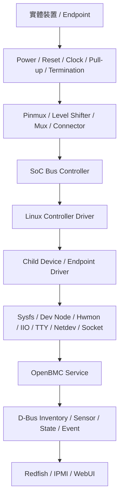
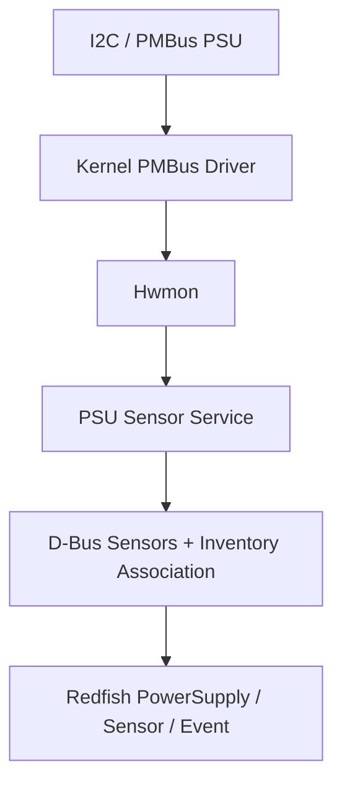

# 5. 周邊匯流排共通架構

BMC 透過各種匯流排連接感測器 / 儲存裝置 / Host / 網路控制器與平台管理元件. 不同介面的電氣特性與 protocol 各不相同, 但從硬體連線 / controller / driver 到 OpenBMC service 的排查順序具有共同架構.

本章建立周邊介面的整體地圖, 說明 I2C / SPI / UART / ADC / PWM / PECI / eSPI / 網路 sideband / USB 與 MCTP 等介面在 BMC 平台中的位置. 各 protocol 的細節則由後續專章深入說明.

## 適用範圍

本章涵蓋 BMC 平台中的周邊匯流排架構、bus map、硬體前置條件、Linux runtime interface、OpenBMC service integration、跨 power state 驗證與 debug safety. 各 protocol 的詳細原理仍由後續專章說明.

## 適用讀者

- 負責 BMC 硬體 bring-up、Linux kernel、Device Tree、OpenBMC service 或平台驗證的人員.
- 需要從實體介面追查至 D-Bus、Redfish、IPMI 或 EventLog 的開發與排查人員.

## 快速導覽

- [共同架構與排查層次](#section-5-1)
- [Bring-up 的共同順序](#section-5-3)
- [Bus Map](#section-5-4)
- [Power、Reset、Clock 與 Pinmux](#section-5-6)
- [I2C、SMBus 與 PMBus](#section-5-7)
- [SPI](#section-5-8)
- [UART 與 Serial Console](#section-5-9)
- [其他周邊介面](#section-5-10)
- [Debug Safety](#section-5-20)
- [跨 Power State 驗證](#section-5-21)
- [共用 Debug Log 收集](#section-5-23)
- [驗收 Checklist](#section-5-26)

<a id="section-5-1"></a>

## 5.1 周邊介面的共同架構

一個周邊裝置從硬體到管理介面, 通常經過以下路徑:



排查時先找出資料在哪一層中斷. 相同的「Redfish 沒有 sensor」可能來自:

- 裝置未供電.
- Reset 尚未解除.
- Pinmux 選錯功能.
- Controller driver 未 probe.
- Mux path 或 address 錯誤.
- Device driver 未 bind.
- Hwmon channel 不存在.
- OpenBMC config 未匹配.
- D-Bus association 缺少.
- bmcweb 沒有取得正確資料.

## 5.2 Controller / Device 與 Protocol

這三個名詞描述不同角色.

### 5.2.1 Controller

Controller 是 SoC 中負責驅動實體介面的硬體, 例如:

- I2C controller.
- SPI controller.
- UART controller.
- ADC controller.
- PWM controller.
- Ethernet MAC.
- USB device controller.
- eSPI controller.

Linux controller driver 通常依 Device Tree 建立對應 bus / class device 或 network interface.

### 5.2.2 Device

Device 是連接在 controller 後面的硬體, 例如:

- I2C EEPROM.
- PMBus PSU.
- SPI flash.
- UART-connected MCU.
- Ethernet PHY.
- USB Host peer.
- MCTP endpoint.

### 5.2.3 Protocol

Protocol 定義雙方如何交換資訊. 例如同一條 I2C 實體連線上可以承載:

- 一般 register-based I2C protocol.
- SMBus access forms.
- PMBus commands.
- MCTP over SMBus.
- Vendor mailbox.

所以「I2C bus 可看到 address」只表示底層連線有回應, 還需要驗證上層 protocol / driver 與資料格式.

<a id="section-5-3"></a>

## 5.3 Bring-up 的共同順序

建議所有周邊介面使用同一套順序:

1. 確認裝置型號 / 接線與 power domain.
2. 確認 reset / clock / pull-up / termination 與 strap.
3. 確認 pinmux 與 mux select.
4. 確認 controller node / kernel config 與 driver probe.
5. 確認 child device / address / chip select 或 endpoint identity.
6. 確認 protocol driver 與 raw interface.
7. 確認 OpenBMC service / D-Bus object 與 association.
8. 確認 Redfish / IPMI 與 event 呈現.
9. 測試 BMC reboot / Host power transition / hot-plug 與 recovery.

跳過前置條件直接使用 userspace 工具, 容易因裝置未上電 / mux path 錯誤或 line ownership 不明而得到誤導結果.

<a id="section-5-4"></a>

## 5.4 Bus Map

Bus map 用來把 schematic / Linux runtime 與 OpenBMC 串在一起. 每個 controller 與裝置至少記錄:

| 欄位 | 說明 |
|---|---|
| Bus Type | I2C / SPI / UART / PECI / eSPI / USB / MCTP 等 |
| Physical Controller | Schematic / SoC 名稱 |
| Linux Interface | `i2c-5` / `spi1.0` / `ttyS4` / `eth0` 等 |
| Topology | Direct / mux / bridge / slot / connector |
| Device / Endpoint | 型號與平台名稱 |
| Address / Identity | I2C address / CS / EID / PHY address 等 |
| Power Domain | Always-on / standby / Host-on / slot power |
| Reset / Clock | 前置相依條件 |
| Driver | Kernel driver |
| Raw Interface | Sysfs / dev node / hwmon / IIO / netdev |
| OpenBMC Service | 讀取或控制裝置的 daemon |
| D-Bus Mapping | Inventory / sensor / state 或 event |
| External Mapping | Redfish / IPMI / EventLog |
| Owner | HW, BMC, BIOS, CPLD, Security 等 |
| Debug Risk | Read-clear / write side effect / reset / erase 等 |

範例:

| Bus | Controller | Linux Interface | Topology | Device | Identity | Driver / Service |
|---|---|---|---|---|---|---|
| I2C | BMC I2C7 | `i2c-20` | Mux `0x70` ch2 | PSU0 | `0x58` | PMBus / PSU Sensor |
| SPI | FMC | `spi0.0` | CS0 | BMC flash | CS0 | SPI-NOR / MTD |
| UART | UART5 | `ttyS4` | Header | BMC console | 115200 8N1 | Serial / getty |
| PECI | PECI0 | `peci-0` | Direct | CPU0 | Package address | PECI hwmon |
| Ethernet | MAC1 | `eth1` | NC-SI | Host NIC | Package / channel | Kernel NC-SI |
| MCTP | SMBus binding | MCTP link | Mux path | Retimer | EID | MCTP / PLDM |

Linux bus number / netdev name 與 gpiochip number 可能受 probe 順序或 topology 影響, 因此 bus map 必須同時保留 physical identity 與 runtime identity.

## 5.5 Device Tree / Kernel 與 Service 的分工

### 5.5.1 Device Tree

Device Tree 常描述:

- Controller 是否啟用.
- Register range 與 interrupt.
- Clock / reset / power supply.
- Pinmux.
- Bus frequency.
- Child device address / chip select 與 compatible.
- Mux topology.

### 5.5.2 Kernel

Kernel 提供:

- Controller driver.
- Bus framework.
- Protocol / device driver.
- Sysfs / character device / hwmon / IIO 或 netdev interface.

### 5.5.3 OpenBMC Service

OpenBMC service 負責:

- 依 inventory 與 power state 決定何時存取裝置.
- 將 raw data 轉成 D-Bus properties.
- 建立名稱與 associations.
- 處理 unavailable / retry / event 與 policy.
- 接收控制要求.

### 5.5.4 Runtime 資料優先

Source DTS 只表示預期設計. 排查 target 時應確認:

- Bootloader 實際載入哪份 DTB.
- `/proc/device-tree` 的內容.
- Controller 與 child device 是否已建立.
- Driver symlink.
- Service 使用的設定檔與版本.

<a id="section-5-6"></a>

## 5.6 Power / Reset / Clock 與 Pinmux

匯流排 controller 出現在 Linux, 不代表外部裝置已可存取. 周邊裝置通常依賴:

- Power rail.
- PGOOD.
- Reset deassert.
- Reference clock.
- Pinmux state.
- Level shifter power.
- Bus mux select.
- Host / slot power state.

常見判讀:

| 現象 | 建議排查方向 |
|---|---|
| Controller 存在, 所有 devices 都無回應 | Pinmux / clock / pull-up / mux / power |
| Host on 後才出現 | 裝置位於 Host power domain |
| BMC reboot 後短暫消失 | Reset default / mux handoff / service timing |
| AC cycle 才能恢復 | Device / bridge state / rail discharge / CPLD latch |

這些前置條件應和第 3 章 Pinmux / GPIO / 第 4 章 Reset / Clock / Power Domain 的資料表對齊.

<a id="section-5-7"></a>

## 5.19 OpenBMC Service Integration

周邊裝置通常需要 service 才會成為對外可用的管理資料.

PSU 範例:



Service integration 需確認:

- Probe / discovery condition.
- Power-state gating.
- Presence gating.
- Retry 與 late-ready behavior.
- Sensor / inventory naming.
- Associations.
- Unavailable 與 Functional policy.
- Event debounce.
- Service dependency.

```bash
$ systemctl --failed
$ systemctl --type=service | grep -Ei 'sensor|entity|mctp|pldm|network'
$ journalctl -b --no-pager | grep -Ei 'sensor|inventory|bus|timeout'
$ busctl tree xyz.openbmc_project.ObjectMapper | head -200
```

<a id="section-5-20"></a>

## 5.20 Debug Safety

周邊工具可能改變硬體狀態或清除證據.

| 動作 | 風險 | 安全原則 |
|---|---|---|
| I2C bus scan | Device 對 probe command 有反應 | 先查 bus map 與 datasheet |
| EEPROM write | FRU / VPD 損壞 | Write protect / 備份 / verify |
| PMBus status clear | Fault evidence 消失 | 先保存 status 與 journal |
| SPI erase / program | Boot / recovery image 損壞 | 確認 range / 備份與 recovery |
| GPIO output 切換 | Power / reset / mux 改變 | 確認 owner 與測試窗口 |
| PWM manual write | Fan policy 被覆蓋 | 使用 maintenance / manual mode |
| eSPI / KCS control | 影響 Host state | 雙端協調與權限控管 |
| PLDM effecter / update | 改變 endpoint state | 區分 query 與 control |
| USB gadget enable | 暴露 storage / network path | 依 field / factory policy 限制 |

通用 debug script 應以唯讀收集為主, 不自動掃描所有 I2C buses / 寫入 registers / 切換 GPIO outputs 或觸發 update.

<a id="section-5-21"></a>

## 5.21 跨 Power State 驗證

周邊介面會隨平台狀態改變. 至少測試:

| 狀態 | 檢查內容 |
|---|---|
| AC applied / BMC booting | Safe defaults / always-on buses |
| BMC ready / Host off | Standby devices / NC-SI policy / Host interfaces |
| Host powering on | PECI / APML / eSPI / slot devices 出現時機 |
| Host on | 完整 sensors / network / MCTP endpoints |
| Host powering off | Service 停止順序 / unavailable events |
| BMC reboot | Host 影響 / mux / GPIO / sideband recovery |
| AC cycle | Controller / bridge 與 endpoint 重新 discovery |
| Hot-plug | Presence / driver / inventory / sensor lifecycle |

Power-state dependency 應由 service 正常處理, 避免裝置尚未供電時產生大量 timeout 與 critical events.

## 5.22 常見問題與判讀

| 現象 | 優先層級 | 第一輪檢查 |
|---|---|---|
| Controller 不存在 | DTS / clock / reset / driver | `dmesg` / running DT / kernel config |
| Controller 存在, 裝置無回應 | Power / pinmux / topology | Scope / reset / mux / address |
| Driver 未 bind | Compatible / ID / dependency | Sysfs driver link / `dmesg` |
| Raw value 存在, D-Bus 沒有 | Service / config | Journal / Probe / PowerState |
| D-Bus 存在, Redfish 沒有 | Mapping / association | ObjectMapper / bmcweb journal |
| Host off 時持續 timeout | Power-state gating | Host state / service policy |
| BMC reboot 後無法恢復 | Ownership / rediscovery | Controller reset / service restart / route |
| Hot-plug 後留下舊資料 | Lifecycle / cache | Inventory / sensor / association cleanup |
| Debug 後狀態改變 | Command side effect | Tool history / status / reset / clear logs |
| 偶發錯誤只在高負載出現 | Timing / signal integrity / contention | Scope / clock / latency / concurrency |

<a id="section-5-23"></a>

## 5.23 共用 Debug Log 收集

以下腳本只收集一般狀態, 不執行 bus scan / register write 或 control command:

```bash
#!/bin/sh

OUT=/tmp/peripheral-bus-debug
mkdir -p "$OUT"

cat /etc/os-release > "$OUT/os-release.txt" 2>&1
uname -a > "$OUT/uname.txt"
cat /proc/cmdline > "$OUT/proc-cmdline.txt"
zcat /proc/config.gz > "$OUT/kernel-config.txt" 2>&1

dmesg -T > "$OUT/dmesg.txt"
journalctl -b --no-pager > "$OUT/journal.txt" 2>&1
systemctl --failed > "$OUT/systemctl-failed.txt" 2>&1

command -v i2cdetect >/dev/null 2>&1 && \
    i2cdetect -l > "$OUT/i2c-adapters.txt" 2>&1
ls -l /sys/bus/i2c/devices > "$OUT/i2c-devices.txt" 2>&1
ls -l /sys/bus/spi/devices > "$OUT/spi-devices.txt" 2>&1
cat /proc/mtd > "$OUT/proc-mtd.txt" 2>&1

cat /proc/tty/driver/serial > "$OUT/serial.txt" 2>&1
find /sys/class/hwmon -maxdepth 4 -type f \
    > "$OUT/hwmon-files.txt" 2>&1
find /sys/bus/iio/devices -maxdepth 4 -type f \
    > "$OUT/iio-files.txt" 2>&1
find /sys/bus/peci -maxdepth 4 -type f \
    > "$OUT/peci-files.txt" 2>&1

ip link > "$OUT/ip-link.txt" 2>&1
ip addr > "$OUT/ip-addr.txt" 2>&1

command -v mctp >/dev/null 2>&1 && {
    mctp link > "$OUT/mctp-link.txt" 2>&1
    mctp route > "$OUT/mctp-route.txt" 2>&1
}

busctl tree xyz.openbmc_project.ObjectMapper \
    > "$OUT/objectmapper.txt" 2>&1
busctl tree xyz.openbmc_project.State.Host \
    > "$OUT/host-state.txt" 2>&1
busctl tree xyz.openbmc_project.State.Chassis \
    > "$OUT/chassis-state.txt" 2>&1

tar czf "/tmp/peripheral-bus-debug-$(date +%Y%m%d-%H%M%S).tar.gz" \
    -C /tmp peripheral-bus-debug
```

## 5.24 Bring-up 順序

1. 建立所有 controllers / topologies / devices 與 endpoints 的 bus map.
2. 確認每條路徑的 power / reset / clock / pinmux 與 mux select.
3. 驗證 controller driver 與 Linux runtime interface.
4. 驗證 child device / address / CS / PHY address / package / channel 或 EID.
5. 驗證 protocol / driver 與 raw interface.
6. 確認 OpenBMC service 的 discovery / gating / retry 與 naming.
7. 建立 inventory / sensor / state 與 associations.
8. 比對 Redfish / IPMI 與 physical device.
9. 執行 BMC reboot / Host power transition / AC cycle 與 hot-plug.
10. 執行可控的 timeout / disconnect 與 recovery 測試.
11. 保存 scope / LA / logs / DTB / kernel / service 與 firmware versions.
12. 將已知副作用與安全限制寫回 bus map.

## 5.25 平台實測紀錄表

| Bus | Controller | Runtime Interface | Topology | Device / Endpoint | Identity | Power State | Driver / Service | Result |
|---|---|---|---|---|---|---|---|---|
| I2C | [待填] | [待填] | [待填] | [待填] | Address [待填] | [待填] | [待填] | [待確認] |
| SPI | [待填] | [待填] | [待填] | [待填] | CS [待填] | [待填] | [待填] | [待確認] |
| UART | [待填] | [待填] | [待填] | [待填] | Baud [待填] | [待填] | [待填] | [待確認] |
| ADC / IIO | [待填] | [待填] | Channel [待填] | [待填] | Scale [待填] | [待填] | [待填] | [待確認] |
| PWM / Tach | [待填] | [待填] | Channel [待填] | Fan [待填] | PPR [待填] | [待填] | [待填] | [待確認] |
| PECI / APML | [待填] | [待填] | [待填] | CPU [待填] | Address [待填] | Host-on | [待填] | [待確認] |
| eSPI / LPC | [待填] | [待填] | [待填] | Host | Channel [待填] | [待填] | [待填] | [待確認] |
| Ethernet / NC-SI | [待填] | [待填] | [待填] | PHY / NIC | [待填] | [待填] | [待填] | [待確認] |
| USB Gadget | [待填] | [待填] | [待填] | Host | Function [待填] | Host-on | [待填] | [待確認] |
| MCTP | [待填] | [待填] | [待填] | [待填] | EID [待填] | [待填] | [待填] | [待確認] |

每列再附:

- Schematic page.
- DTS node.
- Kernel config / driver.
- Safe read method.
- Debug risk.
- D-Bus object.
- Redfish / IPMI mapping.
- 已驗證 power states.
- Recovery方式.

<a id="section-5-26"></a>

## 5.26 驗收 Checklist

架構與文件:

- [ ] 所有 controllers / devices / addresses / topologies 與 owners 已納入 bus map.
- [ ] Physical controller 與 Linux runtime interface 可互相追蹤.
- [ ] Power / reset / clock / pinmux 與 mux dependencies 已記錄.
- [ ] DTS / kernel / Yocto / service config 與 runtime 狀態一致.

介面:

- [ ] I2C adapters / mux paths / 7-bit addresses 與 safe reads 已驗證.
- [ ] SPI mode / clock / CS / bus width / WP 與 recovery 已驗證.
- [ ] UART voltage / baud / pinout / console role 與 mux owner 已驗證.
- [ ] ADC channel / reference / divider / scale 與 unit 已驗證.
- [ ] PWM frequency / polarity / tach PPR 與 control owner 已驗證.
- [ ] PECI / APML 的 package identity 與 Host-state gating 已驗證.
- [ ] eSPI / LPC Host interfaces在 reset / power transitions 後可恢復.
- [ ] Ethernet PHY / MDIO / RGMII / RMII 或 NC-SI 已完成狀態測試.
- [ ] USB gadget role / functions / Host compatibility 與安全政策已驗證.
- [ ] MCTP link / EID / route 與上層 protocol discovery 已驗證.

OpenBMC 與安全:

- [ ] Raw interfaces / D-Bus objects / inventory 與 associations 正確.
- [ ] Redfish / IPMI / EventLog 與硬體狀態一致.
- [ ] Power-state gating / retry / hot-plug 與 unavailable policy 已測試.
- [ ] 高風險 debug commands 具有核准流程 / 備份與 recovery.
- [ ] 共用 debug script 不會執行 bus scan 或修改硬體狀態.
- [ ] BMC reboot / Host power cycle / AC cycle 與 service restart regression 已完成.

## 5.27 本章重點

1. 周邊介面應從硬體前置條件 / controller / device / protocol / service 一路追到 Redfish / IPMI.
2. Controller / device與 protocol 屬於不同層次.
3. Bus map 需同時保存 physical identity / Linux runtime identity 與 OpenBMC mapping.
4. Controller probe 成功後, 仍需確認外部裝置的 power / reset / clock 與 pinmux.
5. I2C mux / NC-SI package / channel 與 MCTP EID都會形成新的 runtime topology.
6. Raw interface 有資料, 不代表 OpenBMC service / association與外部介面已完成.
7. 周邊裝置的 availability 常依賴 Host / slot 或 hot-plug power state.
8. Debug tools 可能清除 fault / 改寫 nonvolatile data / 切換 power 或破壞 boot image.
9. Recovery 測試應涵蓋 BMC reboot / Host transition / AC cycle / hot-plug 與 service restart.
10. I2C / PMBus / KCS / eSPI與 MCTP / PLDM / SPDM的詳細原理應由各自專章承接.

## 5.28 本章參考資料

- Linux kernel documentation - I2C: https://docs.kernel.org/i2c/
- Linux kernel documentation - SPI:https://docs.kernel.org/spi/
- Linux kernel documentation - Serial:https://docs.kernel.org/driver-api/serial/
- Linux kernel documentation - IIO:https://docs.kernel.org/driver-api/iio/
- Linux kernel documentation - Hwmon:https://docs.kernel.org/hwmon/
- Linux kernel documentation - PECI:https://docs.kernel.org/peci/
- Linux kernel documentation - MCTP:https://docs.kernel.org/networking/mctp.html
- Linux kernel networking documentation:https://docs.kernel.org/networking/
- DMTF PMCI standards:https://www.dmtf.org/standards/pmci
- OpenBMC documentation:https://github.com/openbmc/docs
