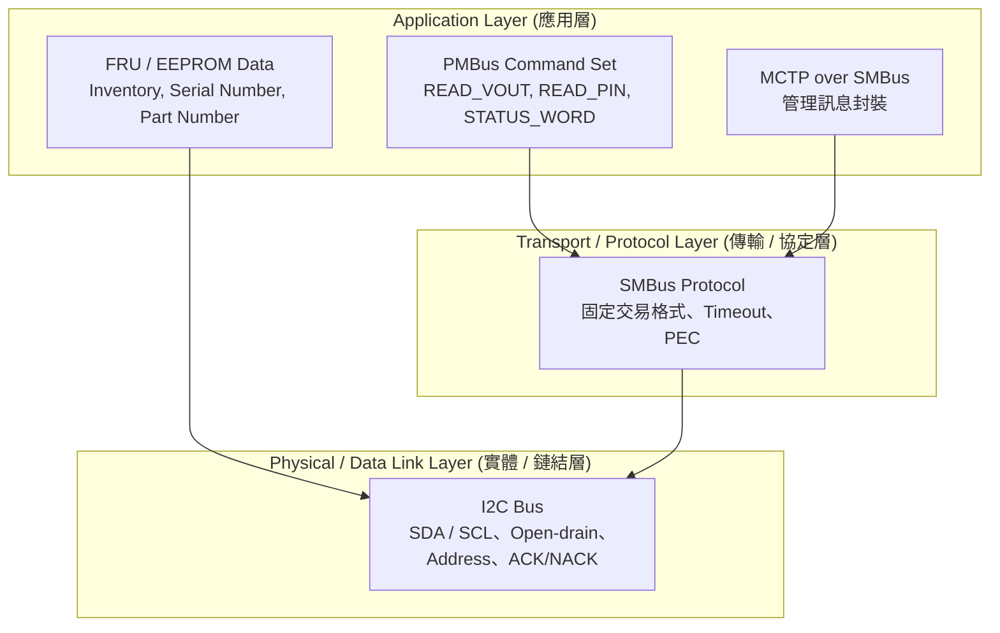
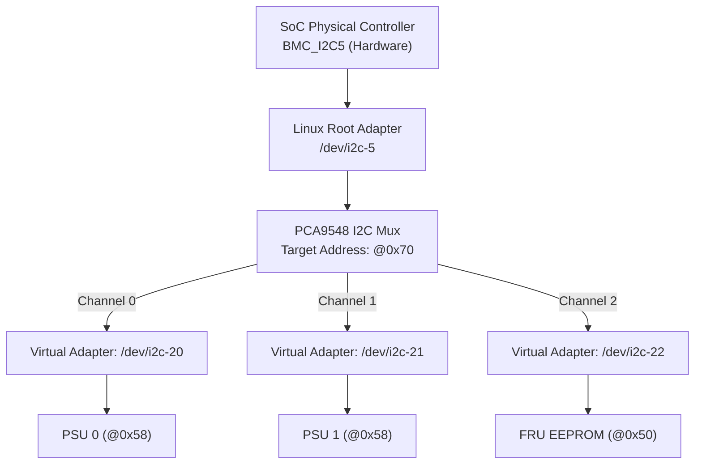

# 6. I2C / SMBus 與 PMBus

在伺服器管理（BMC）與嵌入式系統中，I2C、SMBus 與 PMBus 是最普遍的低速板級（On-board）管理與監控介面。雖然三者在物理層（Physical Layer）具備相容性，但在協定限制、逾時機制、錯誤檢測與應用層語意上存在顯著差異，不可混為一談。


## 6.1 I2C 是什麼，以及 SMBus / PMBus 的協定定位

在理解 SMBus 與 PMBus 之前，必須先理解 **I2C**。I2C 可以把它想成主機板上晶片之間的「低速共用管理小路」。BMC 不會為每一顆 sensor、EEPROM、PSU、VRM 或 CPLD 都拉一組專用資料線，而是讓多個裝置共用同一條 I2C bus，BMC 再用位址去指定要跟哪一顆裝置說話。

### 6.1.1 I2C 的定義

**I2C（Inter-Integrated Circuit）是一種板級晶片間通訊匯流排，只需要兩條線就能讓同一塊板子上的多個 IC 互相傳送控制與狀態資料。**

這兩條線是：

| 線名 | 全名 | 作用 |
|---|---|---|
| **SCL** | Serial Clock | 時鐘線，由 Controller 產生 clock，決定資料何時被取樣 |
| **SDA** | Serial Data | 資料線，負責傳送 address、read/write bit、data byte 與 ACK/NACK |

最常見的 BMC 使用方式如下：

```text
BMC I2C Controller
   ├── Temperature Sensor @0x48
   ├── EEPROM / FRU       @0x50
   ├── PSU PMBus          @0x58
   ├── GPIO Expander      @0x20
   └── I2C Mux            @0x70
```

重點是：**這些裝置可以共用同一組 SCL/SDA 線，但每個 target 需要有自己的 address。**BMC 要讀溫度時，就送出 temperature sensor 的 address；要讀 FRU 時，就送出 EEPROM 的 address。

### 6.1.2 為什麼 I2C 只需要兩條線就可以接很多裝置

I2C 的核心設計是 **shared bus**。所有裝置都接在同一組 SCL 與 SDA 上，但平常不主動驅動 bus。只有被 Controller 指定 address 的 Target 才會回應。

```text
             Pull-up                 Pull-up
               |                       |
SCL -----------+----------+------------+----------
                          |                       
SDA -----------+----------+------------+----------
               |          |            |
              BMC      Sensor       EEPROM
           Controller   Target       Target
```

I2C 採用 **open-drain / open-collector** 類型的輸出架構。裝置通常只能把線拉到 Low，不能主動推到 High；SCL/SDA 變回 High 是靠外部 pull-up resistor 把線拉高。因此，只要任何一個裝置把線拉 Low，整條 bus 就會是 Low。

這個特性帶來兩個重要結果：

1. **多個裝置可以安全共用同一條線**，因為大家都是「拉低」或「放開」，不會出現一顆晶片強推 High、另一顆晶片強拉 Low 的硬碰硬衝突。
2. **Bus 可能被卡死**，例如某顆 target 異常後一直拉住 SDA Low，BMC 就會看到整條 bus stuck low，後面 6.6 的 bus recovery 就是在處理這類問題。

### 6.1.3 Controller 與 Target 是什麼

在 I2C 裡，通訊角色通常分成 **Controller** 與 **Target**。

| 角色 | 舊稱 | 功能 | 在 BMC 系統中的常見例子 |
|---|---|---|---|
| **Controller** | Master | 發起 transaction、產生 SCL clock、送出 target address、決定 read 或 write | BMC SoC 內建 I2C controller，例如 AST2600 I2C |
| **Target** | Slave | 被 address 命中後回應 ACK/NACK，接收或提供資料 | PSU、VRM、temperature sensor、EEPROM、CPLD、GPIO expander |

一次 I2C transaction 通常由 Controller 開始，也由 Controller 結束。Target 不會自己突然開始傳資料給 BMC，除非系統另外設計 interrupt GPIO 或 alert line 通知 BMC 來讀。

### 6.1.4 Address 是什麼，為什麼常看到 0x50、0x58、0x70

I2C bus 上每個 Target 都需要 address。最常見的是 **7-bit address**，也有比較少見的 10-bit address。

常見 BMC address 範例：

| 裝置類型 | 常見 7-bit address | 說明 |
|---|---:|---|
| EEPROM / FRU | `0x50` | 儲存板卡資訊、序號、FRU data |
| Temperature sensor | `0x48` 或 `0x4C` | 讀取板上溫度 |
| PSU / VRM PMBus | `0x58`、`0x5A` | 電源監控與控制 |
| GPIO expander | `0x20` 到 `0x27` | 擴充 GPIO 腳位 |
| I2C mux | `0x70` 到 `0x77` | 擴充下游 I2C channel |

I2C 實際在線上傳送 address 時，會把 **7-bit address 左移一 bit，最後一 bit 放 R/W bit**：

```text
7-bit address: 0x50
Write frame address byte: 0xA0  (0x50 << 1 | 0)
Read frame address byte:  0xA1  (0x50 << 1 | 1)
```

因此文件、datasheet、logic analyzer、Linux command 之間常見混淆：

- Linux `/dev/i2c-*`、Device Tree `reg = <0x50>` 通常使用 **7-bit address**。
- 某些 datasheet 或舊文件會寫 `0xA0 / 0xA1`，那通常是 **8-bit wire format**，已經包含 R/W bit。

> 實務規則：專案文件中只要寫 I2C address，就必須標明是 7-bit 還是 8-bit wire format。否則 schematic、DTS、i2cdetect 與 logic analyzer 很容易對不起來。

### 6.1.5 一次 I2C Transaction 長什麼樣子

最基本的 I2C transaction 由以下元素組成：

```text
START
  ↓
Target Address + R/W bit
  ↓
ACK / NACK
  ↓
Data Byte 0
  ↓
ACK / NACK
  ↓
Data Byte 1 ...
  ↓
STOP
```

以 BMC 讀 EEPROM 某個 offset 為例，常見流程是：

```text
BMC -> EEPROM: START
BMC -> EEPROM: Address 0x50 + Write
EEPROM -> BMC: ACK
BMC -> EEPROM: Offset 0x10
EEPROM -> BMC: ACK
BMC -> EEPROM: Repeated START
BMC -> EEPROM: Address 0x50 + Read
EEPROM -> BMC: ACK
EEPROM -> BMC: Data byte
BMC -> EEPROM: NACK
BMC -> EEPROM: STOP
```

幾個重要名詞：

- **START**：當 SCL 為 High 時，SDA 從 High 變 Low，表示 transaction 開始。
- **STOP**：當 SCL 為 High 時，SDA 從 Low 變 High，表示 transaction 結束。
- **ACK**：接收方把 SDA 拉 Low，表示「我收到了，可以繼續」。
- **NACK**：接收方不拉 Low，表示「我沒有回應、不能繼續，或讀取結束」。
- **Repeated START**：不送 STOP，直接重新送 START，常用於「先寫 register offset，再讀資料」的情境。

### 6.1.6 I2C 的資料是怎麼被取樣的

I2C 的資料有效性規則很重要：**SCL 為 High 時，SDA 必須保持穩定；SDA 通常只能在 SCL 為 Low 時改變。**

```text
SCL:  _|‾|_|‾|_|‾|_|‾|_
SDA:   D0  D1  D2  D3
        ↑   ↑   ↑   ↑
      SCL High 時取樣資料
```

如果 SDA 在 SCL High 期間變化，就可能被解讀成 START 或 STOP，或造成資料 bit 錯誤。因此 I2C waveform debug 時，除了看 address 有沒有 ACK，也要看 SCL/SDA timing 是否符合規格。

### 6.1.7 Clock Stretching 是什麼

I2C 允許 Target 在還沒準備好時，把 SCL 拉 Low，讓 Controller 等一下。這稱為 **Clock Stretching**。

例子：

```text
BMC 要讀 sensor
  ↓
Sensor 還在轉換 ADC 數值
  ↓
Sensor 拉住 SCL Low
  ↓
BMC 等待 SCL 釋放
  ↓
Sensor 準備好後放開 SCL
  ↓
Transaction 繼續
```

這很方便，但也有風險：I2C 本身沒有強制規定所有情境都必須在固定時間內釋放 clock。若 target firmware 或硬體異常，bus 可能長時間卡住。SMBus 後來加入 timeout 規定，就是為了讓系統管理匯流排比較容易從異常中恢復。

### 6.1.8 I2C 在 BMC 裡通常拿來做什麼

在伺服器 BMC 裡，I2C 是非常常見的板級管理通道。典型用途如下：

| 用途 | 常見裝置 | BMC 讀到或控制什麼 |
|---|---|---|
| 溫度監控 | TMP75、NCT75、LM75 類 sensor | 主機板溫度、進風溫度、出風溫度 |
| FRU / Inventory | 24C02、24C64 EEPROM | 板卡名稱、序號、料號、製造商 |
| 電源監控 | PSU、VRM、Hot-swap controller | 電壓、電流、功率、fault status |
| GPIO 擴充 | TCA9555、PCA9555 | Presence、power good、reset、LED |
| Clock / Retimer 管理 | Clock generator、PCIe retimer | 設定暫存器、狀態讀取 |
| CPLD / FPGA 管理 | CPLD registers | board strap、reset control、misc status |
| MCTP over SMBus | SmartNIC、NVMe、management controller | 管理訊息傳輸 |


### 6.1.9 為什麼有了 I2C 還需要 SMBus？ (從物理傳輸到可靠傳輸)

I2C 解決了板級晶片之間「如何用最少的線路（SDA/SCL）連通」的問題，但它本質上只是一個「通用低速電氣與移位傳輸基礎」。在伺服器高可靠度（High Availability）與 BMC 系統管理的場景中，僅依靠標準 I2C 會面臨嚴重的硬體與系統級痛點：

#### 1. I2C 在伺服器管理場景下的四項硬體痛點

```text
[ 傳統 I2C 痛點 ]                              [ SMBus 規格化解法 ]
+------------------------------------+        +------------------------------------+
| 1. 無限 Clock Stretching ( Bus 死鎖 )| ------> | 強制 25ms~35ms Hardware Timeout    |
| 2. 高頻 EMI 干擾導致數據轉向/竄改  | ------> | 導入 PEC (Packet Error Code) CRC-8 |
| 3. 各廠商指令與長度隨意實作        | ------> | 定義 Quick/Byte/Word/Block 標準封包|
| 4. 無法預估交易耗時與 Driver 鎖定  | ------> | 限定 10kHz~100kHz 最低與最高頻率  |
+------------------------------------+        +------------------------------------+

```

* **痛點一：無限期的 Clock Stretching 導致匯流排死鎖（Bus Hang）**
  * *I2C 現象*：Target 晶片可隨意將 SCL 拉低以暫停傳輸（Clock Stretching）。若 Target 晶片內部狀態機卡死，SCL 將被永久拉低，導致整個 I2C Bus 與 controller 完全癱瘓。
  * *SMBus 解法*：**強制規定 25 ms ~ 35 ms 的 Timeout 機制**。一旦 SCL 被拉低超過 35 ms，Controller 與 Target 必須強制宣告逾時並重置介面，避免全系統陷入死鎖。
* **痛點二：缺少數據校驗，干擾數據被誤認為有效值**
  * *I2C 現象*：I2C 僅靠 ACK/NACK 確認位址與 Byte 是否送達，無任何 Payload 正確性校驗。伺服器內部的高頻電磁干擾（EMI）可能改變 SDA 資料電位，導致錯誤的溫度或電壓值被 OS/BMC 採納。
  * *SMBus 解法*：**導入 Packet Error Code (PEC)**，採用 CRC-8 校驗碼附帶於封包尾端，確保資料在嘈雜電磁環境下的完整性。
* **痛點三：傳輸格式自由度過高，作業系統 Driver 難以抽象化**
  * *I2C 現象*：I2C 未規範 Register 寫入長度與讀取序列，導致各晶片廠商自訂寫入邏輯，OS 無法撰寫通用的控制器驅動。
  * *SMBus 解法*：**標準化 7 種交易格式**（Quick Command, Send/Receive Byte, Read/Write Byte/Word, Block Read/Write），讓 Linux Kernel `i2c-core` / `smbus` 能以統一的 API 對外提供服務。

### 6.1.10 為什麼有了 SMBus 還需要 PMBus？ (從可靠傳輸到應用語意)

SMBus 定義了「如何安全可靠地傳送一串 Bytes」（郵差與信封規格），但它完全沒有規定「信件內文寫了什麼」。

當 BMC 存取各家廠商（如 Delta, LiteOn, Flextronics）的電源供應器（PSU）或電壓調節器（VRM）時，如果沒有 PMBus：

* A 廠商可能將「輸出電壓」放在 Register `0x10`（2 Bytes, 毫伏）。
* B 廠商可能將「輸出電壓」放在 Register `0x8B`（LINEAR16 格式）。
* C 廠商的「過溫告警 (Over-Temp Fault)」放在 Bit 3，而 D 廠商放在 Bit 7。

**PMBus（Power Management Bus）是在 SMBus 傳輸層之上建立的「應用層標準電源命令集」**。它讓 BMC 軟體架構不必為每一家電源廠商撰寫客製化驅動，實現了電源模組的**即插即用（Plug-and-Play）與標準化管理**。

#### PMBus 標準指令與資料抽象化層次

```text
+-----------------------------------------------------------------------------------+
|                        PMBus Application Layer (應用層語意)                        |
|   - 標準命令集: READ_VIN(0x88), READ_VOUT(0x8B), READ_IOUT(0x8C), STATUS_WORD(0x79) |
|   - 數據格式轉換: LINEAR11 ($X = Y \cdot 2^N$), LINEAR16, DIRECT                   |
+-----------------------------------------------------------------------------------+
                                         |
                                         v
+-----------------------------------------------------------------------------------+
|                        SMBus Transport Layer (傳輸/協定層)                       |
|   - 封包格式: Block Read / Read Word                                             |
|   - 安全機制: PEC (CRC-8 Checksum) + 25ms Timeout 判定                           |
+-----------------------------------------------------------------------------------+
                                         |
                                         v
+-----------------------------------------------------------------------------------+
|                       I2C Physical & Link Layer (實體/鏈結層)                     |
|   - 物理訊號: SDA / SCL (Open-Drain 電氣特性)                                     |
|   - 定址與控制: START, STOP, 7-bit Target Address, ACK/NACK                       |
+-----------------------------------------------------------------------------------+

```

#### PMBus 帶來的核心價值

1. **統一的運作參數讀取 (Standardized Metrics)**：
    * `READ_VIN` (`0x88`)：讀取 AC/DC 輸入電壓。
    * `READ_VOUT` (`0x8B`)：讀取 DC 輸出電壓。
    * `READ_IOUT` (`0x8C`)：讀取 DC 輸出電流。
    * `READ_PIN` (`0x97`)：讀取系統輸入總功率。
    * `READ_TEMPERATURE_1` (`0x8D`)：讀取電源內部熱點溫度。
2. **標準化的故障處置與狀態回報 (Fault Management)**：
    * `STATUS_WORD` (`0x79`)：提供全系統統一的 16-bit 警告/故障 Flag（包含 VOUT_OV, IOUT_OC, INPUT_UV, OT_FAULT 等）。
    * `CLEAR_FAULTS` (`0x03`)：一鍵清除歷史 Fault 紀錄。
3. **無失真數據格式標準 (Data Formatting)**：
    * 規範了 **LINEAR11** 與 **LINEAR16** 浮點數表示法，使不同 MCU 算力架構下的浮點數轉換具備統一的數學公式（$X = Y \cdot 2^N$）。

### 6.1.11 協定定位與架構分工圖



> 補充：FRU EEPROM 常直接使用 I2C EEPROM 類型的 register/offset 存取，不一定需要 SMBus 或 PMBus。PMBus 裝置則通常使用 SMBus transaction 來承載電源管理命令。

### 6.1.12 I2C / SMBus / PMBus 分層與特性對比

| 比較維度 | I2C (Inter-Integrated Circuit) | SMBus (System Management Bus) | PMBus (Power Management Bus) |
|---|---|---|---|
| **定位** | 板級晶片間低速通訊基礎 | 系統管理用 bus protocol | 電源管理 command set |
| **主要解決問題** | 如何用 SDA/SCL 在晶片間傳 byte | 如何讓系統管理 transaction 更一致、更可恢復 | 如何用標準命令管理 PSU / VRM / power device |
| **協定層級** | 實體層 / 鏈結層 | 協定層 / 傳輸層 | 應用層 |
| **線路** | SDA + SCL | 使用 I2C 相容線路 | 通常跑在 SMBus 上 |
| **常見速度** | 100 kHz、400 kHz、1 MHz、3.4 MHz | 傳統常見 100 kHz，較新版本可支援更高速度 | 承襲 SMBus / 裝置能力 |
| **Timeout** | I2C 本身較寬鬆，clock stretching 可能造成長時間等待 | 有 timeout 要求，避免 bus 長時間被占用 | 承襲 SMBus 行為 |
| **資料校驗** | 基本 I2C 無 PEC | 可使用 PEC CRC-8 | 依 PMBus device 與 command 支援 PEC |
| **典型裝置** | EEPROM、sensor、GPIO expander、mux | Smart battery、系統管理 sensor、MCTP over SMBus endpoint | PSU、VRM、hot-swap controller |
| **BMC 常見 driver** | `at24`、`lm75`、`pca954x`、`gpio-pca953x` | `i2c-dev`、SMBus helper、MCTP SMBus binding | Linux pmbus core 與 vendor pmbus driver |

若以網路 OSI 七層模型進行類比，三者的分工關係如下表：

| 協定名稱 | OSI 模型層級 mapping | 實質扮演角色 | 白話比喻 |
| --- | --- | --- | --- |
| **I2C** | 實體層 / 資料鏈結層 (Physical / Data Link Layer) | 提供 SDA/SCL 兩條線路、START/STOP 條件與 7-bit 定址傳輸。| **實體公路網**：鋪設道路，讓車輛能互相通行。 |
| **SMBus** | 傳輸層 / 協定層 (Transport / Protocol Layer) | 規範傳輸交易格式、25ms 強制 Timeout 與 PEC 資料防錯。 | **交通規則與快遞箱**：規定速限（頻率）、包裹規格（Block Read）與毀損賠償（PEC）。 |
| **PMBus** | 應用層 (Application Layer) | 定義電源管理的 Command ID（如電壓、電流、溫度）與數值轉換公式。 | **快遞箱內的標準文件**：規定信件必須用繁體中文（標準 Command）撰寫，且內容必須包含電壓與電流數值。 |


### 6.1.13 參與者與系統角色分工

- **Controller**：負責產生 SCL、發起 START/STOP、送出 address、控制 read/write 方向。在 OpenBMC 中通常是 SoC 內建 I2C controller，例如 Aspeed AST2600 I2C controller。
- **Target**：被 address 選中後回應 ACK/NACK，接收或提供資料。例如 temperature sensor、EEPROM、PSU、VRM、CPLD。
- **Mux / Switch**：用來擴充 bus、隔離不同 channel、避免 address conflict。例如 PCA9548 8-channel mux。
- **Level Shifter**：用來連接不同電壓域，例如 BMC 3.3V I2C 與某些 1.8V device。
- **Pull-up Resistor**：讓 open-drain bus 在沒人拉低時回到 High。阻值會影響 rise time、bus capacitance 與可達速度。
- **Linux I2C Adapter Driver**：驅動 SoC 實體 I2C controller，例如 `i2c-aspeed.c`。
- **Linux I2C Client Driver**：驅動掛在 bus 上的 target device，例如 `lm75.c`、`pmbus.c`、`at24.c`。
- **OpenBMC Application Service**：例如 `dbus-sensors`、`entity-manager`、`phosphor-hwmon`，負責把 kernel/sysfs/hwmon 資料轉成 D-Bus inventory、sensor 與 Redfish 可見資源。

### 6.1.14 BMC 週邊裝置分類

在典型伺服器主板設計中，BMC 透過 I2C/SMBus 匯流排連接廣泛的週邊設備：

```text
BMC (SoC)
├── I2C Bus 0 ---> FRU EEPROM (24C02 / 24C64)
├── I2C Bus 1 ---> Temperature Sensors (TMP75 / NCT75)
├── I2C Bus 2 ---> GPIO Expanders (TCA9555) / Fan Controller
├── I2C Bus 3 ---> CPLD / FPGA Management Registers
├── I2C Bus 4 ---> I2C Mux (PCA9548)
│   ├── Ch0 ---> PSU 0 (PMBus)
│   ├── Ch1 ---> PSU 1 (PMBus)
│   └── Ch2 ---> VRM / Hot-Swap Controller (PMBus)
├── I2C Bus 5 ---> Clock Generator / PCIe Retimers
└── I2C Bus 6 ---> MCTP over SMBus Endpoints (SmartNIC / NVMe SSD)
```

## 6.2 運作機制與資料格式

### 6.2.1 I2C 與 SMBus 交易類型 (Transaction Types)

一個標準的 I2C Transaction 由 **START (S)**、**7-bit Address + R/W Bit**、**ACK/NACK (A/NA)**、**Data Bytes** 與 **STOP (P)** 組成。若需要連續讀寫，可使用 **Repeated START (Sr)** 切換傳輸方向而不釋放 Bus 控制權。

SMBus 規範了數種標準交易格式，並可在封包尾端加入 **PEC (Packet Error Code)**：

1. **Quick Command**：僅發送位址與 R/W bit（無 Data Byte），常用於簡單的開關控管或設備 Probing。
2. **Send / Receive Byte**：發送或讀取單一 Byte Data。
3. **Read / Write Byte/Word**：指定 1-Byte Register Offset 後讀寫 8-bit 或 16-bit 數據。
4. **Block Read / Write**：先發送 Byte Count，隨後讀寫最多 32 Bytes 的數據區塊。

#### Packet Error Code (PEC) 計算機制

PEC 是採用 Polynomial 為 $X^8 + X^2 + X + 1$（CRC-8）的校驗碼。計算涵蓋範圍自 **Slave Address + R/W Bit** 起算，包含 Command Byte 及所有 Data Bytes：

$$\text{PEC} = \text{CRC-8}(\text{Addr} \parallel \text{R/W} \parallel \text{Cmd} \parallel \text{Data}_1 \parallel \dots \parallel \text{Data}_n)$$

> **重點**：啟用 PEC 可有效避免伺服器內部高頻電磁干擾（EMI）造成的數據竄改，強烈建議在 PMBus 電源監控與 MCTP over SMBus 傳輸中強制開啟。


### 6.2.2 PMBus 數據格式與計算公式

PMBus 讀取的電壓、電流、功率與溫度數值，由雙方約定的數值格式轉換為實際工程單位（如 Volts, Amperes, Watts, $^\circ\text{C}$）：

#### 1. LINEAR11 格式

常用於傳感器讀數（如 READ_VIN, READ_TEMPERATURE）。包含 **5-bit 補碼 Exponent ($N$)** 與 **11-bit 補碼 Mantissa ($Y$)**，打包於 16-bit Word 中：

```text
15                 11 10                       0
+--------------------+-------------------------+
| Exponent (N) [5b]  |   Mantissa (Y) [11b]    |
+--------------------+-------------------------+
```

實際物理數值 $X$ 計算公式：

$$X = Y \cdot 2^N$$

#### 2. LINEAR16 格式

專用於電壓相關命令（如 READ_VOUT）。資料本身為 **16-bit 無號整數 Mantissa ($Y$)**，而 Exponent ($N$) 則獨立由 `VOUT_MODE` (Command `0x20`) 指令讀取（為 5-bit 帶符號整數）：

$$X = Y \cdot 2^N$$

#### 3. DIRECT 格式

部分數位電源控制晶片採用 m, b, R 係數模型，計算公式為：

$$X = \frac{1}{m} \left( Y \cdot 10^{-R} - b \right)$$

* $X$：真實工程數值。
* $Y$：PMBus 讀出的 2-Byte 二進位整數。
* $m$：斜率係數 (Slope)。
* $b$：偏移量 (Offset)。
* $R$：十進位比例指數 (Scaling Exponent)。


### 6.2.3 典型 Transaction 工作流程

以下展示 OpenBMC PMBus 驅動讀取 PSU 輸出電壓（`READ_VOUT`）的完整互動流程：

```text
[ Controller (BMC) ]                                   [ Target (PSU) ]
         |                                                    |
         |--- 1. Generate START (S) ------------------------->|
         |--- 2. Send 7-bit Addr (0x58) + Write Bit (0) ---->|
         |<-- 3. Respond ACK (A) -----------------------------|
         |--- 4. Send Command: READ_VOUT (0x8B) ------------->|
         |<-- 5. Respond ACK (A) -----------------------------|
         |--- 6. Generate Repeated START (Sr) --------------->|
         |--- 7. Send 7-bit Addr (0x58) + Read Bit (1) ----->|
         |<-- 8. Respond ACK (A) -----------------------------|
         |<-- 9. Send VOUT Low Byte --------------------------|
         |--- 10. Send ACK (A) ------------------------------->|
         |<-- 11. Send VOUT High Byte ------------------------|
         |--- 12. Send ACK (A) [If PEC enabled] ------------->|
         |<-- 13. Send PEC Byte (CRC-8) ----------------------|
         |--- 14. Send NACK (NA) ---------------------------->|
         |--- 15. Generate STOP (P) ------------------------->|
         |                                                    |
 [ Userspace Driver ]                                         |
         |--- 16. Read VOUT_MODE (Exponent N) --------------->|
         |--- 17. Apply $X = Y \cdot 2^N$ ------------------->|
         |--- 18. Expose to D-Bus (e.g. 12.05 V) ------------>|
```


## 6.3 Physical Bus 與 Logical Bus (拓撲與 Mux)

在複雜系統中，單一 SoC 實體 Controller 往往透過 I2C Mux（如 PCA9548）擴充成多條獨立的邏輯 Bus。**務必分清實體匯流排編號與 Linux 邏輯 Bus 編號之差異**。

### 6.3.1 實體匯流排與邏輯 Adapter



> **常見維護陷阱**：硬體電路圖（Schematic）上的 `BMC_I2C5` 指的是 Physical Controller；但在 Linux 系統中，PSU 0 實際掛載於 `i2c-20`（Logical Child Adapter）。開發與除錯時必須透過 Device Tree 映射表核對。


### 6.3.2 Device Tree Source (DTS) 配置範例

```dts
&i2c5 {
    status = "okay";
    clock-frequency = <100000>; /* 100 kHz Bus Frequency */

    i2c-mux@70 {
        compatible = "nxp,pca9548";
        reg = <0x70>;
        #address-cells = <1>;
        #size-cells = <0>;
        i2c-mux-idle-disconnect; /* 閒置時自動切斷所有 Channel，防止 Bus 污染 */

        i2c@0 {
            #address-cells = <1>;
            #size-cells = <0>;
            reg = <0>;
            
            psu0: psu@58 {
                compatible = "pmbus";
                reg = <0x58>;
            };
        };

        i2c@1 {
            #address-cells = <1>;
            #size-cells = <0>;
            reg = <1>;
            
            psu1: psu@58 {
                compatible = "pmbus";
                reg = <0x58>;
            };
        };
    };
};
```


## 6.4 系統必備硬體資訊清單

在進行韌體開發、Device Tree 撰寫或硬體 Bring-up 前，必須核對並填妥以下 **11 項必備參數清單**：

| 參數項目 | 說明與範例 | 影響與注意事項 |
| --- | --- | --- |
| **1. Physical Controller** | 如 `i2c-5` (Aspeed AST2600 I2C Controller #5) | 決定硬體 Register Base Address 與 IRQ |
| **2. Linux Adapter** | 如 `/dev/i2c-20` | Userspace 或 Driver 實際存取的邏輯節點 |
| **3. Mux Address & Channel** | 如 PCA9548 位址 `0x70`，Channel `0` | 決定多路複用與邏輯切換規則 |
| **4. Pull-up 電壓與電阻** | 如 **3.3V**, **2.2k$\Omega$** 上拉電阻 | 影響訊號上升時間 ($t_r$) 與最高 Bus 速度 |
| **5. Bus Frequency** | **100 kHz** (Standard) / **400 kHz** (Fast Mode) | 必須符號匯流排上最慢裝置的上限 |
| **6. 7-bit Target Address** | 如 `0x58` (PSU), `0x50` (EEPROM) | Linux 核心一律採用 **7-bit 表示法**（不含 R/W bit） |
| **7. Address Strapping Pins** | 如 `A0/A1/A2` 腳位接地或上拉 | 決定實體晶片在 Bus 上的最終位址 |
| **8. Power Domain** | 如 `3.3V_AUX` (Standby) 或 `12V_MAIN` | 決定該 Bus 裝置在特定電源狀態下的可讀性 |
| **9. Protocol & Driver** | 如 `pmbus` driver / `at24` driver | 決定 Linux Kernel 載入的驅動模組 |
| **10. Safe Read Method** | 如是否需要開啟 PEC / 是否支援 Block Read | 防止非預期操作造成裝置 Hang 機 |
| **11. Bus Recovery 方式** | 如 GPIO Clock Pulsing / Mux Hardware Reset | 當 SDA 卡死（Stuck Low）時的自動復原策略 |


## 6.5 Target 檢查與掃描風險控制

### 6.5.1 Linux 系統檢查指令

在 Linux/OpenBMC Target 環境中，可透過以下指令盤點匯流排拓撲：

```bash
# 1. 列出系統中所有的 I2C Adapters (包含 Physical 與 Virtual Mux Buses)
i2cdetect -l

# 2. 印出邏輯 Bus 與實體硬體 Controller 的對應關係鏈結
for bus in /sys/bus/i2c/devices/i2c-*; do
    echo "=== Logical Bus: $(basename "$bus") ==="
    readlink -f "$bus/device"
done

# 3. 檢查特定 Bus 上已被 Driver 綁定的裝置 (顯示為 UU)
i2cdetect -y -r 20

```


### 6.5.2 `i2cdetect` Probing 掃描風險與禁忌

> **危險警告：切勿在未知的生產環境或敏感匯流排上無腦執行 `i2cdetect -y <bus>`！**

`i2cdetect` 預設透過發送 **SMBus Quick Write** 或 **Read Byte** 命令來盲測位址是否有回應。這可能引發嚴重的硬體異常：

1. **Write-Only / State-Machine 裝置崩潰**：部分舊型 CPLD、時鐘晶片或寫入保護暫存器，會將 Probing 命令誤認為有效的寫入指令，導致內部狀態機亂碼或暫存器被非預期改寫。
2. **FIFO 指針偏移**：對帶有 FIFO 的感測器進行 Read Probing，會導致內部 FIFO Data 指針自動遞增，破壞後續正規 Driver 的資料讀取。
3. **EEPROM 誤寫入**：若 Probing 訊號正好落在 EEPROM Write Cycle 期間，可能造成 EEPROM 內部資料毀損。

**安全規範**：除新建板卡（Bring-up 階段）外，生產環境應優先查閱原理圖與 Bus Map，直接針對指定位址進行讀取，嚴禁全網域動態盲掃。


### 6.5.3 PMBus 敏感命令操作規範

在 PMBus 營運除錯中，部分命令具備破壞性或狀態改變特性，必須遵循以下操作順序：

* `CLEAR_FAULTS` (`0x03`)：**發送後會立即清空 PSU 內部的歷史 Fault/Warning 暫存器**。除錯時**必須先將 `STATUS_WORD` (`0x79`) 與 `STATUS_VOUT` 等歷史紀錄完畢備份**後，方可執行清除。
* `PAGE` (`0x00`)：多通道 PMBus 裝置（如 Dual-output VRM）透過 `PAGE` 指令切換 Rail。在多執行緒/非同步環境下發送命令，必須進行全域 Lock 保護，避免 A 執行緒切換到 Page 1 後，B 執行緒誤將 Page 1 當作 Page 0 讀取。
* `STORE_DEFAULT_ALL` (`0x11`) / `RESTORE_DEFAULT_ALL` (`0x12`)：會改寫或載入非揮發性記憶體（NVM），頻繁發送會縮短 NVM 壽命並導致系統電壓瞬變。


## 6.6 Bus Stuck 故障診斷與 Recovery 復原機制

由於 I2C 採用 Open-Drain 架構，若 Target 晶片在傳輸過程中因電源異常、訊號干擾或重置（Reset）發生中斷，極易導致匯流排線路被硬體拉低而卡死（Bus Stuck）。

### 6.6.1 線路異常狀態對照表

| 線路狀態 (Line State) | 故障物理現象分析 | 常見可能原因 | 建議排查方向 |
|---|---|---|---|
| SCL High / SDA Low | Target 晶片持續將 SDA 拉低，等待 Controller 給予 SCL Clock 來完成傳輸。 | 1. Controller 在讀取資料中途突然 Reset。  2. 訊號干擾導致 Target 錯過 SCL Pulse。 | 執行 9-Clock Recovery 復原程序。 |
| SCL Low (SCL Stuck Low) | SCL 匯流排被拉低，全匯流排癱瘓。 | 1. 某裝置執行過長的 Clock Stretching。 2. 硬體電路短路或 Controller 死鎖。 | 檢查是否有裝置掛死，或觸發 硬體 Reset / Power Cycle。 |
| Mux 下游全無回應 (NACK) | Mux 實體位址可回應，但下游 Channel 上的所有裝置皆無回應。 | 1. Mux Channel 未成功開啟。 2. 下游 Pull-up 電源未供電。 3. Mux 被下游 Stuck 隔離。 | 檢查 Mux 驅動、下游 $V_{\text{CC}}$ 供電及 Mux RESET_N 腳位。 |
| 特定 Power State 無回應 | 僅在 Host Power-On (S0) 時可讀取，Standby (S5) 時無回應或讀出 0xFF。 | 1. 該 Target 裝置位於 Main Power Domain (非 Auxiliary Power)。 2. Level Shifter 倒灌或未啟用。 | 核對原理圖之 Power Rail，禁止在 S5 狀態輪詢 S0 電源域的裝置。 |


### 6.6.2 Bus Recovery 復原策略與機制

當 Kernel 檢測到 SDA Stuck Low 時，現代 Linux I2C Driver（如 Aspeed I2C Driver）支援自動化 Bus Recovery：

```text
[ Detect SDA Stuck Low ]
          |
          v
1. Switch I2C Controller SCL/SDA Pins to GPIO Mode
          |
          v
2. Toggle SCL Pin 9 times (Clock Pulsing)
   -> Forces Slave to release SDA Line
          |
          v
3. Check if SDA Line goes HIGH?
   ├── [YES] ---> Send STOP Condition (SDA Low->High while SCL High)
   │              Switch Pins back to I2C Mode -> Bus Recovered!
   │
   └── [NO]  ---> 4. Trigger Mux Hardware Reset Pin (RESET_N)
                  │
                  ├── [Recovered] ---> Resume Operation
                  └── [Failed]    ---> 5. Trigger Target Power Cycle / System Reset
```

1. **SCL Clock Pulsing (9-Clock Recovery)**：
    * Controller 將 SCL/SDA 引腳切換為 GPIO 模式。
    * 手動將 SCL 切換輸出 9 個 Clock Pulse。當 Target 發送完當前 Byte 並收到 Clock 後，會自動釋放 SDA 開漏線路。
    * Controller 產生一個 STOP Condition（SCL 為 High 時將 SDA 從 Low 拉高），結束該異常 Transaction 並切回 I2C 模式。
2. **Mux Hardware Reset**：
    * 若 Clock Pulsing 無法解除卡死，拉低 Mux 晶片之 `RESET_N` 腳位，強制切斷下游所有子 Channel，隔離故障線路以保全 Root Bus。
3. **Target Power Cycle / Cold Reset**：
    * 若上述軟硬體手段皆失效，最終透過 GPIO 切斷該 Target 裝置的 $V_{\text{CC}}$ 供電（Power Cycle），進行硬體強制重置。