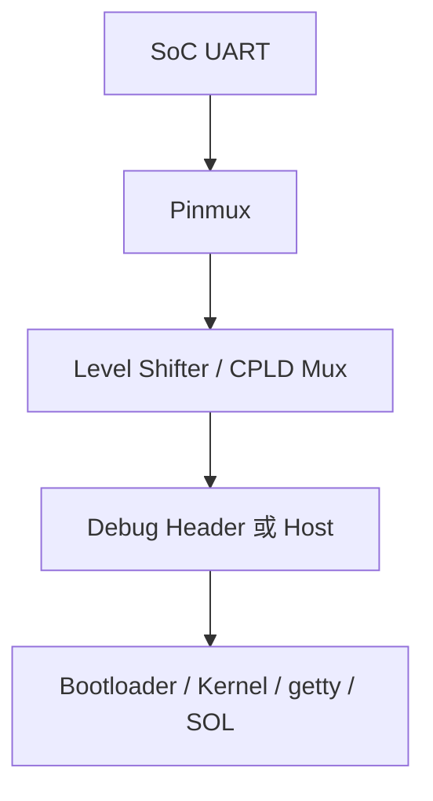

# 8. UART 與 Serial Console

## 8.1 UART 是什麼

UART 是非同步、點對點的序列傳輸方式，用於 boot console、Host console、BMC debug、manufacturing 與 recovery。雙方不共享 clock，而是事先約定 baud rate、data bits、parity 與 stop bits。UART 只提供 byte stream，通常沒有 message boundary、address、retransmission 或身份驗證。

### 定義與目的

UART 是非同步、點對點的序列傳輸方式，用於 boot console、Host console、BMC debug、manufacturing 與 recovery。雙方不共享 clock，而是事先約定 baud rate、data bits、parity 與 stop bits。UART 只提供 byte stream，通常沒有 message boundary、address、retransmission 或身份驗證。

### 參與者與角色

- Transmitter：以 TX 線傳送 frame。
- Receiver：以本地 clock oversampling RX 並重建 bits。
- UART controller / tty driver：提供 FIFO、interrupt、DMA、termios 與 tty device。
- Console / getty / SOL service：消費或轉送 byte stream。
- Mux / CPLD：在 BMC、Host、header、SOL 等路徑間切換 ownership。

## 8.2 怎麼運作

### 資料格式與規則

UART frame 通常由 idle high、start bit、5 至 9 個 data bits、optional parity 與 1 至 2 個 stop bits組成。常見表示法 115200 8N1 代表 115200 baud、8 data bits、no parity、1 stop bit。break、RTS/CTS、XON/XOFF 是否支援需另行確認。文字行、binary packet 或 console escape sequence 都屬上層規則。

### 工作流程

1. 雙方設定相同 baud 與 frame format。
2. Transmitter 拉低 TX 形成 start bit，再依順序送出 data、parity 與 stop。
3. Receiver oversample 並檢查 framing / parity。
4. Controller 經 FIFO / interrupt / DMA 將 bytes 交給 tty layer。
5. Console、getty、logger 或 SOL service 讀寫 tty。
6. 若存在 mux，切換前需停止 producer、flush FIFO 並確認 ownership。

## 8.3 實務限制與潛在風險

### 相容性與版控

baud clock tolerance、flow control、line discipline、binary framing 與 mux policy 必須一致。

### 安全性與防禦

console 可能暴露 boot log、shell 或密碼；production 應限制 header、getty、SOL privilege 與 debug mode。

### 錯誤處理

UART 無重送；framing、parity、overrun 與 byte loss 需由上層偵測，binary protocol 應加入 length、sequence 與 CRC。

### 效能與資源

低 baud 會阻塞 boot log；高輸出量可造成 FIFO overrun、CPU interrupt 或 systemd journal 壓力。

### 標準化與文件

UART 電氣層還需區分 TTL、RS-232、RS-485；connector pinout、voltage 與 crossover 必須文件化。


UART 是 BMC bring-up 的基本診斷入口. 需要記錄:

- Controller instance.
- Linux TTY.
- Baud rate / data bits / parity / stop bits.
- Signal voltage.
- Header pinout 與 GND.
- RTS / CTS.
- Pinmux 與 mux owner.
- Bootloader / kernel / login 或 Host SOL 的角色.

## 8.4 Console Path



## 8.5 Target 檢查

```bash
$ cat /proc/cmdline | tr ' ' '\n' | grep console
$ cat /proc/tty/driver/serial 2>/dev/null
$ ls -l /dev/ttyS* /dev/ttyAMA* 2>/dev/null
$ systemctl list-units 'serial-getty@*'
```

## 8.6 常見問題

- 完全無輸出: Power / pinmux / TX path / mux / console parameter.
- 亂碼: Baud / clock parent / 電壓 / data format.
- Bootloader 有輸出, kernel 後消失: Kernel console / pinctrl / driver / getty.
- BMC console 與 Host console 混線: CPLD / mux owner 或文件名稱不清楚.

BMC local console 與 Host SOL 應使用不同名稱, 並在 service / connector 文件中清楚標示.

<a id="section-5-10"></a>

