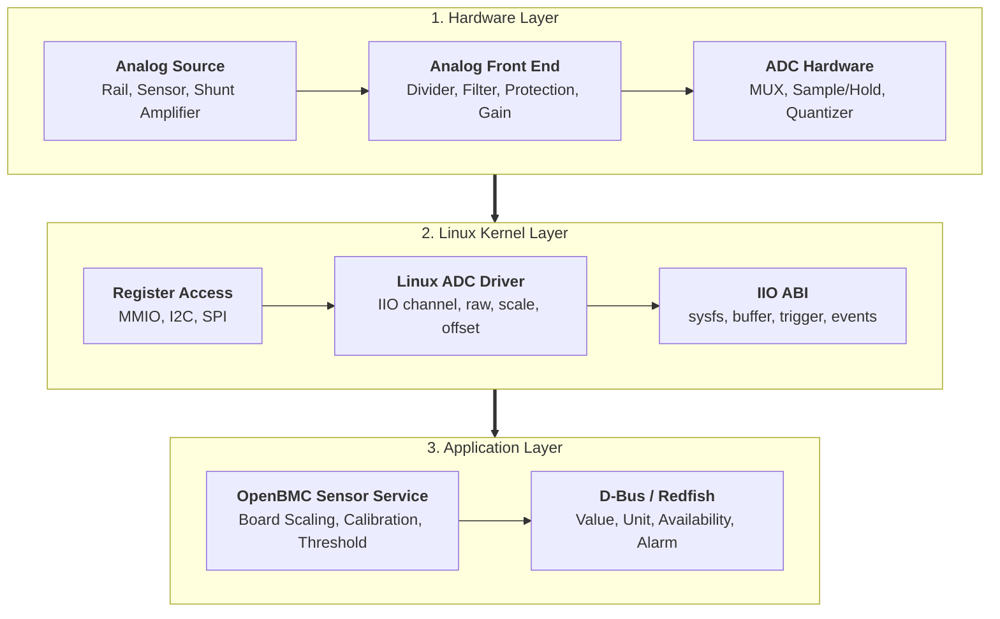
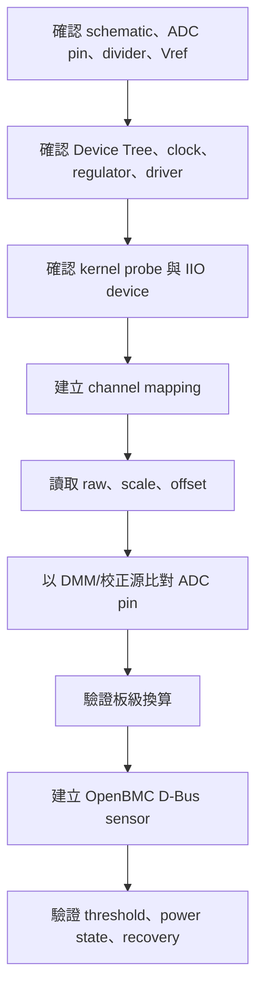

# 9. ADC 與 Linux IIO

ADC（Analog-to-Digital Converter）負責將類比電壓轉換成數位碼；Linux IIO（Industrial I/O）則提供 ADC、DAC 與各類感測器的統一資料模型、驅動介面與 userspace ABI。在 OpenBMC 平台中，ADC 常用於監控電源軌、溫度感測器輸出、電流感測放大器與板級識別電壓。

ADC 不是訊息交換型協定。本章從「類比前端、量化、Linux IIO、板級換算與 OpenBMC Sensor」建立完整資料鏈，並說明 bring-up、校正、故障復原與驗收方法。

## 9.1 系統分層與責任



> **分層原則**：IIO 提供的是晶片與 channel 層級的資料表示。分壓比、外部增益、shunt 阻值、板級誤差與 power-state policy 通常屬於平台整合責任，不能假設都由 ADC driver 自動處理。

### 9.1.1 參與者與角色

| 角色 | 主要責任 |
|---|---|
| Analog source | 提供被量測的電壓、電流轉換電壓或感測器輸出 |
| Analog front end | 分壓、濾波、保護、阻抗匹配與訊號放大 |
| ADC hardware | 取樣、保持、量化、channel multiplexing 與 conversion |
| Voltage reference | 決定 ADC 的轉換基準與 full-scale 範圍 |
| Bus/controller driver | 提供 MMIO、I2C 或 SPI register access |
| IIO ADC driver | 宣告 channel、scan type、raw、scale、offset、sampling frequency、buffer 與 trigger |
| IIO core | 建立 IIO device、sysfs ABI、buffer、event 與 character device |
| Consumer | 將 raw data 轉成工程值，加入板級 scaling、calibration 與有效性判定 |
| OpenBMC sensor service | 建立 D-Bus sensor、threshold、availability、functional state 與 association |
| Validation equipment | 使用 DMM、校正電源、電子負載或示波器建立量測基準 |

## 9.2 ADC 量化、工程值模型與 IIO Data Alignment

### 9.2.1 理想 ADC 模型

對理想的 $N$-bit、單極性 ADC，若數位碼範圍為 $0$ 到 $2^N - 1$，ADC pin 上的理想電壓可表示為：

$$\text{V}_{\text{adc}} = \text{RawCode} \times \frac{\text{V}_{\text{ref}}}{2^N - 1}$$

部分硬體或 driver 以 $2^N$ 作為 LSB 分母，或有效位元未填滿 register。正式換算必須以 ADC datasheet、driver 實作與 IIO ABI 實測結果為準，不可只依解析度自行推導。

若 IIO driver 提供 `raw`、`scale` 與 `offset`，常見的一般化表示為：

$$\text{Value}_{\text{at\_ADC\_pin}} = (\text{raw} + \text{offset}) \times \text{scale}$$

若前端有電阻分壓：

$$\text{V}_{\text{source}} = \text{Value}_{\text{at\_ADC\_pin}} \times \frac{R_{\text{top}} + R_{\text{bottom}}}{R_{\text{bottom}}}$$

若 ADC 量測的是電流感測放大器輸出：

$$\text{Current} = \frac{\text{Value}_{\text{at\_ADC\_pin}} - \text{V}_{\text{zero}}}{\text{AmplifierGain} \times R_{\text{shunt}}}$$

其中 $\text{V}_{\text{zero}}$ 可能是零電流偏壓。雙向電流感測器尤其不可假設 $0\text{ V}$ 等於 $0\text{ A}$。

### 9.2.2 Bit Alignment 與 IIO Buffer Scan Element 結構

在 Buffered Capture 模式下，硬體取樣資料被填入記憶體緩衝區時，需要明確定義其記憶體排版。IIO 透過 `scan_type` 定義資料在 Register / Buffer 中的儲存格式：

```text
+---------------------------------------------------------------------------------+
|                               IIO Scan Element Format                           |
+---------------------------------------------------------------------------------+
| MSB                                                                         LSB |
| [  Unused / Padding Bits  ] [         Real Bits (Storage)         ] [ Shift ]   |
| <------------------------- Storage Bits (e.g., 16 bits) --------->              |
+---------------------------------------------------------------------------------+
 Example: 12-bit sample stored in 16-bit word with 0-bit shift (Right-aligned)
 Bit [15:12] = Padding (0 or Sign extension)
 Bit [11:0]  = Real ADC Sample Data (12-bit)
```

* **Nominal resolution**：datasheet 宣告的 ADC 位元數（如 10, 12, 16 bits）。
* **Effective resolution (ENOB)**：受雜訊、reference、layout 與取樣條件影響後可用的有效解析度。
* **Storage bits**：driver 或硬體 register 用於儲存 sample 的位元數（通常為 8, 16, 32 bits）。
* **Real bits**：scan element 中真正有效的 sample 位元數。
* **Shift**：有效位元在 storage word 內的右移位元數。
* **Endianness**：buffer sample 的 byte order (`be` 或 `le`)。
* **Signedness**：資料是 unsigned (`u`) 或 two's-complement signed value (`s`)。


### 9.2.3 誤差來源與不確定度預算 (Error Budget)

| 誤差分類 | 影響因素 | 典型改善或修正途徑 |
| --- | --- | --- |
| **Reference Error** | Initial tolerance、靜態偏置與溫飄 ($ppm/^\circ C$) | 使用高精度外接 Vref、工廠校正 |
| **ADC Non-linearity** | Offset Error、Gain Error、INL (積分非線性)、DNL | 兩點或多點增益/偏移校正 |
| **Analog Front-End** | 電阻分壓容差 (1% vs 0.1%)、放大器 Offset 與 Gain Error | 採用高精密低溫飄電阻 (0.1%) |
| **Sampling Dynamics** | Source Impedance 與 Sample/Hold Acquisition Time 不匹配 | 加設前端 Operational Amplifier Buffer 或RC電路 |
| **System & Environment** | Power Rail Ramp、PCB Ground Offset、Switching Noise | 優化 PCB Layout、開立數位濾波/平均取樣 |


## 9.3 Linux IIO 架構

```text
+---------------------------------------------------------------+
| Userspace                                                     |
| OpenBMC sensor service / test tool / data logger              |
+-----------------------+-------------------+-------------------+
| sysfs attributes      | /dev/iio:deviceX  | event interface   |
| raw/scale/offset      | buffered samples  | threshold/events  |
+-----------------------+-------------------+-------------------+
| Linux IIO Core                                                |
| device, channel, buffer, trigger, scan element, event ABI     |
+---------------------------------------------------------------+
| ADC Driver                                                    |
| read_raw, write_raw, channel spec, scan type, buffer ops      |
+---------------------------------------------------------------+
| Regmap / MMIO / I2C / SPI / platform bus                      |
+---------------------------------------------------------------+
| ADC hardware + reference + analog front end                   |
+---------------------------------------------------------------+
```

### 9.3.1 Device 與 channel

IIO device 通常出現在：

```text
/sys/bus/iio/devices/iio:deviceX/
/dev/iio:deviceX
```

同一個 `iio:deviceX` 可包含多個 voltage channel。`X` 是 runtime enumeration index，可能因 probe order、Device Tree 或 kernel 版本而改變，因此 production 程式不應只靠固定的 `iio:device0` 辨識硬體。應結合 `name`、Device Tree path、parent device 或 stable symlink 建立 mapping。

常見 attributes：

```text
name
in_voltage0_raw
in_voltage0_scale
in_voltage0_offset
in_voltage0_sampling_frequency
in_voltage_scale
sampling_frequency
```

實際名稱與 scope 由 driver 決定。`in_voltage_scale` 可能是 shared-by-type，`in_voltage0_scale` 則可能是 per-channel。若 attribute 不存在，不代表 scale 為 1。

### 9.3.2 Sysfs Attributes 語意

Sysfs Attributes 包含 `raw`、`scale`、`offset` 與 `processed`

| Attribute | 一般語意 | 使用注意事項 |
|---|---|---|
| `*_raw` | 未轉成標準工程單位的 sample code | 應搭配 scale、offset 與 ABI 說明 |
| `*_scale` | 每一 code 對應的工程量比例 | 單位與小數格式需依 ABI 確認 |
| `*_offset` | 在乘上 scale 前加入的 code-domain offset | 不可任意改成乘法後偏移 |
| `*_processed` | driver 已處理的工程值 | 是否包含板級 divider 需查 driver 與 binding |
| `*_input` | 常見於 hwmon，而非典型 IIO raw ABI | 單位通常由 hwmon ABI 定義 |

IIO sysfs 可能以整數、`integer + micro`、`integer + nano`、fractional 或 logarithmic 形式表達 scale。shell script 不應假設所有 scale 都是單一整數。

### 9.3.3 Direct mode 與 buffered mode

**Direct mode** 適合低頻 sensor polling：

1. userspace 讀取 `in_voltageX_raw`；
2. driver 啟動或等待 conversion；
3. driver 回傳單筆 sample；
4. consumer 套用 scale 與板級換算。

**Buffered mode** 適合較高頻率或需多 channel 同步的資料擷取：

1. 啟用 `scan_elements/in_voltageX_en`；
2. 設定 buffer length、watermark 與 trigger；
3. 啟用 buffer；
4. 從 `/dev/iio:deviceX` 讀取固定 scan layout；
5. 依 `*_index`、`*_type` 和 timestamp 解析每一筆 scan。

> **重要限制**：buffer layout 不是單純依 channel 編號排列。consumer 必須讀取 `scan_elements/*_index` 與 `*_type`，處理 alignment、storage bits、shift、endianness 與 timestamp。

### 9.3.4 Trigger、sampling frequency 與 timestamp

Trigger 決定何時取得 sample，可能來自：

- ADC data-ready interrupt；
- hardware timer；
- external trigger；
- IIO software trigger；
- driver-defined polling source。

`sampling_frequency` 是取樣設定，不一定等於 userspace 最終收到的有效更新率。averaging、conversion time、buffer watermark、bus latency 與 consumer scheduling 都可能降低實際資料率。

Timestamp 可能由硬體或 kernel 在不同時間點產生。若應用需要 channel 間相位關係或事件時間精度，必須確認 timestamp source 與語意。

## 9.4 Linux source tree 與 kernel configuration

典型程式碼位置如下，實際檔名依 kernel branch 而異：

```text
linux/
├── drivers/iio/
│   ├── adc/                 # ADC drivers
│   ├── buffer/              # IIO buffer implementations
│   ├── trigger/             # trigger support
│   ├── industrialio-core.c  # IIO core
│   └── industrialio-buffer.c
├── include/linux/iio/
└── Documentation/ABI/testing/sysfs-bus-iio
```

常見 kernel configuration 概念：

```text
CONFIG_IIO=y
CONFIG_IIO_BUFFER=y                 # 使用 buffered capture 時
CONFIG_IIO_TRIGGER=y                # 使用 trigger 時
CONFIG_IIO_TRIGGERED_BUFFER=y       # driver 採 triggered buffer 時
CONFIG_<ADC_DRIVER>=y or m          # 平台實際 ADC driver
```

不得只確認 `CONFIG_IIO=y`。還需確認 bus controller、regulator、clock、reset、pinctrl 與 ADC-specific driver 已啟用。

## 9.5 Device Tree、schematic 與 runtime mapping

ADC bring-up 應建立以下可追溯鏈：

```text
Schematic rail / sensor output
        ↓
Divider、filter、protection、amplifier and ADC pin
        ↓
ADC datasheet channel number
        ↓
Device Tree ADC node、reference、clock and consumer mapping
        ↓
Linux platform/I2C/SPI device
        ↓
IIO device name and channel attributes
        ↓
OpenBMC configuration
        ↓
D-Bus sensor path、unit、threshold and inventory association
```

### 9.5.1 Static topology 與 runtime state

| 類別 | 內容 | 典型來源 |
|---|---|---|
| Physical topology | rail、divider、ADC pin、reference、filter、test point | schematic、BOM、layout |
| Hardware capability | resolution、input range、sample time、channel mode | ADC datasheet |
| Firmware description | ADC node、clock、reference、channel mapping | Device Tree、ACPI、board config |
| Runtime enumeration | `iio:deviceX`、channel attributes、driver binding | sysfs、udev、kernel log |
| Board conversion | divider、gain、shunt、calibration | platform configuration |
| Management model | D-Bus path、unit、threshold、availability | OpenBMC entity/sensor config |

### 9.5.2 Device Tree 檢查清單

```text
ADC Device Tree checklist
[ ] ADC controller node path
[ ] status = "okay"
[ ] compatible 與實際 IP/晶片相符
[ ] register / I2C / SPI address 正確
[ ] clock、reset、interrupt 與 pinctrl 正確
[ ] reference regulator phandle 正確
[ ] regulator voltage 與實際 Vref 相符
[ ] channel 定義與 schematic ADC pin 相符
[ ] differential / single-ended mode 正確
[ ] acquisition time 或 clock rate 符合 source impedance
[ ] consumer channel name 或 io-channel mapping 穩定
[ ] 沒有其他 driver claim 同一個 device/address
```

Device Tree binding 會隨 ADC driver 不同而改變。本章不提供可直接複製到所有平台的 DTS 範本。正式文件應引用 target kernel 對應 binding，並貼入平台實際 DTS fragment。

### 9.5.3 Runtime mapping 命令

```sh
# 找出 IIO devices
for d in /sys/bus/iio/devices/iio:device*; do
    [ -d "$d" ] || continue
    printf '%s name=' "$d"
    cat "$d/name" 2>/dev/null || echo unknown
    readlink -f "$d/device" 2>/dev/null || true
done

# 列出 channel attributes
find /sys/bus/iio/devices -maxdepth 3 -type f | sort

# 檢查 driver binding 與 parent path
readlink -f /sys/bus/iio/devices/iio:device0/device
readlink -f /sys/bus/iio/devices/iio:device0/device/driver

# 檢查 Device Tree runtime node，若平台提供 of_node
readlink -f /sys/bus/iio/devices/iio:device0/device/of_node 2>/dev/null || true
```

建議建立專案 mapping table：

| 邏輯 Sensor | Schematic net | ADC pin/channel | IIO device name | IIO attribute | 板級公式 | D-Bus path |
|---|---|---:|---|---|---|---|
| `P12V` | `P12V_MON` | CH3 | target 實測 | `in_voltage3_raw` | 待填 divider 與 calibration | 待填 |
| `P3V3` | `P3V3_MON` | CH5 | target 實測 | `in_voltage5_raw` | 待填 | 待填 |

範例值只能作格式示意，不可直接當成平台設定。

## 9.6 OpenBMC Sensor mapping

### 9.6.1 建議資料模型

每個 ADC sensor 至少保存：

```text
ADC Sensor mandatory fields
Identity:
  SensorName
  InventoryAssociation
  PhysicalRailOrSignal
Hardware:
  IIODeviceName
  ChannelIndex
  ADCResolution
  InputMode
  ReferenceSource
Conversion:
  RawAttribute
  ScaleAttribute
  OffsetAttribute
  DividerRatio or Gain
  ShuntResistance
  CalibrationRevision
Runtime:
  Value
  Unit
  MinValue
  MaxValue
  Availability
  Functional
  LastUpdateTime
  LastRawCode
  LastFailureReason
Policy:
  WarningThresholds
  CriticalThresholds
  PowerStateRequirement
  PollRate
  DebounceOrHysteresis
```

### 9.6.2 資料轉換順序

建議固定換算順序並在程式與文件中一致：

```text
1. Read raw code
2. Validate read status and sample freshness
3. Apply IIO offset in code domain
4. Apply IIO scale
5. Apply board-level divider / amplifier / shunt formula
6. Apply manufacturing or field calibration
7. Convert to D-Bus base unit
8. Check physical plausibility and power-state validity
9. Update value, availability and thresholds
```

不得把 sysfs read failure、空字串、parse error 或 stale cache 轉成 `0 V`。`0` 是合法 ADC code，錯誤狀態必須用 availability/functional/error 狀態獨立表示。

### 9.6.3 Threshold、hysteresis 與 debounce

Threshold 應以最終工程值定義，並考量：

- 電源規格容差；
- ADC 與前端誤差預算；
- power-up/power-down transient；
- polling interval；
- alarm hysteresis；
- debounce 次數或持續時間；
- sensor unavailable 與 out-of-range 的區別。

若 rail 在某些 host power state 本來就關閉，應以 power-state policy 決定 sensor 是否可用，不應因讀到接近 0 V 就永久觸發 undervoltage alarm。

## 9.7 取樣、效能與資源設計

ADC polling 會消耗 CPU、bus bandwidth、電力與 kernel/userspace wakeups。設計時需要平衡：

- 高速保護是否應由硬體 comparator 或 PMBus fault 機制負責；
- IIO sensor 是否只做慢速 telemetry；
- 每個 sensor 的必要更新率；
- 多 channel 是否可批次取得；
- averaging 應在硬體、driver 或 userspace 哪一層完成；
- buffer 是否比逐一讀 sysfs 更有效率；
- I2C/SPI ADC 是否與其他高優先裝置共用 bus；
- error retry 是否可能形成 busy loop。

> **設計原則**：不要以高頻 userspace polling 取代硬體保護。若 rail fault 必須在微秒或毫秒級切斷電源，應由硬體監控器、comparator、CPLD 或 PMIC 保護路徑處理。

## 9.8 Calibration 與量測追溯

### 9.8.1 校正層級

| 校正層級 | 修正內容 | 保存位置範例 |
|---|---|---|
| Silicon/driver | 晶片內部 trim、reference correction | hardware/driver |
| Board design | divider、amplifier、shunt nominal value | platform config |
| Manufacturing | board-specific gain/offset | EEPROM、FRU、calibration partition |
| Field/service | 維修後校正或政策補償 | secured configuration store |

### 9.8.2 常見線性校正

若用兩點校正，可建立：

```text
Vcorrected = GainCorrection x Vmeasured + OffsetCorrection
```

校正紀錄至少包含：

```text
Calibration Record
Board serial number:
Board revision:
ADC device/channel:
Reference equipment:
Reference equipment calibration due date:
Temperature:
Power state:
Input point 1 / raw / computed / reference:
Input point 2 / raw / computed / reference:
Gain correction:
Offset correction:
Coefficient format and unit:
Software/config revision:
Engineer:
Timestamp:
```

### 9.8.3 校正安全性

校正係數會直接影響監控與自動控制。若可被任意修改，可能掩蓋過壓、欠壓或過流。因此應：

- 限制寫入權限；
- 驗證係數範圍與格式；
- 使用版本、CRC 或簽章保護；
- 保留 audit log；
- 發生資料損壞時使用明確 fallback policy；
- 不可在係數無效時默默使用 0。

## 9.9 Bring-up 流程



### 9.9.1 Pre-check

```text
[ ] Schematic net、test point、ADC channel 已確認
[ ] ADC input 不超過 absolute maximum
[ ] divider 與 protection 元件值已核對 BOM
[ ] Vref nominal value 與來源已確認
[ ] DMM 或校正源的量測有效期可追溯
[ ] Kernel config 與 driver 已啟用
[ ] Target image、kernel、DTS revision 已記錄
[ ] 測試 power state 與負載條件已定義
```

### 9.9.2 基本檢查命令

```sh
# Kernel probe 與 IIO log
dmesg -T | grep -Ei 'adc|iio|vref|regulator|clock|timeout|probe'

# IIO device 與所有 attributes
find /sys/bus/iio/devices -maxdepth 3 -type f | sort

# 若平台同時使用 hwmon
find /sys/class/hwmon -maxdepth 3 -type f | sort

# 範例：讀單一 channel，路徑需依 target 調整
cat /sys/bus/iio/devices/iio:device0/name
cat /sys/bus/iio/devices/iio:device0/in_voltage0_raw
cat /sys/bus/iio/devices/iio:device0/in_voltage0_scale
```

### 9.9.3 單點驗證流程

1. 用 DMM 量測 ADC pin，而不是只量 rail source。
2. 同時保存 raw、scale、offset 與 timestamp。
3. 算出 ADC pin 電壓。
4. 套用 divider/gain/shunt 公式得到 source 工程值。
5. 比對 DMM 與 D-Bus 值。
6. 重複多個輸入點，至少覆蓋低、中、高範圍。
7. 在不同 power state、負載與溫度下重測。
8. 確認誤差落在預先定義的 budget 內。

## 9.10 Test Case：ADC 線性與 OpenBMC mapping

### 9.10.1 測試目的

- 驗證 raw code 隨輸入單調變化；
- 驗證 IIO scale/offset 解析正確；
- 驗證 divider、gain、shunt 與 calibration；
- 驗證 D-Bus value、unit、threshold 與 availability；
- 驗證 sensor service restart、BMC reboot 與 power cycle 後可恢復。

### 9.10.2 測試點

建議依安全輸入範圍選擇至少五點：

```text
0% 或安全低點
25%
50%
75%
接近滿量程但保留安全 margin 的高點
```

若無法直接注入 ADC pin，應以可控 rail、電子負載或 sensor simulator 產生測試條件。禁止為測試而使 ADC pin 超出 absolute maximum。

### 9.10.3 測試紀錄表

| Point | Reference input | DMM at ADC pin | Raw | Scale | Offset | Calculated source | D-Bus value | Error | Result |
|---:|---:|---:|---:|---:|---:|---:|---:|---:|---|
| 1 | 待填 | 待填 | 待填 | 待填 | 待填 | 待填 | 待填 | 待填 | PASS/FAIL |
| 2 | 待填 | 待填 | 待填 | 待填 | 待填 | 待填 | 待填 | 待填 | PASS/FAIL |

### 9.10.4 驗收條件

- 所有測試點均未飽和，除非該 case 專門驗證 saturation；
- raw code 對輸入保持合理單調性；
- 誤差符合專案 error budget；
- sensor unit 與數值倍率正確；
- threshold 在預期點進入與退出，hysteresis 正確；
- 無 parse error、timeout storm 或 busy-loop；
- service restart、BMC reboot 後 mapping 不漂移；
- journal 與 dmesg 無新增非預期錯誤。

## 9.11 Failure and Recovery

故障處理應包含 trigger、observable、impact、triage、recovery 與 acceptance criteria。不要把重啟 BMC 當成第一步，因為重啟可能清除現場證據。

### 9.11.1 Raw code 固定為 0

**可能原因**：rail 確實為 0、power domain 關閉、channel mapping 錯誤、reference 未啟動、pinmux 錯誤、driver read failure 被誤轉成 0、輸入短路或 ADC 故障。

**Triage**：

```sh
cat /sys/bus/iio/devices/iio:deviceX/name
cat /sys/bus/iio/devices/iio:deviceX/in_voltageY_raw
cat /sys/bus/iio/devices/iio:deviceX/in_voltageY_scale 2>/dev/null || true
dmesg -T | grep -Ei 'adc|iio|regulator|vref|timeout|error'
```

1. 用 DMM 量 ADC pin。
2. 確認 host/BMC power state。
3. 核對 IIO device name 與 channel index。
4. 檢查 reference regulator、clock 與 reset。
5. 確認 sensor service 沒有把 read error 轉成 0。

**Acceptance**：已區分真實 `0 V` 與 unavailable；恢復後 raw、工程值及 availability 同步正確。

### 9.11.2 Raw code 固定為滿量程

**可能原因**：輸入超過 full scale、divider 裝錯、reference 過低或無效、input pin open/floating、channel mode 錯誤、register alignment 錯誤。

**安全處置**：先確認 ADC pin 未超過 absolute maximum。若可能過壓，應停止測試並移除輸入，不要持續用 software retry。

**Acceptance**：硬體輸入回到安全範圍；raw 不再飽和；divider、Vref 與 channel mapping 有實測證據。

### 9.11.3 數值倍率錯誤

**現象**：數值固定差 2 倍、4 倍、1000 倍，或不同 channel 使用錯誤公式。

**優先檢查**：

- mV、uV、V 的單位轉換；
- `scale` 的 IIO 表示格式；
- divider ratio 的方向；
- `2^N` 與 `2^N - 1` 假設；
- differential gain；
- hwmon 與 IIO ABI 混用；
- calibration 是否重複套用。

**Acceptance**：公式每一階段有 intermediate value；單位清楚；多點測試均符合 tolerance。

### 9.11.4 Channel swap

**可能原因**：schematic pin name、datasheet channel number、DTS index、driver index 或 OpenBMC config 對應不一致。

**Recovery**：逐一改變單一 rail或注入單一 channel，記錄哪個 raw attribute 發生變化，重建 mapping table。不可只改 sensor 顯示名稱掩蓋底層 mapping 錯誤。

### 9.11.5 Noisy 或跳動過大

**Triage**：

1. 同時以示波器觀察 ADC pin。
2. 比較單筆取樣與 averaging 結果。
3. 檢查 Vref、ground、source impedance 與 RC settling。
4. 查看是否為 channel switching ghosting。
5. 檢查 poll interval 是否與系統 switching noise 同步。
6. 評估數位濾波是否掩蓋真實 transient。

**Recovery**：依根因修正 layout、filter、acquisition time、averaging 或 poll strategy。不可只增加 debounce 來掩蓋硬體雜訊。

### 9.11.6 Stale sample

**現象**：rail 已變化但 D-Bus value 不更新；sysfs raw 正常而 sensor service 保留舊值；conversion timeout 後仍顯示 last-known-good。

**防護**：保存 sample timestamp 與 last-success time。超過 freshness limit 時應標示 unavailable 或 stale，而非無限期顯示舊值。

### 9.11.7 Probe defer 或 IIO device 不存在

**可能原因**：reference regulator、clock、reset controller、bus controller 尚未 ready；DTS compatible/address 錯誤；driver 未編譯；probe failure。

```sh
dmesg -T | grep -Ei 'defer|probe|adc|iio|regulator|clock|reset'
find /sys/bus/platform/devices -maxdepth 2 -type l | sort
find /sys/bus/i2c/devices -maxdepth 2 -type l | sort
find /sys/bus/spi/devices -maxdepth 2 -type l | sort
```

**Acceptance**：driver 已 bind；IIO device 與預期 parent path 一致；reboot 後可穩定重建。

### 9.11.8 Buffer overrun 或 scan layout 錯誤

**現象**：buffer sample 數值不合理、channel 交錯、timestamp 被當成電壓、資料在高 rate 時丟失。

**Triage**：保存 `scan_elements/*_en`、`*_index`、`*_type`、buffer length、watermark、trigger 與 sampling frequency。逐欄位解析，不可假設 packed layout。

**Acceptance**：連續擷取下 channel 與 timestamp 正確；overrun 可被偵測；consumer 有 backpressure 或降速策略。

## 9.12 Debug Toolchain

### 9.12.1 Topology 與 driver binding

回答問題：哪一個 IIO device 對應哪顆 ADC 與 Device Tree node？

```sh
for d in /sys/bus/iio/devices/iio:device*; do
    echo "=== $d ==="
    cat "$d/name" 2>/dev/null || true
    readlink -f "$d/device" 2>/dev/null || true
    readlink -f "$d/device/driver" 2>/dev/null || true
done
```

### 9.12.2 ABI 與 channel attributes

回答問題：driver 實際暴露哪些 raw、scale、offset、sampling 與 buffer controls？

```sh
find /sys/bus/iio/devices/iio:deviceX -maxdepth 2 -type f | sort
grep -H . /sys/bus/iio/devices/iio:deviceX/in_voltage*_scale 2>/dev/null
grep -H . /sys/bus/iio/devices/iio:deviceX/in_voltage*_offset 2>/dev/null
```

對可能改變硬體狀態的 attributes，不要用無差別 `grep` 或批次讀取。正式 debug script 應維護 read-only allowlist。

### 9.12.3 Kernel log 與 dynamic debug

```sh
dmesg -T | grep -Ei 'adc|iio|regulator|vref|clock|reset|timeout|overflow'

# 先查看 target 是否提供對應 dynamic debug entry
grep -Ei 'drivers/iio|industrialio' \
    /sys/kernel/debug/dynamic_debug/control 2>/dev/null
```

Dynamic debug 可能改變 timing。重現 conversion timeout 或 race 時，需記錄 debug 開關是否啟用。

### 9.12.4 Tracepoints

```sh
find /sys/kernel/tracing/events -maxdepth 2 -type d \
    \( -iname '*iio*' -o -iname '*adc*' -o -iname '*regulator*' \) -print 2>/dev/null

cat /sys/kernel/tracing/available_events 2>/dev/null | \
    grep -Ei 'iio|adc|regulator|i2c|spi'
```

不同 kernel branch 的 event 名稱不同，應以 target `available_events` 為準。

### 9.12.5 OpenBMC D-Bus 與 service

```sh
# 尋找 sensor service 與 voltage objects
busctl tree xyz.openbmc_project.Hwmon 2>/dev/null || true
busctl tree xyz.openbmc_project.ADCSensor 2>/dev/null || true
busctl tree xyz.openbmc_project.SensorService 2>/dev/null || true

# 依 target service 名稱收集 log
systemctl --type=service --state=running | grep -Ei 'sensor|adc|hwmon'
journalctl -b --no-pager | grep -Ei 'adc|iio|sensor|threshold|scale|timeout'
```

Service name 依 OpenBMC image 與專案架構而異，正式文件應替換成 target 實際名稱。

### 9.12.6 外部儀器

| 工具 | 回答的問題 |
|---|---|
| DMM | ADC pin 與 source 的穩態電壓是否正確 |
| Oscilloscope | 是否有 ripple、transient、settling 或 ground bounce |
| Calibrated source | ADC 線性、offset 與 gain error |
| Electronic load | rail 在不同負載下的行為 |
| Logic analyzer | 外接 I2C/SPI ADC register transaction 是否正確 |

任何儀器的 ground connection 與量測範圍都必須符合平台安全規範。

### 9.12.7 Debug bundle

```sh
out=/tmp/adc_debug
mkdir -p "$out"

date -Ins > "$out/timestamp.txt"
uname -a > "$out/uname.txt"
dmesg -T > "$out/dmesg.txt"
find /sys/bus/iio/devices -maxdepth 3 -type f | sort > "$out/iio_files.txt"

for d in /sys/bus/iio/devices/iio:device*; do
    [ -d "$d" ] || continue
    n=$(basename "$d")
    {
        echo "path=$d"
        printf 'name='; cat "$d/name" 2>/dev/null || true
        printf 'device='; readlink -f "$d/device" 2>/dev/null || true
        printf 'driver='; readlink -f "$d/device/driver" 2>/dev/null || true
    } > "$out/${n}_identity.txt"

done

journalctl -b --no-pager | grep -Ei \
    'adc|iio|sensor|regulator|vref|threshold|timeout' \
    > "$out/journal_filtered.txt"
```

不建議 debug bundle 無差別讀取所有 sysfs attributes，因為部分檔案可能觸發 conversion、改變狀態或造成高負載。應依 target driver 建立 read-only collection list。

## 9.13 安全性與防禦

ADC 看似只讀，但仍有安全與可靠度風險：

1. **Electrical safety**：輸入不得超過 absolute maximum；前端保護不可只依 software。
2. **Control-plane influence**：若 ADC value 參與 fan、power cap 或 shutdown，錯誤 scaling 可能造成實體損害。
3. **Calibration integrity**：係數需有權限、範圍、版本與完整性保護。
4. **Resource exhaustion**：任意提高 sampling frequency、開啟 buffer 或 trigger 可能耗盡 CPU、memory 或 bus bandwidth。
5. **Information exposure**：電源軌波形、負載變化與高頻 telemetry 可能透露系統工作狀態，存取權限應符合產品威脅模型。
6. **Input validation**：userspace 必須拒絕 NaN、overflow、非法 scale、除以零、異常 divider 與損壞的 calibration data。
7. **Fail-safe policy**：sensor unavailable 與 out-of-range 必須分開處理，不能把缺值當正常值。

## 9.14 Test Environment 與證據

```text
Test Environment
Board:
Board revision:
BMC SoC:
BMC image:
Kernel version:
Kernel config source:
Device Tree revision:
ADC IP / external ADC part:
ADC driver:
IIO device name:
Channel:
Resolution:
Reference source and nominal voltage:
Schematic net:
Divider / filter / amplifier:
OpenBMC sensor service version:
Calibration revision:
DMM / source model and serial:
Instrument calibration due date:
Ambient temperature:
Host power state:
Load condition:
```

### 9.14.1 Failure Evidence

```text
ADC Failure Evidence
Timestamp:
Power state:
Load state:
IIO device name/path:
Parent device path:
Driver:
Channel attribute:
Raw code:
Scale:
Offset:
Calculated ADC pin value:
Divider/gain/shunt formula:
Calibration coefficients:
D-Bus value:
D-Bus availability:
DMM at ADC pin:
DMM at source:
Vref measured:
Kernel log excerpt:
Sensor service log excerpt:
Recovery action:
Recovery result:
```

### 9.14.2 Pass/Fail 定義

不能只用 `cat in_voltageX_raw` 成功作為通過。至少要確認：

- channel 與 schematic mapping 正確；
- raw、scale、offset 與板級公式正確；
- 實測誤差符合 budget；
- power-state dependency 正確；
- threshold、hysteresis、availability 正確；
- stale、timeout、saturation 可被診斷；
- reboot、service restart 與 power cycle 後可恢復；
- journal 與 dmesg 無新增非預期錯誤；
- calibration revision 與測試證據可追溯。

## 9.15 Bring-up 與驗收 Checklist

### 9.15.1 Hardware and Analog Front End

- [ ] ADC pin、schematic net 與 test point 已確認。
- [ ] 最大輸入不超過 ADC absolute maximum。
- [ ] divider、filter、protection、gain 與 shunt 值已核對。
- [ ] source impedance 與 acquisition time 相容。
- [ ] Vref nominal、tolerance、noise 與 power sequence 已確認。
- [ ] ground domain 與 common-mode range 已確認。
- [ ] 未使用 channel 的浮接處理符合設計要求。

### 9.15.2 Kernel and IIO

- [ ] Kernel config 啟用 IIO core、ADC driver 與必要 buffer/trigger。
- [ ] Clock、reset、regulator、pinctrl 與 bus controller 正常。
- [ ] Driver probe 成功且 parent path 正確。
- [ ] IIO device name 可穩定識別，不只依賴 `deviceX` index。
- [ ] Channel attributes 與 driver ABI 已記錄。
- [ ] raw signedness、realbits、storagebits、shift 與 endianness 已確認。
- [ ] Buffer scan layout 與 timestamp 已驗證，若有使用。

### 9.15.3 Conversion and Calibration

- [ ] raw、offset、scale 的套用順序正確。
- [ ] divider、gain、shunt 與 unit conversion 正確。
- [ ] 未重複套用 driver 與 userspace scaling。
- [ ] 多點線性測試通過。
- [ ] 溫度與 power-state 測試通過。
- [ ] Calibration coefficient 有 revision、完整性與範圍檢查。
- [ ] Error budget 與 acceptance tolerance 已定義。

### 9.15.4 OpenBMC Integration

- [ ] D-Bus sensor path、unit、range 與 inventory association 正確。
- [ ] Warning/Critical threshold 正確。
- [ ] Hysteresis 與 debounce 正確。
- [ ] Power-state dependency 正確。
- [ ] Read failure 不會被表示為 `0 V`。
- [ ] Stale sample 會轉為明確狀態。
- [ ] Poll rate 不造成 CPU 或 bus overload。
- [ ] Sensor service restart 後可恢復。

### 9.15.5 Failure and Recovery

- [ ] `0 code`、滿量程、channel swap 與倍率錯誤已有測試。
- [ ] Reference unavailable 與 conversion timeout 已測試。
- [ ] Probe defer / driver unbind 後的恢復行為已確認。
- [ ] Buffer overrun 或高頻取樣壓力已測試，若適用。
- [ ] BMC reboot、host power cycle 與 warm reset 後 mapping 穩定。
- [ ] Debug bundle 與外部儀器量測流程已驗證。
- [ ] Recovery 優先局部處理，不以 BMC reboot 作為通用解法。

## 9.16 本章重點

- ADC 是類比量測功能，IIO 是 Linux 的資料模型與 ABI，兩者不等同於管理協定。
- 完整資料鏈必須從 schematic、analog front end、ADC pin、driver、IIO ABI、板級公式一路對應到 OpenBMC D-Bus object。
- `raw` 不能單獨解讀；`scale`、`offset`、reference、resolution、divider、gain、shunt 與 calibration 都可能影響結果。
- `iio:deviceX` 的 index 不是穩定硬體身份，應結合 IIO `name`、parent path 與 Device Tree mapping。
- Buffer consumer 必須依 scan element 的 index、type、alignment 與 endianness 解碼。
- `0 code` 與 read failure 是不同狀態；stale sample 與真實穩態值也必須分開表示。
- ADC 誤差驗收應基於完整 error budget，並使用 DMM 或校正源做多點比對。
- 高速保護不應依賴高頻 userspace polling。
- Debug 應由實體電壓、Vref、driver binding、IIO attributes、板級換算與 D-Bus mapping 逐層收斂。
- 故障發生時先保存 raw、scale、offset、power state、DMM 與 log，再執行局部 recovery。

## 9.17 本章參考資料

- Linux Kernel IIO subsystem documentation。
- Linux Kernel IIO ABI documentation：`Documentation/ABI/testing/sysfs-bus-iio`。
- Linux Kernel Device Tree binding，對應 target ADC driver。
- Target ADC datasheet 與 silicon errata。
- Target SoC technical reference manual。
- Platform schematic、BOM、layout、power tree 與 hardware design guide。
- OpenBMC sensor service、entity-manager 或平台 sensor configuration 文件。
- 專案 calibration specification、error budget 與 production test plan。
