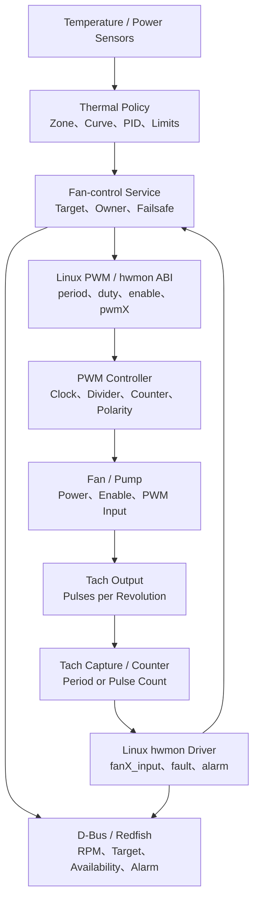
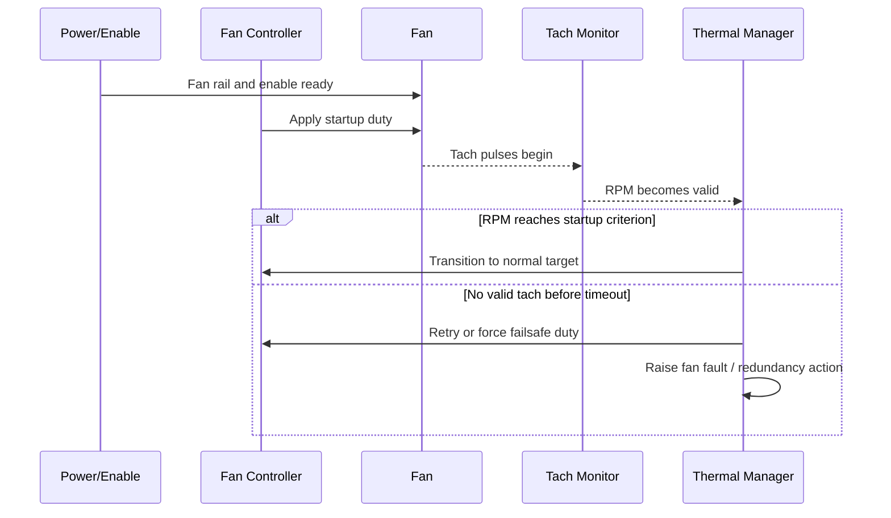
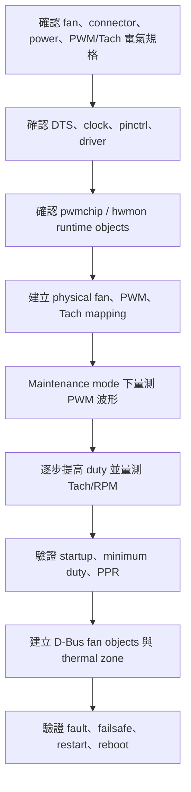

# 10. PWM、Tach 與風扇控制

PWM（Pulse Width Modulation）以週期性波形的有效時間比例控制風扇、LED、加熱器或其他負載；Tachometer（Tach）則以脈衝頻率回報旋轉元件的速度。在 OpenBMC 平台中，PWM 與 Tach 最常共同構成風扇控制與監控迴路，但兩者本身不是訊息交換型協定，而是波形產生、邊緣擷取、計數與 timer/counter 類型的硬體介面。

本章由電氣介面、PWM 波形、Tach 脈衝、Linux PWM/hwmon、OpenBMC fan-control、thermal policy、故障復原與驗收建立完整資料鏈。重點不只是「能寫 duty、能讀 RPM」，而是確保控制權唯一、換算正確、失效時進入安全狀態，並能追溯到實體風扇與散熱區域。

## 10.1 系統分層與責任



> **分層原則**：PWM controller 只保證產生指定波形，Tach controller 只量測輸入脈衝。風扇是否啟動、指定 duty 應對應多少 RPM、何時判定失速，以及故障後要全速、降載或關機，都是平台 policy 與系統整合責任。

### 10.1.1 參與者與角色

| 角色 | 主要責任 |
|---|---|
| Thermal sensors | 提供 CPU、DIMM、VR、GPU、inlet、outlet 等溫度或功率資料 |
| Thermal policy | 定義 zone、風扇曲線、PID、上下限、hysteresis 與降載策略 |
| Fan-control service | 計算 target、取得控制權、寫入 PWM、監看 Tach 並執行 fail-safe |
| PWM controller | 依 clock、period、duty、polarity 與 enable 產生輸出波形 |
| Fan power/enable path | 提供風扇電源、load switch、hot-swap 與 enable/reset 控制 |
| Fan | 將 PWM 命令轉成機械轉速與氣流 |
| Tach source | 每一轉輸出固定數量的 pulses-per-revolution（PPR） |
| Tach capture/controller | 計數固定時間內的脈衝，或量測相鄰邊緣間隔 |
| Linux driver | 將 PWM、RPM、fault、alarm 與 capability 暴露給 kernel/userspace |
| OpenBMC D-Bus services | 建立 RPM sensor、target、inventory、presence、fault 與 association |
| CPLD/EC/BMC watchdog | 在 software 失效、BMC reset 或 bus hang 時提供硬體 fail-safe |
| Validation equipment | 以示波器、頻率計、光學轉速計、風洞或熱負載驗證 |

## 10.2 PWM 波形與控制模型

### 10.2.1 基本參數

PWM 波形由以下參數定義：

- **Period**：一個完整週期的時間。
- **Frequency**：`1 / Period`。
- **Duty cycle**：active time 占 period 的比例。
- **Polarity**：active-high 或 active-low。
- **Enable**：PWM generator 是否輸出波形。
- **Idle state**：停用時輸出保持 high、low 或 high-impedance，依硬體而定。
- **Resolution**：counter 可表示的 period/duty 步階。

一般 duty 計算：

```text
DutyPercent = ActiveTime / Period x 100%
```

若 hwmon ABI 使用 `0` 至 `255`：

```text
DutyPercent = pwmX / 255 x 100%
pwmX = round(DutyPercent x 255 / 100)
```

平台可能使用其他範圍，或透過 lookup table 將命令映射成實際 duty。正式實作必須以 driver ABI 與 target image 實測為準。

### 10.2.2 Frequency、resolution 與 clock divider

典型 PWM controller 使用來源 clock、prescaler 與 period counter 產生波形：

```text
PWM frequency = SourceClock / (Prescaler x PeriodCounts)
Duty ratio    = DutyCounts / PeriodCounts
```

較高頻率通常會降低可用 duty resolution；較低頻率可能產生可聽噪音、風扇控制不穩或不符合風扇規格。需同時確認：

- clock source 與實際頻率；
- prescaler/divider 的整數限制；
- period register 位元數；
- duty register 是否允許真正的 0% 與 100%；
- clock rate 變更是否影響現有 PWM；
- suspend/resume 或 BMC reset 時輸出狀態。

### 10.2.3 Polarity 與 4-wire fan 控制

常見 4-wire fan 的 PWM input 與 Tach output 具有特定電氣要求，例如 open-drain/open-collector、外部 pull-up、邏輯電壓與建議頻率。平台設計不得只根據訊號名稱判斷 active polarity。

Polarity 設錯可能造成：

- 低命令變成高轉速；
- 100% duty 變成停止或最低轉速；
- 波形看似存在，但 active time 與風扇定義相反；
- BMC reset 時 idle level 導致風扇降速。

Bring-up 必須以示波器同時確認頻率、振幅、duty、polarity 與停用狀態。

### 10.2.4 Duty 與 RPM 並非線性關係

風扇的 duty-to-RPM 關係受供電電壓、負載、背壓、溫度、軸承、風扇 revision 與控制器韌體影響。常見特性包括：

- 低於 minimum running duty 時失速；
- 從停止啟動所需 duty 高於持續運轉的最低 duty；
- 高 duty 區域接近轉速飽和；
- 相同 duty 在不同風阻下得到不同 RPM；
- 不同風扇個體有允許公差。

因此不能用單一線性公式假設 `50% duty = 50% rated RPM`。

## 10.3 Tach 脈衝與 RPM 換算

### 10.3.1 Pulses per revolution

若風扇每轉輸出 `PPR` 個完整脈衝，固定時間窗內計數為 `PulseCount`：

```text
RPM = PulseCount x 60 / (SampleWindowSeconds x PPR)
```

若量測相鄰等價邊緣的週期 `Tpulse`：

```text
RPM = 60 / (Tpulse x PPR)
```

若 controller 對 rising 與 falling edge 都計數，實際 edge count 與 datasheet 的 pulse 定義可能相差 2 倍。實務上常見 RPM 正好差 `2x` 或 `0.5x`，通常與 PPR 或 edge selection 有關。

### 10.3.2 Count-window 與 period-capture

| 方法 | 優點 | 限制 |
|---|---|---|
| 固定時間窗計數 | 硬體簡單，高速時穩定 | 低速時解析度差，更新延遲受 window 影響 |
| 量測脈衝週期 | 低速解析度較佳 | 高速需要足夠 counter clock，缺脈衝需 timeout |
| 多週期平均 | 抑制 jitter | 增加响应延遲，可能掩蓋快速失速 |

風扇控制 loop 與 fault detector 可使用不同濾波：控制迴路需要平滑 RPM，安全監控則需要在規定時間內偵測失速。

### 10.3.3 Counter overflow、underflow 與 timeout

換算需處理：

- counter overflow 或 wrap；
- 過低 RPM 導致 measurement timeout；
- 過高 RPM 導致 period count 太小；
- input glitch 產生不合理高 RPM；
- fan 停止時沒有新 edge；
- clock rate 與 divider 變更；
- register 中的 valid、overflow 或 timeout bit。

Driver 不應將所有 invalid capture 都無條件表示為 `0 RPM`。若硬體能區分 no-pulse、overflow 與 read error，應保留對應 fault context。

### 10.3.4 PPR 驗證

PPR 應由 fan datasheet、BOM part number 與實測共同確認。替代料或不同 revision 可能具有不同 Tach 定義。驗證方法：

1. 固定 PWM duty；
2. 使用示波器或頻率計量測 Tach frequency；
3. 使用光學轉速計取得機械 RPM；
4. 由 `PPR = TachFrequency x 60 / RPM` 反推；
5. 在多個 RPM 點重複驗證。

## 10.4 Linux PWM 與 hwmon 架構

```text
+----------------------------------------------------------------+
| OpenBMC fan-control / fan-monitor / manual test                 |
+---------------------------+------------------------------------+
| PWM framework sysfs/API   | hwmon ABI                          |
| period, duty_cycle, enable| pwmX, pwmX_enable, fanX_input      |
+---------------------------+------------------------------------+
| Linux PWM Core            | hwmon Core                         |
+---------------------------+------------------------------------+
| PWM controller driver     | Tach / fan controller driver      |
+---------------------------+------------------------------------+
| Clock, pinctrl, MMIO, I2C, SPI, regmap                         |
+----------------------------------------------------------------+
| PWM output, fan power, Tach input and physical fan              |
+----------------------------------------------------------------+
```

### 10.4.1 PWM framework

PWM controller 可能出現在：

```text
/sys/class/pwm/pwmchipX/
```

依 kernel 與 driver 版本，可能包含：

```text
npwm
export
unexport
pwmY/period
pwmY/duty_cycle
pwmY/polarity
pwmY/enable
```

`pwmchipX` 與 `pwmY` 的 runtime 編號不一定是穩定硬體身份。production mapping 應結合 Device Tree、controller parent path、channel index 與平台設定。

> **控制權警告**：若 PWM 已由 kernel consumer 或 fan daemon claim，直接透過 legacy sysfs export 可能失敗，或與 production service 競爭。測試應使用產品定義的 manual/maintenance mode，而不是強制搶占。

### 10.4.2 hwmon ABI

PWM 與 Tach 常透過 `/sys/class/hwmon/hwmonX/` 暴露：

```text
name
pwm1
pwm1_enable
pwm1_freq
fan1_input
fan1_min
fan1_max
fan1_alarm
fan1_fault
fan1_label
```

不同 driver 只實作其中一部分。常見語意：

- `pwmX`：PWM 命令，常見範圍 `0..255`；
- `pwmX_enable`：控制模式，數值定義依 driver ABI；
- `fanX_input`：目前 RPM；
- `fanX_min/max`：RPM threshold；
- `fanX_alarm/fault`：硬體或 driver 判定的異常。

不得假設所有 driver 的 `pwmX_enable=1` 都代表相同模式。正式文件需記錄 target driver 的實際 ABI。

### 10.4.3 Stable identity 與 mapping

`hwmonX` 會因 probe order 改變。OpenBMC service 不應只 hardcode `/sys/class/hwmon/hwmon0/pwm1`。應使用：

- `name`；
- `fanX_label`；
- parent device path；
- Device Tree `of_node`；
- udev symlink；
- platform/entity configuration；
- inventory association。

### 10.4.4 Kernel source tree 與 configuration

典型程式碼位置：

```text
linux/
├── drivers/pwm/             # PWM controller drivers
├── drivers/hwmon/           # Tach, fan controller and hwmon drivers
├── drivers/counter/         # Generic counter framework, if used
├── include/linux/pwm.h
├── include/linux/hwmon.h
└── Documentation/hwmon/
```

常見 kernel configuration 概念：

```text
CONFIG_PWM=y
CONFIG_PWM_SYSFS=y           # 若測試或產品需要 legacy sysfs
CONFIG_HWMON=y
CONFIG_<SOC_PWM_DRIVER>=y or m
CONFIG_<FAN_TACH_DRIVER>=y or m
CONFIG_COUNTER=y             # 若 tach driver 使用 counter framework
```

同時確認 clock、reset、pinctrl、GPIO、I2C/SPI controller 與 regulator/load-switch driver。

## 10.5 Device Tree、schematic 與 runtime mapping

應建立以下可追溯鏈：

```text
Thermal zone / physical fan location
        ↓
Fan connector、power rail、enable、PWM net、Tach net
        ↓
SoC/CPLD PWM channel and Tach input channel
        ↓
Device Tree controller、clock、pinctrl、consumer mapping
        ↓
Linux pwmchip/hwmon parent device
        ↓
PWM and fan attributes
        ↓
OpenBMC fan inventory、RPM sensor and target
        ↓
Thermal zone and redundancy policy
```

### 10.5.1 Static topology 與 runtime state

| 類別 | 內容 | 典型來源 |
|---|---|---|
| Physical topology | fan tray、connector、rotor、zone、airflow direction | mechanical drawing、schematic |
| Electrical topology | fan power、enable、PWM、Tach、pull-up、mux | schematic、BOM |
| Controller mapping | PWM channel、Tach channel、clock、polarity | SoC TRM、CPLD spec、DTS |
| Runtime objects | pwmchip、hwmon、fan input、alarm | sysfs、kernel log |
| Management mapping | inventory、target、RPM、presence、fault | OpenBMC config、D-Bus |
| Thermal policy | curve、PID、zone、redundancy、failsafe | product thermal specification |

### 10.5.2 Device Tree 檢查清單

```text
PWM/Tach Device Tree checklist
[ ] controller node path and compatible
[ ] status = "okay"
[ ] clock and reset configuration
[ ] pinctrl function and electrical configuration
[ ] PWM channel index
[ ] PWM period/frequency requirement
[ ] PWM polarity
[ ] Tach channel index and edge selection
[ ] Tach clock, divider and measurement mode
[ ] fan power-enable GPIO or regulator
[ ] presence input, if available
[ ] consumer phandle/channel mapping
[ ] shared pins or alternate functions do not conflict
[ ] safe boot/reset output state
```

不同 SoC、CPLD 與 fan controller 的 binding 不同，正式專案文件應貼入 target DTS fragment，不能直接套用通用範本。

### 10.5.3 Runtime mapping 命令

```sh
# PWM controllers
for d in /sys/class/pwm/pwmchip*; do
    [ -e "$d" ] || continue
    echo "=== $d ==="
    cat "$d/npwm" 2>/dev/null || true
    readlink -f "$d/device" 2>/dev/null || true
done

# hwmon devices and parent paths
for d in /sys/class/hwmon/hwmon*; do
    [ -e "$d" ] || continue
    echo "=== $d ==="
    cat "$d/name" 2>/dev/null || true
    readlink -f "$d/device" 2>/dev/null || true
done

# Read-only inventory of relevant attributes
find /sys/class/hwmon -maxdepth 2 -type f | \
    grep -E '/(name|fan[0-9]+_(input|min|max|alarm|fault|label)|pwm[0-9]+(_enable|_freq)?)$' | sort
```

建議維護專案 mapping table：

| Physical fan | Connector | PWM channel | Tach channel | hwmon label | Inventory path | Thermal zone |
|---|---|---:|---:|---|---|---|
| Fan 0 | 待填 | 待填 | 待填 | 待填 | 待填 | 待填 |
| Fan 1 | 待填 | 待填 | 待填 | 待填 | 待填 | 待填 |

## 10.6 OpenBMC fan object 與控制權

### 10.6.1 建議資料模型

```text
Fan object mandatory fields
Identity:
  FanName
  PhysicalSlot
  Connector
  InventoryAssociation
  PartNumberOrSupportedModels
Hardware:
  PWMController
  PWMChannel
  PWMFrequency
  PWMPolarity
  TachController
  TachChannel
  PulsesPerRevolution
  PresenceSource
  PowerEnableSource
Runtime:
  CommandedDuty
  EffectiveDuty
  TargetRPM
  ActualRPM
  Presence
  Availability
  Functional
  LastTachTimestamp
  LastFailureReason
Policy:
  Owner
  ControlMode
  MinimumRunningDuty
  StartupDuty
  StartupTime
  MaximumDuty
  MinimumExpectedRPM
  StallTimeout
  FaultDebounce
  ThermalZone
  RedundancyGroup
  FailsafeAction
```

### 10.6.2 控制權模型

同一 PWM channel 在任一時間只能有一個 authoritative owner。常見 owner：

- automatic thermal-control service；
- maintenance/manual test mode；
- firmware update or manufacturing test；
- CPLD/EC hardware failsafe；
- bootloader or early-boot initialization。

建議狀態機：

```text
Uninitialized
    ↓ hardware and mapping ready
AutomaticControl
    ↓ authorized maintenance request
ManualMaintenance
    ↓ timeout, operator release or service exit
AutomaticControl
    ↓ sensor loss, service crash or watchdog expiry
FailsafeFullSpeed
    ↓ required inputs and controller recover
RecoveryValidation
    ↓ stability window passes
AutomaticControl
```

Manual mode 必須具備：

- 身分與權限檢查；
- 明確 lease/timeout；
- duty 上下限；
- audit log；
- service exit 時恢復策略；
- 過溫或 critical fault 可以強制覆蓋 manual command。

### 10.6.3 Command、target 與 actual 分離

應分開保存：

- **Commanded duty**：policy 要求的 duty；
- **Effective duty**：實際寫入硬體的 duty，經過 clamp、slew-rate 或 fallback；
- **Target RPM**：若為 closed-loop control，期望轉速；
- **Actual RPM**：Tach 回報值；
- **Control mode**：automatic、manual、failsafe、hardware-owned；
- **Owner**：目前誰可寫 PWM。

只記錄 `pwm=255` 無法證明風扇真的全速。必須同時檢查 Tach、presence、power 與 fault。

## 10.7 啟動、閉迴路控制與 thermal policy

### 10.7.1 風扇啟動流程



啟動期間不應立即套用正常 stall threshold。需定義：

- fan rail stable delay；
- startup duty；
- startup kick duration；
- Tach valid delay；
- startup RPM criterion；
- retry 次數與 cooldown；
- 最終 fail-safe action。

### 10.7.2 Open-loop 與 closed-loop

**Open-loop duty control**：thermal policy 直接決定 duty，架構簡單，但風扇差異、背壓與老化會造成 RPM 不一致。

**Closed-loop RPM control**：controller 比較 target RPM 與 actual RPM，使用 PI/PID 或分段調節。需處理：

- integrator windup；
- duty clamp；
- startup region；
- stall region；
- Tach noise 與 filtering；
- control-loop period；
- fan deadband；
- target step 的 slew-rate；
- missing Tach 時停止閉迴路並切換 fail-safe。

### 10.7.3 Thermal zone 與多風扇系統

一個 thermal zone 可能受多個 sensor 與多個 fan 影響。Zone policy 至少需定義：

- input sensors 與權重；
- setpoint 或 fan curve；
- output fans；
- fan minimum/maximum；
- sensor missing policy；
- fan missing/fault policy；
- redundancy group；
- degraded mode；
- critical shutdown 或 host throttle 介面。

Service active 不代表 thermal control ready。合格 readiness 應同時確認：

```text
THERMAL_READY is true only if:
  required sensors are present and fresh
  fan inventory and PWM/Tach mapping are valid
  PWM owner is established
  fan power is ready
  required Tach inputs are valid or within startup grace period
  policy configuration is loaded and validated
  hardware/software failsafe path is armed
```

### 10.7.4 Failsafe 原則

故障時的安全動作由產品熱設計決定，常見策略：

| 狀況 | 建議 policy 方向 |
|---|---|
| 單一溫度 sensor unavailable | 使用冗餘 sensor、提高 zone duty 或進入 degraded mode |
| Fan-control service crash | watchdog/CPLD 接手並將風扇設為安全 duty |
| 單一 fan stall | 其餘風扇補償、記錄 fault、必要時降載 |
| 多顆 fan fault | 全速、host throttle、graceful shutdown 或硬體保護 |
| Tach 全部 unavailable | 不可假設風扇正常，通常進入保守 fail-safe |
| PWM write failure | 驗證實際輸出與硬體 watchdog，必要時觸發平台保護 |

「全速」常是保守策略，但不一定適用所有負載。泵浦、機械限制、聲學要求或風道設計可能需要不同安全狀態，應由產品 safety/thermal analysis 決定。

## 10.8 效能、濾波與資源設計

PWM/Tach polling 與 control loop 需平衡反應速度、穩定性與系統負載：

- 過短 Tach window 使低速 RPM 量化抖動；
- 過長 window 延遲 stall detection；
- D-Bus 更新頻率不必等於硬體 sample rate；
- 相同 RPM 不應每次小變動都產生 event；
- fan curve 切換需要 hysteresis；
- PWM target 變化可加入 slew-rate，避免聲學跳變與控制震盪；
- 失速保護不可因平均濾波過重而延遲；
- I2C fan controller 與其他裝置共用 bus 時要限制 transaction rate；
- retry 必須有上限與 backoff，不能因 Tach missing 形成 busy loop。

## 10.9 Bring-up 流程



### 10.9.1 Pre-check

```text
[ ] Fan part number, revision and rated voltage recorded
[ ] PWM voltage, polarity and recommended frequency confirmed
[ ] Tach electrical type, pull-up voltage and PPR confirmed
[ ] Fan rail and enable path confirmed
[ ] Fan can be safely operated over the planned duty range
[ ] Thermal load and shutdown protection are available
[ ] Production fan daemon can enter authorized maintenance mode
[ ] Oscilloscope and optical tachometer are available
[ ] Test image, kernel, DTS and configuration revisions are recorded
```

### 10.9.2 基本檢查命令

```sh
dmesg -T | grep -Ei 'pwm|tach|fan|hwmon|clock|reset|pinctrl|probe|timeout'

find /sys/class/pwm -maxdepth 4 -type f 2>/dev/null | sort

find /sys/class/hwmon -maxdepth 2 -type f | \
    grep -E '/(name|fan[0-9]+_(input|min|max|alarm|fault|label)|pwm[0-9]+(_enable|_freq)?)$' | sort

systemctl --type=service --state=running | grep -Ei 'fan|thermal|sensor'
journalctl -b --no-pager | grep -Ei 'fan|tach|pwm|thermal|stall|failsafe'
```

### 10.9.3 安全手動測試流程

1. 確認 host/thermal load 處於可控狀態。
2. 依產品流程進入 maintenance/manual mode。
3. 保存原 owner、mode、duty、target 與 RPM。
4. 設定安全 startup duty，而不是直接從低 duty 啟動。
5. 以示波器確認 PWM frequency、polarity、voltage 與 duty。
6. 確認風扇開始旋轉並取得有效 Tach。
7. 逐步測試多個 duty 點，保留 settling time。
8. 使用光學轉速計比對 hwmon/D-Bus RPM。
9. 測試 minimum running duty 與 startup duty，避免長時間 stall。
10. 結束後釋放 manual lease，確認 automatic policy 重新取得控制權。
11. 驗證原本 thermal target、RPM 與 alarm 狀態恢復。

> 不建議直接 `echo` 覆寫 production PWM attribute。若 daemon 仍在執行，命令可能立即被覆蓋，或形成兩個 owner 互相搶寫。

## 10.10 Test Case：Duty、RPM、啟動與失速

### 10.10.1 測試目的

- 驗證 PWM frequency、polarity 與 duty accuracy；
- 驗證 duty command 到實際波形的 mapping；
- 驗證 Tach PPR 與 RPM 換算；
- 找出 startup duty、minimum running duty 與 usable range；
- 驗證 D-Bus target、actual、presence、fault 與 availability；
- 驗證 stall、disconnect、service crash 與 fail-safe。

### 10.10.2 Duty sweep

建議測試點依 fan 安全工作範圍設定，例如：

```text
Startup duty
Minimum validated running duty
40%
60%
80%
100% or platform maximum
```

每一點需等待預先定義的 settling time，並記錄：

| Point | Command | Measured duty | Frequency | Tach Hz | PPR | hwmon RPM | Optical RPM | Error | Result |
|---:|---:|---:|---:|---:|---:|---:|---:|---:|---|
| 1 | 待填 | 待填 | 待填 | 待填 | 待填 | 待填 | 待填 | 待填 | PASS/FAIL |
| 2 | 待填 | 待填 | 待填 | 待填 | 待填 | 待填 | 待填 | 待填 | PASS/FAIL |

### 10.10.3 Startup test

```text
For each required power state and temperature condition:
1. Stop or power-cycle fan according to safe test plan.
2. Apply configured startup duty.
3. Measure time to first valid Tach.
4. Measure time to startup RPM criterion.
5. Transition to normal target.
6. Repeat for the required number of cycles.
7. Record failures, retries and current/voltage anomalies.
```

Startup 測試應覆蓋最低允許供電、預期高背壓與老化 margin，不能只在開放桌面環境測試。

### 10.10.4 Stall/fault test

若產品安全規範允許，可使用受控方式模擬 Tach disconnect、fan removal 或 fan fault。禁止以手直接阻擋旋轉葉片。測試需確認：

- fault 在規定時間內出現；
- startup grace 不會誤報；
- fault debounce 不會延遲過久；
- 其餘風扇或 zone duty 依 policy 補償；
- Redfish/event log 含 fan identity、slot、RPM、duty 與時間；
- 風扇恢復後需經 stability window 才清除 fault；
- 若 policy 要求，host throttle 或 shutdown 正常執行。

### 10.10.5 驗收條件

- PWM 波形符合 fan/controller 規格；
- command 與實測 duty 誤差符合 budget；
- RPM 與校正轉速計誤差符合 budget；
- 所有 physical fan、PWM 與 Tach mapping 正確；
- startup 在規定條件與時間內成功；
- minimum duty 不造成持續 stall；
- fan fault 與 recovery 行為符合 thermal policy；
- manual mode 有 timeout 並能回到 automatic control；
- service restart、BMC reboot 與 power cycle 後 owner/mapping 正確；
- journal 與 dmesg 無非預期錯誤。

## 10.11 Failure and Recovery

故障處理應保存波形、RPM、owner、mode、power state、thermal state 與 log，再進行局部 recovery。不要先重啟 BMC，以免清除控制權競爭或 transient fault 的證據。

### 10.11.1 PWM 寫入成功但風扇不轉

**可能原因**：fan power/enable 未建立、PWM pinmux 錯誤、polarity 錯誤、duty 低於 startup requirement、風扇未插入、connector mapping 錯誤、風扇故障。

**Triage**：

1. 檢查 presence、fan rail 與 enable。
2. 以示波器直接量 fan connector 的 PWM pin。
3. 確認 frequency、voltage、polarity、duty。
4. 套用已驗證的 startup duty。
5. 檢查風扇是否有機械阻塞或 part mismatch。
6. 確認 PWM channel 對應到正確 connector。

**Acceptance**：風扇可重複啟動；Tach 在 timeout 內成立；無過流或異常噪音。

### 10.11.2 Fan 旋轉但 RPM 為 0

**可能原因**：Tach pull-up 缺失、pinmux/edge 設定錯誤、Tach channel swap、PPR/timeout 設定錯誤、input level 不相容、driver capture 未啟動。

```sh
cat /sys/class/hwmon/hwmonX/name
cat /sys/class/hwmon/hwmonX/fanY_input
cat /sys/class/hwmon/hwmonX/fanY_fault 2>/dev/null || true
dmesg -T | grep -Ei 'tach|fan|capture|counter|timeout|overflow'
```

以示波器在 SoC/CPLD input 端確認脈衝，而不只在 fan connector 端量測。

### 10.11.3 RPM 固定差 2 倍或比例錯誤

優先檢查：

- PPR；
- rising-only、falling-only 或 both-edge counting；
- Tach clock/divider；
- sample window；
- register prescaler；
- unit 是否已是 RPM；
- fan 替代料是否使用不同 PPR。

**Acceptance**：多個 duty 點與光學轉速計比對均符合 tolerance，不只修正單一點。

### 10.11.4 PWM command 被立即覆蓋

**原因**：automatic fan daemon 仍擁有控制權、hardware auto mode 啟用、另一個 service 週期性寫入，或 watchdog 觸發 fail-safe。

**Recovery**：

1. 保存目前 owner、mode 與 service log。
2. 使用產品定義 API 進入 maintenance mode。
3. 禁止直接 kill 多個 thermal service 造成無 owner 狀態。
4. 測試完成後釋放 lease。
5. 確認 automatic owner 恢復且 target 正常。

### 10.11.5 Tach RPM 跳動或瞬間過高

**可能原因**：open-collector pull-up 不適當、EMI/glitch、ground bounce、edge filter 不足、sample window 太短、counter wrap、fan connector 接觸不良。

**Triage**：比較原始 Tach 波形、hardware count 與 hwmon RPM，檢查 pulse width、double edge、雜訊與不合理短週期。不可只增加 userspace averaging 掩蓋電氣問題。

### 10.11.6 False stall during startup

**原因**：未設定 startup grace、window 尚未累積足夠脈衝、低溫或背壓使 spin-up 變慢、startup duty 不足。

**Recovery**：依測試數據調整 startup duty、grace period 與判定條件，但需保留 stall detection 的最大安全時間。

### 10.11.7 Fan stall while PWM is nonzero

**處置**：

1. 將該 fan 標示 fault/unavailable。
2. 依 policy 提高同 zone 其他風扇。
3. 記錄 duty、target、RPM、presence、power 與 sensor context。
4. 可依規範執行有限次高 duty restart attempt。
5. retry 失敗後停止反覆啟動並進入 degraded/failsafe。
6. 必要時通知 host throttle 或 shutdown。

### 10.11.8 hwmon 或 pwmchip index 改變

**現象**：reboot 或 image update 後控制錯誤風扇，或 sensor path 消失。

**根因**：以 runtime index 作固定 identity。應改用 name、label、parent path、Device Tree 與 inventory mapping。Acceptance 必須包含多次 reboot 與不同 probe order 的驗證。

### 10.11.9 Service crash 或控制權遺失

**必要行為**：

- hardware watchdog/CPLD 在期限內設定安全 duty；
- D-Bus control mode 反映 failsafe；
- restart 後先驗證 sensor、mapping 與 owner，再接回 automatic control；
- 不可立即使用 stale integrator 或舊 target；
- audit log 記錄 crash、failsafe 進入/退出與恢復結果。

### 10.11.10 Fan removal 或 hot-swap

應處理：

- presence change 與 Tach loss 的關聯；
- 拔除時避免將 noise 誤判為 overspeed；
- 插入後重新確認 part/FRU、PPR 與 capability；
- 使用 startup sequence，而非直接套用正常低 duty；
- inventory、RPM sensor 與 fault object 不重複；
- redundancy policy 動態更新。

## 10.12 Debug Toolchain

### 10.12.1 PWM topology

回答問題：PWM controller 是否存在、channel 數與 parent path 是否正確？

```sh
for d in /sys/class/pwm/pwmchip*; do
    [ -e "$d" ] || continue
    echo "=== $d ==="
    printf 'npwm='; cat "$d/npwm" 2>/dev/null || true
    printf 'device='; readlink -f "$d/device" 2>/dev/null || true
    printf 'driver='; readlink -f "$d/device/driver" 2>/dev/null || true
done
```

### 10.12.2 hwmon mapping

回答問題：哪個 hwmon device 提供哪一個 fan/PWM attribute？

```sh
for d in /sys/class/hwmon/hwmon*; do
    [ -e "$d" ] || continue
    echo "=== $d ==="
    printf 'name='; cat "$d/name" 2>/dev/null || true
    printf 'device='; readlink -f "$d/device" 2>/dev/null || true
    for f in "$d"/fan*_label "$d"/fan*_input "$d"/fan*_fault "$d"/pwm*; do
        [ -f "$f" ] || continue
        case "$f" in
            *_enable) continue ;;
        esac
        printf '%s=' "$(basename "$f")"
        cat "$f" 2>/dev/null || true
    done
done
```

注意：批次讀取前需確認 attribute 為 read-only。Production debug 工具不應無差別寫入 `pwmX` 或 `pwmX_enable`。

### 10.12.3 Kernel log、trace 與 dynamic debug

```sh
dmesg -T | grep -Ei 'pwm|tach|fan|hwmon|counter|clock|reset|timeout|overflow'

find /sys/kernel/tracing/events -maxdepth 2 -type d \
    \( -iname '*pwm*' -o -iname '*hwmon*' -o -iname '*counter*' \) -print 2>/dev/null

cat /sys/kernel/tracing/available_events 2>/dev/null | \
    grep -Ei 'pwm|tach|fan|counter|gpio|i2c'

grep -Ei 'drivers/(pwm|hwmon|counter)' \
    /sys/kernel/debug/dynamic_debug/control 2>/dev/null
```

Tracepoint 與 debug entry 依 kernel branch 不同，正式指南應保存 target 實際輸出。

### 10.12.4 OpenBMC service 與 D-Bus

```sh
systemctl --type=service --all | grep -Ei 'fan|thermal|sensor'

journalctl -b --no-pager | \
    grep -Ei 'fan|thermal|pwm|tach|stall|failsafe|target|owner'

busctl tree xyz.openbmc_project.FanControl 2>/dev/null || true
busctl tree xyz.openbmc_project.FanSensor 2>/dev/null || true
busctl tree xyz.openbmc_project.SensorService 2>/dev/null || true
```

Service 與 bus name 依專案實作而異，需替換成 target 實際名稱。判斷 readiness 時要同時查看 owner、policy、sensor freshness、RPM 與 failsafe，而非只看 service active。

### 10.12.5 外部儀器

| 工具 | 回答的問題 |
|---|---|
| Oscilloscope | PWM frequency/duty/polarity/voltage，Tach pulse width、noise 與 missing pulse |
| Frequency counter | Tach frequency 與 PWM frequency 是否準確 |
| Optical tachometer | hwmon/D-Bus RPM 是否正確 |
| Current probe or power analyzer | startup current、stall current 與供電是否穩定 |
| Thermal chamber/load | 最差溫度、背壓與熱負載下是否可啟動及散熱 |
| Logic analyzer | 外接 I2C/SPI fan controller register transaction |

### 10.12.6 Debug bundle

```sh
out=/tmp/fan_debug
mkdir -p "$out"

date -Ins > "$out/timestamp.txt"
uname -a > "$out/uname.txt"
dmesg -T > "$out/dmesg.txt"
find /sys/class/pwm -maxdepth 4 -type f 2>/dev/null | sort > "$out/pwm_files.txt"
find /sys/class/hwmon -maxdepth 2 -type f | sort > "$out/hwmon_files.txt"

for d in /sys/class/pwm/pwmchip*; do
    [ -e "$d" ] || continue
    n=$(basename "$d")
    {
        echo "path=$d"
        printf 'npwm='; cat "$d/npwm" 2>/dev/null || true
        printf 'device='; readlink -f "$d/device" 2>/dev/null || true
        printf 'driver='; readlink -f "$d/device/driver" 2>/dev/null || true
    } > "$out/${n}_identity.txt"
done

for d in /sys/class/hwmon/hwmon*; do
    [ -e "$d" ] || continue
    n=$(basename "$d")
    {
        echo "path=$d"
        printf 'name='; cat "$d/name" 2>/dev/null || true
        printf 'device='; readlink -f "$d/device" 2>/dev/null || true
    } > "$out/${n}_identity.txt"
done

journalctl -b --no-pager | \
    grep -Ei 'fan|thermal|pwm|tach|stall|failsafe|hwmon|counter' \
    > "$out/journal_filtered.txt"
```

Duty、RPM、target、owner 與 mode 應透過 target 專用的 read-only collection API 補充。不要讓 debug bundle 在未授權狀態下改變 PWM。

## 10.13 安全性與防禦

PWM 直接影響散熱能力，錯誤控制可能造成過熱、硬體降頻、資料損壞或永久損害。至少需具備：

1. **Single owner**：同一 PWM channel 只能有一個 authoritative owner。
2. **Authorized override**：manual mode 需權限、lease、timeout 與 audit。
3. **Bounded command**：驗證 duty、frequency、target RPM 與 slew-rate 範圍。
4. **Sensor freshness**：temperature 或 Tach stale 時不可沿用無限期舊值。
5. **Independent failsafe**：service crash、BMC hang 或 watchdog expiry 時由硬體或獨立邏輯提供安全 duty。
6. **Thermal escalation**：風扇不足時需支援補償、降載與關機，而非只記錄事件。
7. **Configuration integrity**：PPR、mapping、minimum duty、curve、PID 與 failsafe config 需有版本與完整性保護。
8. **Safe update**：更新 fan-control policy 前需驗證 schema、range 與 rollback。
9. **Physical safety**：不可用手阻擋葉片測試 stall；hot-swap 與高速風扇需遵守機構安全程序。
10. **Information protection**：高頻 thermal telemetry 與控制狀態的存取權限應符合產品威脅模型。

## 10.14 Test Environment 與證據

```text
Test Environment
Board:
Board revision:
BMC SoC / CPLD:
BMC image:
Kernel version:
Kernel config source:
Device Tree revision:
PWM driver:
Tach/hwmon driver:
Fan-control service and revision:
Thermal policy revision:
Fan manufacturer and part number:
Fan revision:
Rated voltage/current/RPM:
PWM recommended frequency and polarity:
Tach PPR:
Physical slot and connector:
PWM channel:
Tach channel:
Fan power/enable source:
Presence source:
Thermal zone:
Redundancy group:
Oscilloscope:
Optical tachometer:
Ambient temperature:
Host power/load state:
Airflow restriction or chassis condition:
```

### 10.14.1 Failure Evidence

```text
Fan Failure Evidence
Timestamp:
Power state:
Thermal/load state:
Physical fan/slot:
Part number:
Presence:
Fan power and enable:
PWM owner:
Control mode:
Commanded duty:
Effective duty:
Measured PWM frequency/duty/polarity:
Target RPM:
Actual hwmon RPM:
Optical RPM:
Tach frequency:
PPR:
Tach valid/fault/overflow state:
Temperature sensor values and freshness:
Thermal zone state:
Redundancy state:
Failsafe state:
Kernel log excerpt:
Fan-control log excerpt:
Event log:
Recovery action:
Recovery result:
```

### 10.14.2 Pass/Fail 定義

不能只用 `pwmX` 寫入成功或 `fanX_input` 非零作為通過。至少需確認：

- PWM 實體波形正確；
- physical fan、PWM、Tach、inventory 與 thermal zone mapping 正確；
- Tach PPR 與 RPM 換算正確；
- startup、minimum duty、maximum duty 與 operating range 已驗證；
- owner 與 manual lease 正確；
- stall、removal、sensor loss 與 service crash 會進入預期 fail-safe；
- fault/recovery event 可追溯；
- reboot、power cycle、service restart 與 hot-swap 後可恢復；
- config revision、儀器與原始測試資料完整；
- journal 與 dmesg 無新增非預期錯誤。

## 10.15 Bring-up 與驗收 Checklist

### 10.15.1 Hardware and Electrical

- [ ] Fan part number、revision、rated voltage/current/RPM 已確認。
- [ ] PWM frequency、voltage、polarity、drive type 已確認。
- [ ] Tach drive type、pull-up voltage、PPR 已確認。
- [ ] Fan power、enable、presence 與 hot-swap path 已確認。
- [ ] PWM/Tach pinmux 與 connector mapping 已確認。
- [ ] Startup current、stall current 與 power budget 已確認。
- [ ] BMC reset/boot 時 PWM idle state 安全。
- [ ] Hardware/CPLD failsafe 已驗證。

### 10.15.2 Kernel and Runtime Mapping

- [ ] Kernel config 啟用 PWM、hwmon 與 target drivers。
- [ ] Clock、reset、pinctrl、GPIO、I2C/SPI 正常。
- [ ] PWM/Tach driver probe 成功。
- [ ] pwmchip/hwmon parent path 與 DTS 相符。
- [ ] Production mapping 不依賴可變的 `pwmchipX`/`hwmonX` index。
- [ ] 所有 fan label、PWM channel、Tach channel 已逐一驗證。
- [ ] Frequency、counter divider、edge mode 與 timeout 已記錄。

### 10.15.3 Fan Characterization

- [ ] Duty command 與實測波形已多點驗證。
- [ ] PPR 與 RPM 已用外部轉速計驗證。
- [ ] Startup duty/time 已驗證。
- [ ] Minimum running duty 已驗證。
- [ ] Maximum duty/RPM 已驗證。
- [ ] Duty-to-RPM curve 已在 chassis/airflow 條件下量測。
- [ ] 低溫、高溫、低電壓與高背壓 margin 已確認。
- [ ] Fan tolerance 與替代料差異已納入 policy。

### 10.15.4 OpenBMC and Thermal Policy

- [ ] D-Bus inventory、RPM、target、presence、fault mapping 正確。
- [ ] 每個 PWM 只有一個 authoritative owner。
- [ ] Automatic/manual/failsafe mode 可明確辨識。
- [ ] Manual override 有權限、lease、timeout 與 audit。
- [ ] Sensor freshness、hysteresis、debounce 正確。
- [ ] Thermal zone input/output mapping 正確。
- [ ] Fan redundancy 與 degraded policy 正確。
- [ ] Closed-loop control 無持續震盪或 integrator windup，若適用。
- [ ] Critical thermal escalation 可觸發 throttle 或 shutdown。

### 10.15.5 Failure and Recovery

- [ ] PWM no-output、wrong polarity 與 channel swap 已測試。
- [ ] Fan spins but no Tach 已測試。
- [ ] PPR/edge 設錯造成倍率錯誤已可診斷。
- [ ] Startup false alarm 與真正 stall 已能區分。
- [ ] Fan removal/hot-swap 已測試，若平台支援。
- [ ] Tach glitch、timeout、overflow 已有處理。
- [ ] Fan-control service crash 會進入安全狀態。
- [ ] Temperature sensor loss 會進入產品定義的 degraded/failsafe。
- [ ] Service restart、BMC reboot、host power cycle 後控制權可重建。
- [ ] Debug bundle 與外部儀器流程已驗證。

## 10.16 本章重點

- PWM 是波形命令，Tach 是速度回授，兩者不代表風扇控制系統已完整就緒。
- Duty、frequency、polarity、idle state 與 electrical drive type 都必須符合風扇規格。
- Duty 與 RPM 通常不是線性關係；startup duty 也常高於 minimum running duty。
- Tach RPM 換算必須確認 PPR、edge selection、clock、sample window、timeout 與 counter range。
- `pwmchipX` 與 `hwmonX` index 不是穩定硬體身份，應以 parent path、label、Device Tree 與 inventory 建立 mapping。
- Commanded duty、effective duty、target RPM、actual RPM、mode 與 owner 必須分開表示。
- 同一 PWM channel 必須有唯一 owner；manual mode 需要授權、lease、timeout 與 audit。
- Service active 不等於 thermal ready。Readiness 必須同時涵蓋 sensor freshness、fan mapping、owner、Tach 與 fail-safe。
- Fan-control service crash、Tach loss 或 temperature sensor loss時，平台必須進入產品定義的安全狀態。
- Debug 應從 fan power、PWM 波形、Tach 波形、kernel mapping、RPM 換算、D-Bus object 與 thermal policy逐層收斂。
- 故障發生時先保存 owner、mode、duty、RPM、溫度、波形與 log，再執行局部 recovery。

## 10.17 本章參考資料

- Linux Kernel PWM subsystem documentation。
- Linux Kernel hwmon subsystem與 hwmon sysfs ABI documentation。
- Linux Kernel target PWM/Tach/fan-controller driver documentation。
- Target SoC technical reference manual 或 CPLD specification。
- Target Device Tree binding documentation。
- Fan manufacturer datasheet、application note與 qualification report。
- Platform schematic、BOM、mechanical drawing、airflow design與 power tree。
- OpenBMC fan-control、fan-monitor、sensor service及 platform configuration文件。
- 專案 thermal design specification、fan curve、PID tuning、redundancy與 fail-safe policy。
- 系統 thermal validation、acoustic validation與 production test plan。
