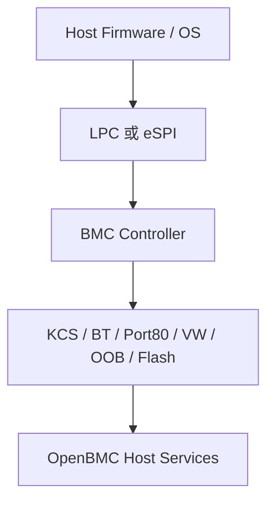

# 12. eSPI / LPC 與 Host Interface

## 12.1 eSPI / LPC 是什麼

LPC 是 Host chipset 與低速 peripheral之間的傳統同步匯流排；eSPI 是其後繼介面，以較少訊號承載 Peripheral、Virtual Wire、Out-of-Band與Flash channels。它們解決 Host 與 BMC / EC / Super I/O之間的低速控制、legacy I/O、reset / interrupt、管理通信與共享 flash需求。KCS、BT、Port 80與部分 mailbox是建立在這些通道上的功能，不等同於 eSPI本身。

### 定義與目的

LPC 是 Host chipset 與低速 peripheral之間的傳統同步匯流排；eSPI 是其後繼介面，以較少訊號承載 Peripheral、Virtual Wire、Out-of-Band與Flash channels。它們解決 Host 與 BMC / EC / Super I/O之間的低速控制、legacy I/O、reset / interrupt、管理通信與共享 flash需求。KCS、BT、Port 80與部分 mailbox是建立在這些通道上的功能，不等同於 eSPI本身。

### 參與者與角色

- Host / eSPI master：通常由 PCH控制 link與channel。
- BMC / eSPI slave：提供 peripheral decode、virtual wire、OOB或flash service。
- BIOS / Host driver：設定 decode、channel與KCS/IPMI使用。
- BMC kernel driver / service：處理KCS、POST code、OOB與flash事件。
- CPLD / security controller：可能控制 reset、strap、flash mux與write protect。

## 12.2 怎麼運作

### 資料格式與規則

LPC以frame、cycle type、address、data與LFRAME#時序進行transaction。eSPI以封包化channel傳輸，包含 cycle type、tag、length、payload與CRC；Virtual Wire以索引和狀態傳遞 sideband signals。KCS另定義 status、command/data register與狀態機；Port 80通常是Host firmware寫出的診斷code。

### 工作流程

1. Standby power、clock、reset與straps建立。
2. eSPI master與slave完成reset、capability與channel設定。
3. Virtual Wires傳遞 platform reset / sleep / warning states。
4. Peripheral channel提供KCS、Port 80或legacy I/O。
5. OOB channel交換管理messages；Flash channel依ownership讀寫shared flash。
6. BIOS與BMC service對齊channel readiness、timeout與recovery。

## 12.3 實務限制與潛在風險

### 相容性與版控

核對eSPI revision、channel capability、frequency、I/O mode、BIOS與BMC controller版本。

### 安全性與防禦

flash channel、host I/O decode與OOB messages都跨trust boundary；必須驗證權限、write protect與payload。

### 錯誤處理

處理CRC、timeout、unsupported cycle、channel reset與Host reset；不可在recovery時誤切flash ownership。

### 效能與資源

OOB與flash traffic共享link資源；大量POST或management traffic可能影響latency。

### 標準化與文件

eSPI有Intel公開規範，但SoC register、KCS channel與BIOS設定仍具平台差異。


eSPI / LPC 是 Host chipset 與 BMC 之間的 sideband path, 可承載:

- KCS / BT IPMI system interface.
- Port 80 POST code.
- Virtual Wire.
- Mailbox.
- Flash access.
- OOB management.

本節只建立整體位置; KCS / BT / SSIF 與 eSPI 的狀態機 / channels 與雙端排查由第 30 章說明.



這條路徑常依賴 RSMRST / PLTRST / PCH power 與 eSPI clock. BMC driver 正常不代表 Host side 已完成初始化.

Target:

```bash
$ dmesg | grep -Ei 'espi|lpc|kcs|bt|ipmi|port80|postcode'
$ ls -l /dev/ipmi* /dev/kcs* 2>/dev/null
$ systemctl --type=service | grep -Ei 'ipmi|postcode|host'
```

