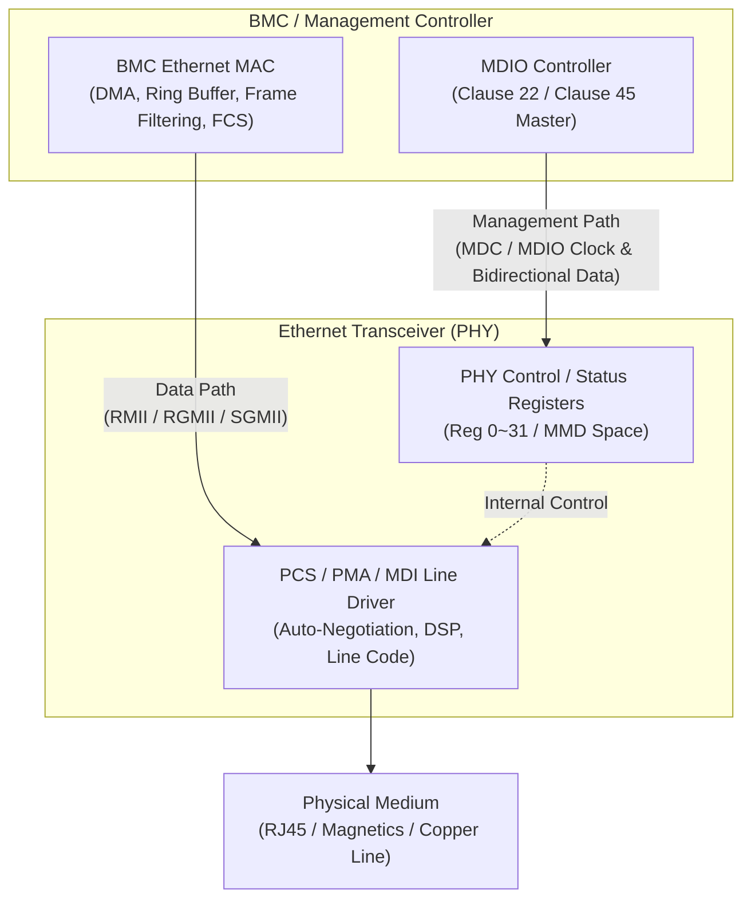

# 13. Ethernet MAC / PHY 與 MDIO 

在基於 BMC 或邊緣控制器的嵌入式系統中，網路通訊架構採用資料路徑（Data Path）與管理路徑（Management Path）的雙軌分離設計。
* 資料路徑由 Ethernet MAC 負責數據幀的封裝與 DMA 高速搬移，再經由 PHY 實體層晶片將數位訊號轉換為實體線路的類比訊號進行傳輸。
* 管理路徑則透過獨立的 MDIO 帶外（Out-of-band）介面，實現對 PHY 晶片即時狀態的配置與監控。


## 13.1 Ethernet / MDIO 架構與分工



### 13.1.1 參與者與角色分工

* **Ethernet MAC (Layer 2 - Data Link Layer)**：
    * 負責 Ethernet Frame 的封裝與解封裝（MAC Address、EtherType、Payload、FCS / CRC-32 檢測）。
    * 管理 DMA Ring Buffer（TX/RX Descriptors）、Interrupt Moderation、Frame Filtering 與 IEEE 1588 PTP 時鐘。
* **PHY / PCS / PMA (Layer 1 - Physical Layer)**：
    * **PCS (Physical Coding Sublayer)**：執行線路編碼（如 4B5B, 8b/10b, PAM-5）與 Auto-Negotiation（自適應協商）。
    * **PMA / PMD (Physical Medium Attachment / Dependent)**：執行 Serializer/Deserializer (SerDes)、時鐘與資料復原（CDR）、類比電訊號驅動與媒介轉換。
* **MDIO Controller (Management Interface)**：
    * 作為 Master 主動發送 MDC（Management Data Clock）與 MDIO（Management Data Input/Output）訊號，對 PHY 暫存器進行讀寫。
* **Linux Kernel Network Subsystem (`phylib` / `phylink`)**：
    * 抽象化 PHY 晶片的狀態機，監控 Link Status、自動調配速率與全雙工模式，並同步重新配置 MAC 端的時鐘與資料介面。


### 13.1.2 Clause 22 與 Clause 45 管理介面比較

IEEE 802.3 定義了兩種 MDIO 管理協定規格：

| 特性比較 | Clause 22 | Clause 45 |
| --- | --- | --- |
| **主要應用** | 10/100/1000 Mbps (1GbE 以內) | 10GbE / Multi-Gigabit / 複雜 PCS/PMA 晶片 |
| **PHY / Port 定址** | 5-bit PHY Address (最多支持 32 個 PHY) | 5-bit Port Address (PRTAD, 最多 32 個 Port) |
| **暫存器定址** | 5-bit Reg Address (每 PHY 僅 32 個暫存器) | 5-bit Device Address (DEVAD/MMD) + **16-bit Reg Address** |
| **定址空間能力** | 固定 32 個 Direct Registers | 每 MMD 支持高達 65,536 個 Registers |
| **讀寫操作** | 單一 Frame 完成 Read / Write | 兩階段操作：先發送 Address Frame，再發送 Data Frame |
| **擴充機制** | 需透過 Reg 13/14 進行 MMD 間接存取（Indirect Access） | 原生支援 MMD (MDIO Manageable Device) 架構 |


## 13.2 實體介面（MII 變體）與 Hardware Strapping

MAC 與 PHY 之間的資料傳輸介面（Data Path）隨速率需求演進。嵌入式系統中最常見的為 RMII 與 RGMII。

### 13.2.1 MII 介面類型比較

1. **RMII (Reduced MII - 10/100 Mbps)**：
    * 將傳統 MII 的 16 根 Data/Control 線路縮減為 4 根（2-bit TXD, 2-bit RXD）。
    * 依賴全系統統一的 **50 MHz 參考時鐘**（Data 採單邊緣採樣）。時鐘可由 MAC 提供、PHY 提供或外部晶振提供，若時鐘偏移或 Source 設定錯誤會導致完全無法連線。
2. **RGMII (Reduced Gigabit MII - 10/100/1000 Mbps)**：
    * 採用 **125 MHz DDR (Double Data Rate)** 技術，在時鐘正負邊緣皆進行資料採樣（4-bit $\times$ 2 = 8-bit 等效匯流排）。
    * **RGMII Clock Skew (時鐘遲滯)**：為滿足 setup time 與 hold time，RGMII 要求 **TX/RX Clock 必須比 Data 訊號延遲約 1.5 ns ~ 2.0 ns**。

#### RGMII 遲滯模式（`phy-mode`）配置指南

PCB 佈線與 PHY 設定必須完全 match，否則會出現 Link Up 但出現大量 CRC Error 或 Packet Loss：

* `rgmii`：MAC 與 PHY **皆不提供** 內部延遲（必須由 PCB 走線印製 serpentine delay 補足 2 ns）。
* `rgmii-id` (Internal Delay)：PHY 晶片在內部 **同時開啟** TX 與 RX 遲滯（最推薦之標準設定）。
* `rgmii-txid`：PHY 晶片僅開啟 TX 遲滯。
* `rgmii-rxid`：PHY 晶片僅開啟 RX 遲滯。

### 13.2.2 Hardstrapping 與 Reset Release Timing

PHY 晶片在硬體 Reset 解除（`RESET_N` 腳位由 Low 轉 High）的上升沿瞬間，會對特定的 Pin（如 RXD0~RXD3, LED 腳位）進行電位採樣，此動作稱為 **Hardstrapping**。

* **Strapped 功能**：决定 PHY Address、預設 PHY Mode、Auto-Neg 宣告範圍、Master/Slave 模式與 PHY 內部 LDO 電壓。
* **Timing 風險**：若電源（$V_{\text{DD}}$）與 Reference Clock 尚未完全穩定，電源管理 IC 就過早釋放 `RESET_N`，PHY 將採樣到錯誤的 Strap 值（例如 PHY Address 偏移，導致 MDIO 讀不到 PHY ID）。

    ```text
    Power Supply (VDD)   : _____/----------------------- (Stable)
    Ref Clock (25/50MHz) : _______/~~~~~~~~~~~~~~~~~~~~~ (Stable)
    RESET_N (Reset Pin)  : __________/------------------ (Release)
                                    ^ [Strapping Sampling Point!]

    ```

## 13.3 MDIO 協定與 Register Model

### 13.3.1 Clause 22 / 45 Frame 結構解析

MDIO 為雙線半雙工匯流排（MDC 為 Master 產生的 Clock，MDIO 為雙向 Data）：

#### Clause 22 MDIO Frame 格式

```text
+---------+----+----+------------+------------+----+---------------+
| PREAMBLE| ST | OP | PHY ADDR   | REG ADDR   | TA | DATA          |
| 32-bits | 2b | 2b | 5-bits     | 5-bits     | 2b | 16-bits       |
+---------+----+----+------------+------------+----+---------------+
| 111...1 | 01 | 01(Wr) / 10(Rd)              | Z0(Rd) / 10(Wr)    |
+---------+----+------------------------------+--------------------+
```

#### Clause 45 MDIO Frame 格式（兩階段操作）

* **Address Frame (OP = 00)**：指定 Port Address 與 MMD Device Address，並寫入 16-bit Target Register Address。
* **Data Frame (OP = 01/11/10)**：執行 Read / Write / Read-Post-Increment 操作。

### 13.3.2 標準 Clause 22 PHY 暫存器 (Reg 0 ~ Reg 15)

所有符合 IEEE 802.3 規範的 PHY 至少需實作下列核心暫存器：

| Reg ID | 暫存器名稱 | 關鍵 Bit 與功能說明 |
| --- | --- | --- |
| **Reg 0** | Basic Control | `Bit 15`: Soft Reset, `Bit 12`: Auto-Negotiation Enable, `Bit 13/6`: Speed Select (10/100/1000M), `Bit 11`: Power Down |
| **Reg 1** | Basic Status | `Bit 5`: Auto-Neg Complete, `Bit 2`: **Link Status** (1=Up, 0=Down), `Bit 3`: Auto-Neg Ability |
| **Reg 2** | PHY Identifier 1 | OUI (Organizationally Unique Identifier) 上半部 (Bit 18:3) |
| **Reg 3** | PHY Identifier 2 | OUI 下半部 + Model Number (Bit 9:4) + Revision Number (Bit 3:0) |
| **Reg 4** | Auto-Neg Advertisement | 設定本端發布能力（100BASE-TX Full/Half, 10BASE-T Full/Half, Pause Frames） |
| **Reg 5** | Auto-Neg Link Partner Ability | 讀取對端（Link Partner）宣告的通訊能力 |
| **Reg 9** | 1000BASE-T Control | Gigabit 能力宣告與 Master/Slave 手動/自動配置 |
| **Reg 10** | 1000BASE-T Status | Gigabit 連線狀態、Master/Slave 配置結果與本地/遠端接收器狀態 |

### 13.3.3 Device Tree Bindings 結構

在 Linux 開發中，MDIO 控制器與 PHY 必須在 Device Tree (`.dts`) 中精確映射：

```dts
&mac0 {
    status = "okay";
    phy-mode = "rgmii-id";           /* 指定 PHY 內部處理 TX/RX 遲滯 */
    phy-handle = <&eth_phy0>;

    mdio0: mdio {
        #address-cells = <1>;
        #size-cells = <0>;

        eth_phy0: ethernet-phy@1 {   /* 1 為 PHY 的 Hardware Strap Address */
            compatible = "ethernet-phy-ieee802.3-c22";
            reg = <1>;               /* MDIO PHY Address = 1 */
            reset-gpios = <&gpio0 15 GPIO_ACTIVE_LOW>;
            reset-assert-us = <10000>;
            reset-deassert-us = <50000>;
        };
    };
};

```

## 13.4 Linux Kernel phylib 與 phylink 運轉機制

Linux Kernel 透過 `phylib` / `phylink` 管理 PHY 晶片的動態生命週期，避免驅動程式需要輪詢硬體。

```text
 [ HW Power/Reset ] ---> [ MDIO Driver Probe (Read Reg 2/3 PHY ID) ]
                                      |
                                      v
 [ Match PHY Driver ] ---> [ Configure Capabilities & Interrupt/Poll ]
                                      |
                                      v
 [ Trigger Auto-Negotiation ] <---> [ Link Partner Exchange ]
                                      |
                                      v
 [ Link State Change Event ] ---> [ Update PHY State Machine ]
                                      |
                                      v
 [ Call mac_config / mac_link_up ] ---> [ Reconfigure MAC Clock & Duplex ]

```

### 13.4.1 運作流程與狀態機

1. **MDIO Probe & Matching**：MDIO 匯流排驅動掃描 `reg` 指定的 PHY Address，讀取 Reg 2 與 Reg 3 的 32-bit PHY ID，並匹配對應的 PHY Driver（如 `realtek.ko`, `marvell.ko`）。若無專用驅動則載入 `Generic PHY` 驅動。
2. **Capabilities Advertising**：驅動設定 Reg 4 / Reg 9 發布本地支持的最高速率與 Pause Flow Control 能力。
3. **Auto-Negotiation (AN) 階段**：PHY 與對端交換 FLP (Fast Link Pulse)，進行速率與雙工模式協商。
4. **Link-Up 觸發與 MAC 重構**：
* PHY 偵測到實體訊號建立（Reg 1 Bit 2 變為 `1`）。
* `phylib` / `phylink` 接收到 PHY 中斷（Interrupt）或 polling 偵測到狀態改變。
* `phylink` 呼叫 MAC 驅動的回呼函式（如 `mac_link_up()`），根據協商結果**動態切換 MAC 內部的 Clock Rate、Speed (10/100/1000M) 與 Duplex (Half/Full)**。


### 13.4.2 phylib vs. phylink 之差異

* **`phylib`**：傳統架構，專門用於點對點的「MAC $\rightarrow$ PHY」固定連線（如 RMII / RGMII）。
* **`phylink`**：現代架構，適用於複雜的 SerDes、SFP 熱插拔模組、SGMII 介面與動態 PCS 模式切換。機能上支援將 MAC、PCS 與 PHY 的狀態轉移進行完全同步的鏈式管理。


## 13.5 實務風險、障礙排查與 Target 實務命令

### 13.5.1 常見實務坑點與風險分析

* **時鐘遲滯（Clock Skew）設定錯誤**：
    * *現象*：`ip link` 顯示 `Link Up`，`ethtool` 速率正常，但 ping 封包完全無法通過，或出現高比率的 RX CRC Error。
    * *原因*：`phy-mode` 設為 `rgmii` 而非 `rgmii-id`，導致 Data 與 Clock 在邊緣採樣時發生 Setup/Hold Time 違規。
* **PHY Address Strap 採樣錯誤**：
    * *現象*：Kernel 報錯 `MDIO bus read timeout` 或找不到 PHY。
    * *原因*：硬體 Reset 時間過短、Pull-Up/Pull-Down 電阻焊錯，導致 PHY 採樣到的 Address與 Device Tree `reg = <X>` 不一致。
* **MDIO 輪詢過度占用 CPU / 匯流排**：
    * *現象*：系統在高負載時系統響應變慢。
    * *原因*：若 PHY 未連接中斷腳位（PHY Interrupt line），`phylib` 會採用 1 秒多次的 Polling 模式讀取 Reg 1。若 MDIO 匯流排同時有其他鎖定競爭，將產生延遲。
* **Link Up $\neq$ Data Path OK**：
    * PHY 的 Link Up 僅代表「PHY 與對端 PHY 的 Cable 電訊號連結成功」，不保證 MAC 端的 DMA Ring Buffer、FIFO 時鐘、RGMII 介面與 VLAN Tag 處理是正確的。


### 13.5.2 Target 實務除錯指令集與 SOP

當系統出現 **No Link** 或 **Packet Loss** 時，依照下列四階段排查 SOP：

#### 第一階段：檢查 Kernel 驅動與 PHY 探測狀態

```bash
# 檢查 MAC 驅動、MDIO 匯流排與 PHY Probe 紀錄
dmesg | grep -Ei 'ethernet|mac|phy|mdio|rgmii|rmii'
```

*正常預期*：應看到 MDIO 成功讀取 PHY ID，並綁定對應驅動（如 `Attached PHY driver [Realtek RTL8211F Gigabit Ethernet]`）。

#### 第二階段：檢查 Linux 網路介面與 Link 狀態

```bash
# 查看介面 Flag (是否包含 UP, LOWER_UP)
ip link show eth0

# 查看 ethtool 讀取的 Link 協商細節
ethtool eth0
```

*重點檢查*：

* `Speed:` 及 `Duplex:` 是否正確協商出 1000Mb/s 及 Full。
* `Link detected:` 是否為 `yes`。
* `Auto-negotiation:` 是否為 `on`。

#### 第三階段：檢查 MAC / PHY 底層統計計數器 (Counters)

```bash
# 檢視硬體層級的統計數據（如 CRC Error、Drop、FIFO Overflow）
ethtool -S eth0 | grep -Ei 'err|drop|crc|frame|align'
```

*診斷判定*：

* 若 `rx_crc_errors` 或 `rx_align_errors` 持續增加 $\rightarrow$ **代表 RGMII 時鐘遲滯 (`phy-mode`) 設定錯誤，或訊號受到干擾**。
* 若 `rx_fifo_errors` 或 `rx_missed_errors` 增加 $\rightarrow$ **代表 MAC DMA 處理速度跟不上，或 Bus 頻寬不足**。

#### 第四階段：直接讀取 MDIO PHY 暫存器（進階除錯）

若安裝有 `phytool` 或 `mdio-tool`，可直接跳過 Kernel 讀取物理暫存器：

```bash
# 讀取 PHY (Address 1) 的 Reg 0 (Basic Control) 與 Reg 1 (Basic Status)
phytool read eth0/1/0
phytool read eth0/1/1
```


### 13.5.3 No-Link 故障排除流程圖 (SOP)

```text
[ 網卡無法連線 (No Link) ]
          |
          v
1. 執行 `dmesg | grep mdio` 
   ├── [否] 找不到 PHY? 
   │         └──> 檢查 PHY 電源、Reference Clock (25/50MHz) 與 Reset Pin 釋放時序，比對 DTS 中的 reg 位址。
   └── [是] 成功找到 PHY?
             |
             v
2. 執行 `ethtool eth0`
   ├── [否] Link detected: no?
   │         └──> 檢查網路線、RJ45 磁性模組 (Magnetics) 焊盤、PHY Strapping 腳位是否設錯。
   └── [是] Link detected: yes (但 Ping 不通)?
             |
             v
3. 執行 `ethtool -S eth0` 檢查 RX/TX Counters
   ├── [有] 大量 CRC / Alignment Error?
   │         └──> 修改 Device Tree 中的 `phy-mode` (如 `rgmii` <-> `rgmii-id`)，調整 PCB 遲滯。
   └── [無] 錯誤計數為 0，但資料傳不出去?
             └──> 檢查 MAC DMA Interrupt、IP/Subnet 配置、VLAN Tag 或 Firewall 規則。
```