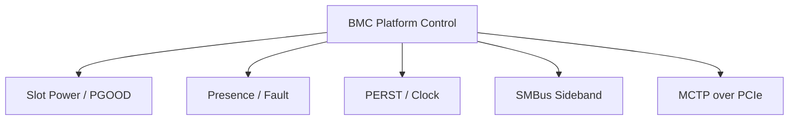

# 15. PCIe 管理 Sideband

## 15.1 PCIe 管理 Sideband 是什麼

PCIe管理sideband是與PCIe data link配套的一組控制與管理介面，包括PERST#、CLKREQ#、WAKE#、presence、hot-plug、SMBus / I2C、VPD、retimer或switch mailbox。它不是單一完整protocol，而是多個標準與平台訊號的集合，用來完成slot電源、reset、clock、inventory、firmware與fault管理。

### 定義與目的

PCIe管理sideband是與PCIe data link配套的一組控制與管理介面，包括PERST#、CLKREQ#、WAKE#、presence、hot-plug、SMBus / I2C、VPD、retimer或switch mailbox。它不是單一完整protocol，而是多個標準與平台訊號的集合，用來完成slot電源、reset、clock、inventory、firmware與fault管理。

### 參與者與角色

- Host Root Complex / BIOS：enumerate device並設定PCIe link。
- Endpoint / add-in card：回應PERST、link training與configuration。
- BMC / CPLD：控制slot power、reset、presence與sideband bus。
- Retimer / switch：管理lane signal conditioning、routing與telemetry。
- Inventory / power service：建立slot、device、FRU與event關聯。

## 15.2 怎麼運作

### 資料格式與規則

PERST#、CLKREQ#、WAKE#與presence是level / edge signals；SMBus / I2C sideband使用各自transaction；PCIe VPD有keyword / resource data結構；retimer與switch管理register可能遵循I2C、MCTP或vendor mailbox。所有訊號與messages必須在platform interface contract中個別定義。

### 工作流程

1. Auxiliary power建立，BMC讀取presence與FRU。
2. BMC / CPLD依sequence啟用slot power與reference clock。
3. 保持PERST#直到power / clock / retimer ready。
4. Release PERST#，Host進行link training與enumeration。
5. BMC經sideband讀取retimer / switch status並同步inventory。
6. Hot-plug、fault或reset時依policyquiesce、記錄與復原。

## 15.3 實務限制與潛在風險

### 相容性與版控

PCIe generation、CEM、hot-plug、retimer firmware、bifurcation與sideband register版本必須一致。

### 安全性與防禦

slot power、reset、firmware與VPD寫入需權限控制；防止未授權裝置與sideband spoofing。

### 錯誤處理

區分presence、power-good、link-down與enumeration failure；定義timeout、rollback與surprise removal。

### 效能與資源

retimer管理通常低頻，但錯誤輪詢與event storm可增加I2C / CPU負載；PCIe data效能需由Host工具另驗證。

### 標準化與文件

部分訊號由PCI-SIG規範，vendor mailbox與board glue常為私有實作，必須保存register map。

BMC 可能不參與 Host PCIe enumeration, 但可以管理:

- Slot power.
- Presence.
- PERST.
- Reference clock enable.
- Retimer / switch sideband.
- MCTP over PCIe VDM.
- Device firmware update.
- SPDM attestation.

PCIe sideband control 需和 Host power sequence 協調. 任意 reset retimer / clock buffer 或 endpoint 可能造成 Host link 失效.

