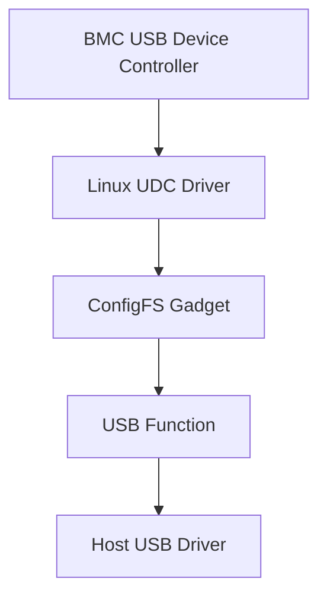

# 16. USB Gadget

## 16.1 USB Gadget 是什麼

USB Gadget是Linux讓BMC作為USB device連接Host的框架，可實作virtual media、USB NIC、serial或複合裝置。USB標準定義enumeration、descriptors、endpoints與transfers；Linux configfs用來組合function、configuration與UDC。它解決Host-facing虛擬周邊需求，但也形成可被Host存取的安全邊界。

### 定義與目的

USB Gadget是Linux讓BMC作為USB device連接Host的框架，可實作virtual media、USB NIC、serial或複合裝置。USB標準定義enumeration、descriptors、endpoints與transfers；Linux configfs用來組合function、configuration與UDC。它解決Host-facing虛擬周邊需求，但也形成可被Host存取的安全邊界。

### 參與者與角色

- USB Host：提供VBUS、enumerate device並載入class driver。
- UDC：BMC端USB device controller。
- Gadget core / configfs：建立descriptors、configurations與functions。
- Function driver：mass storage、ECM/NCM/RNDIS、ACM等。
- OpenBMC service：管理backing image、network、session、authorization與lifecycle。

## 16.2 怎麼運作

### 資料格式與規則

Host先讀Device、Configuration、Interface、Endpoint與String descriptors。Control transfers使用endpoint 0與setup packet；bulk、interrupt或isochronous endpoints承載function data。Mass storage使用USB storage commands，ECM/NCM/RNDIS定義network framing，ACM提供serial class。VID/PID、class、subclass、protocol與descriptor length必須一致。

### 工作流程

1. Host偵測pull-up並對device reset。
2. Host經endpoint 0讀descriptors並set address。
3. Host選擇configuration，class driver依interfaces建立device。
4. Gadget function開始處理control與data transfers。
5. OpenBMC service掛載image、設定network或轉送serial。
6. Eject、disconnect、Host reset或BMC reboot時安全解除function與backing resource。

## 16.3 實務限制與潛在風險

### 相容性與版控

Host OS class driver、USB speed、descriptor、VID/PID、ECM/NCM/RNDIS與composite layout需驗證。

### 安全性與防禦

Host是非信任輸入；驗證control requests、限制virtual media image、授權session並隔離USB network。

### 錯誤處理

處理stall、disconnect、reset、busy LUN、UDC bind failure與Host不合規request。

### 效能與資源

virtual media受USB speed、backing storage與CPU copy影響；composite functions共享endpoints與bandwidth。

### 標準化與文件

USB core與class規範公開，但Host相容性、RNDIS與vendor descriptors需跨OS實測。


USB gadget 讓 BMC 以 USB device 身分連接 Host, 可提供:

- Virtual media.
- USB network.
- USB serial.
- HID.
- Provisioning interface.

資料路徑:



Target:

```bash
$ dmesg | grep -Ei 'usb|gadget|udc|configfs'
$ ls -l /sys/class/udc 2>/dev/null
$ find /sys/kernel/config/usb_gadget -maxdepth 4 -type f 2>/dev/null
```

需驗證 VBUS detect / role / Host driver / BMC / Host reboot / virtual media detach, 以及 field / manufacturing mode 的安全政策.

