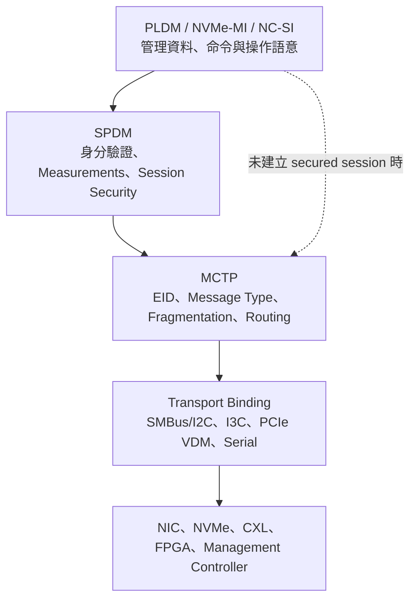
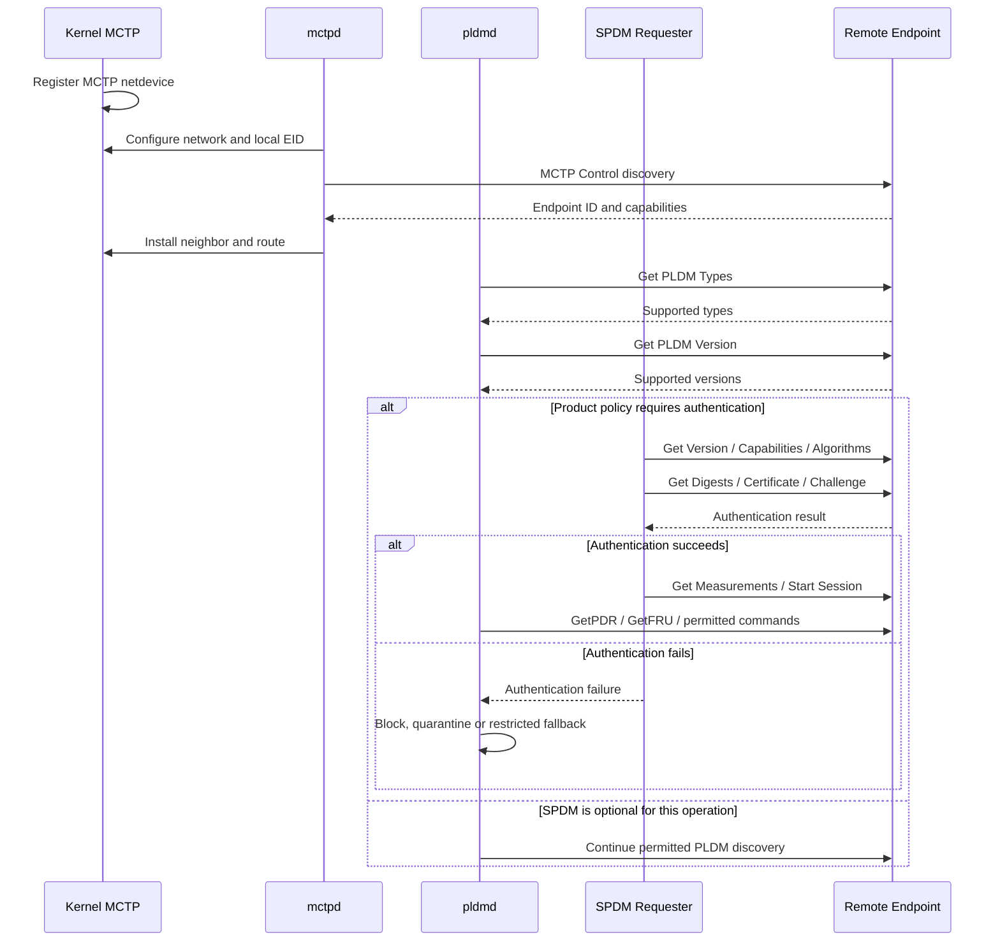

# 17. MCTP、PLDM 與 SPDM

MCTP、PLDM 與 SPDM 分別處理管理訊息的傳輸、平台管理語意，以及裝置身分與安全連線。三者常一起出現在 BMC 與 NIC、NVMe、CXL、GPU、FPGA 或安全控制器之間，但它們不是單一協定，也不應由同一個狀態代表整體健康。

## 17.1 三層協定職責



> **層級概念**：可將 **MCTP** 理解為運輸與路由系統，**PLDM** 是管理命令及資料模型，**SPDM** 是身分查驗、量測與安全 Session。此比喻用於理解分層，正式實作仍應以 DMTF Specifications、Transport Binding 與產品安全政策為準。

### 17.1.1 MCTP (Management Component Transport Protocol)

MCTP 是由 DMTF（發布於 **DSP0236**）制定的輕量級傳輸層協定，旨在解決伺服器平台內部管理控制器（如 BMC）與各獨立模組（如 SmartNIC、GPU、PCIe 擴充卡、電源供應器等）之間的低階溝通問題。MCTP 專注於定址、封包分段（Segmentation）、重組（Reassembly）與路由機制。

#### 核心概念與機制

* **Endpoint ID (EID)**：
    * MCTP 網路中的 8-bit 邏輯端點位址（如 `0x00` 代表 Null，`0xFF` 代表 Broadcast）。每個能處理 MCTP 訊息的實體或邏輯單元皆會獲配一個 EID。
* **Network & Routing**：
    * EID 的獨立位址空間。透過 MCTP Bridging/Routing 機制，跨越不同實體匯流排的裝置仍可在統一的 EID 空間中互相溝通。
* **Interface / Link**：
    * 實體 transport binding 實例（例如 SMBus/I2C、PCIe VDM、Serial 或 KCS）。在 Linux kernel (5.15+) 中，通常抽象化並表示為 `netdevice` / socket 介面。
* **Neighbor**：
    * 記錄遠端 EID 與底層實體位址（如 PCIe BDF 或 I2C Slave Address）的映射表（概念同 ARP table）。
* **Route Table**：
    * 指定特定 EID 或 EID 範圍應透過哪一個 Physical Interface 傳輸。
* **Message Type**：標頭中的 8-bit 欄位，用以區分上層負載類型：
    * `0x00`：Control Message
    * `0x01`：PLDM
    * `0x02`：SPDM
    * `0x04`：NVMe-MI
    * 其他：Vendor-defined 等
* **Message Tag & Tag Owner**：
    * 3-bit 欄位，配合 Tag Owner bit 用於在非同步傳輸環境中精確關聯 Request 與 Response。
* **SOM / EOM 與 Packet Sequence**：
    * **SOM (Start of Message)** / **EOM (End of Message)**：標記大封包傳輸的開頭與結尾。
    * **Packet Sequence (2-bit)**：用於傳輸過程中監測封包遺失或錯序。
* **Baseline MTU**：為適應低階硬體，MCTP 規範最小基準傳輸單位為 **64 Bytes**。

> **傳輸特性**：MCTP 本質上是 **Connectionless & Best-effort** 協定，底層不保證訊息可靠性（No ACK / Retransmission）或送達順序。任何需要超時重傳（Timeout/Retry）、重試策略或交易一致性（Transaction Idempotency）的功能，必須由上層協定（如 PLDM 或 SPDM）自行實作。

### 17.1.2 PLDM (Platform Level Data Model)

PLDM（DMTF **DSP0240** 系列）定義了平台層級的高效能二進位資料模型與管理命令，旨在以極低的大頭開銷（Overhead）實現跨廠商元件的標準化監控與控制。

#### 主要協定類型 (PLDM Message Types)

1. **PLDM Base (Type 0)**：基礎架構探索，用於查詢 terminus 支援的 PLDM 版本、類型與具體命令。
2. **Platform Monitoring and Control (Type 1)**：平台監控與控制。核心為 **PDR (Platform Descriptor Records)**，定義數值型/狀態型傳感器（Sensors）、執行器（Effectors）與 Event Log 傳輸。
3. **FRU Data (Type 2)**：存取可替換元件（FRU）的硬體結構化元資料（如 serial number、part number、model 等）。
4. **BIOS Control and Configuration (Type 3)**：設定與同步 BIOS 屬性表（Attribute Table），實現無痛的 Out-of-Band BIOS 參數配置。
5. **Firmware Update (Type 4)**：提供 Out-of-Band 韌體更新機制（包含 Image 傳輸分段、驗證與生效流程）。
6. **Redfish Device Enablement, RDE (Type 6)**：允許資源受限的擴充卡將內部資料結構轉換為 JSON/Redfish 格式，大幅減少 BMC 端的客製化 Driver 需求。

#### 交易與探索機制

* **Instance ID**：5-bit 欄位，用於追蹤並配對特定的 Request 與 Response 交易。
* **Completion Code**：8-bit 狀態碼（例如 `0x00 SUCCESS`、`0x01 ERROR` 等），於 Response 中回報執行結果。
* **動態探索原則（Discovery First）**：不同 Terminus（端點）支援的 PLDM Type、Commands 乃至 Version 差異極大。BMC 在進行任何控制或監控前，**必須先執行 Base Discovery**（如 `GetPLDMTypes` 與 `GetPLDMCommands`），嚴禁直接硬編碼（Hardcode）假設對方支援特定功能。

### 17.1.3 SPDM (Security Protocol and Data Model)

SPDM（DMTF **DSP0274**）是硬體層級的安全架構協定，為裝置身份驗證、韌體與狀態測量（Attestation）、密鑰交換及建立加密安全通道（Secured Messages）提供標準化流程。

#### 協定生命週期與階段

1. **Version & Capability Negotiation**：雙方確認支援的 SPDM 版本（如 1.0 / 1.1 / 1.2 / 1.3）與安全特性（如是否支援 Digest、Certificates、Measurements、PSK 或 Session）。
2. **Algorithm Negotiation**：協商密碼學演算法（如 Digest/Hash 演算法、Asymmetric Key 簽章演算法、AEAD 加密演算法等）。
3. **Certificate Chain Retrieval**：透過 `GET_DIGESTS` 與 `GET_CERTIFICATE` 獲取裝置內建的 X.509 證書鏈與裝置身份（Device Identity）。
4. **Challenge Authentication**：BMC 發送隨機挑戰碼（Challenge），裝置使用其硬體私鑰進行簽章並回傳，以證明其具備該證書對應的私鑰擁有權。
5. **Device Measurements**：請求裝置提供 RoT（Root of Trust）保護下的測量值（如 Bootloader、Firmware Digest、硬體配置等），實現硬體 Attestation。
6. **Session Establishment & Secured Messages**：建立加密會話（Session），導出 Session Keys。後續的 MCTP/PLDM 流量可透過 **Secured MCTP (DSP0277)** 進行 AES-GCM 加密與完整性保護。

#### 零信任架構下的 BMC 驗證責任

> **關鍵原則**：SPDM 協定握手成功（Challenge Success）僅代表「裝置具備合法的密鑰與證書」，**並不等於該裝置預設被信任**。

作為 Trust Verifier（驗證者），BMC 必須額外執行以下策略評估（Policy Enforcement）：

* **Certificate Chain Validation**：驗證證書鏈是否可追溯至受信任的 Root CA。
* **Revocation Status**：確認證書未被撤銷（經由 CRL/OCSP 或靜態撤銷清單）。
* **Firmware Attestation Policy**：比對 `MEASUREMENTS` 回傳的 Digest 是否符合白名單（Golden Measurements / Allowlist）。
* **Context Verification**：檢查憑證有效期、系統當前時間以及 Subject Alternative Name (SAN) 是否與實際物理 slot/BDF 相符。

### 17.1.4 參與者與角色

| 角色 | 責任 |
| --- | --- |
| **MCTP Bus Owner** | 發現 endpoint、管理或分配 EID、建立 topology |
| **MCTP Endpoint** | 收發 MCTP Control 或上層 messages |
| **MCTP Bridge** | 在不同 interfaces 或 bindings 間路由 packets |
| **`mctpd`** | 執行 MCTP Control Protocol 與 bus-owner policy，管理 remote endpoint、route、neighbor 與 D-Bus objects |
| **`pldmd`** | 執行 PLDM discovery、PDR、FRU、sensor、event 與 firmware-update flows |
| **SPDM Requester** | 驗證 responder、取得 measurements、建立 session |
| **SPDM Responder** | 提供 certificate、challenge response、measurements 與 secured session |
| **Kernel MCTP** | 提供 interfaces、networks、route、neighbor、fragmentation、reassembly 與 `AF_MCTP` sockets |

### 17.1.5 補充：MCTP / PLDM / SPDM 階層架構參考

| 協定層級 | 代表協定 | 核心職責 | 關鍵機制 |
| --- | --- | --- | --- |
| **Application / Data Model** | **PLDM** | 定義管理資料格式與商業邏輯 | PDR, Sensors, FRU, Firmware Update |
| **Security Layer** | **SPDM** | 裝置認證、韌體量測與密鑰交換 | Challenge-Response, Certificates, Measurement |
| **Transport Layer** | **MCTP** | 訊息切片、重組與端點路由 | EID, SOM/EOM, Message Type/Tag |
| **Physical / Link Layer** | **PCIe VDM / SMBus / Serial** | 實體訊號傳輸 | BDF Address, Slave Address, Netdevice |

## 17.2 資料格式與關聯規則

在多層級微服務與硬體管理架構中，MCTP、PLDM 與 SPDM 各自定義了嚴密的 Header 結構與狀態關聯（Correlation）規則。了解這些欄位編碼與週期控管，是開發高穩定度 BMC Daemon（如 OpenBMC `pldmd`、`mctpd` 或 `spdm-responder`）的重要基礎。

### 17.2.1 MCTP Header 格式與分段機制

MCTP（DMTF **DSP0236**）的傳輸標頭長度固定為 **4 Bytes**（共 32 bits），隨後緊跟 1 Byte 的 Message Type：

| 位元組 (Byte) | 位元範圍 (Bits) | 欄位名稱 | 說明 |
| --- | --- | --- | --- |
| **Byte 0** | Bit [7:4] | **Header Version** | 規範格式版本，目前固定為 `0x1` (`0b0001`) |
|  | Bit [3:0] | **Reserved** | 預留欄位，傳送時填 `0` |
| **Byte 1** | Bit [7:0] | **Destination EID (Target EID)** | 目標端點邏輯位址 |
| **Byte 2** | Bit [7:0] | **Source EID (Origin EID)** | 來源端點邏輯位址 |
| **Byte 3** | Bit [7] | **SOM (Start of Message)** | `1` 代表此封包為長訊息的第一個片段 (First fragment) |
|  | Bit [6] | **EOM (End of Message)** | `1` 代表此封包為長訊息的最後一個片段 (Last fragment) |
|  | Bit [5:4] | **Packet Sequence** | 2-bit 封包序號（`0` $\rightarrow$ `1` $\rightarrow$ `2` $\rightarrow$ `3` $\rightarrow$ `0`），用於檢測遺失與錯序 |
|  | Bit [3] | **Tag Owner (TO)** | `1` 代表 Request 發起者（Requester）；`0` 代表 Response 回應者（Responder） |
|  | Bit [2:0] | **Message Tag** | 3-bit 訊息標籤（`0x0`~`0x7`），用於非同步環境下配對 Request/Response |
| **Byte 4** | Bit [7:0] | **Message Type** | 識別 Payload 類型（如 `0x01` PLDM, `0x02` SPDM, `0x04` NVMe-MI） |

#### 分段與重組（Fragmentation & Reassembly）

* **Kernel 處理分工**：在現代 Linux 架構（Kernel 5.15+ 的 `AF_MCTP` 核心模組）中，封包的分段（Fragmentation）、序號累加（Sequence Increment）以及重組（Reassembly）完全在 **Kernel 空間**處理。
* **Userspace 觀點**：Userspace 應用程式透過 Socket (`socket(AF_MCTP, SOCK_DGRAM, 0)`) 發送或接收時，讀寫的皆是**完整的 Message（包含 Message Type，但不含 4-Byte MCTP Transport Header）**，大幅簡化應用層開發。

### 17.2.2 PLDM Header 格式與 Transaction 機制

PLDM（DMTF **DSP0240**）控制標頭長度為 **3 Bytes**，包含交易關聯與命令類型：

| 位元組 (Byte) | 位元範圍 (Bits) | 欄位名稱 | 說明 |
| --- | --- | --- | --- |
| **Byte 0** | Bit [7] | **Request Bit (R)** | `1` 代表 Request 命令；`0` 代表 Response 回應 |
|  | Bit [6] | **Datagram Bit (D)** | `1` 代表單向通知（不需要 Response）；`0` 代表雙向交易 |
|  | Bit [5] | **Reserved** | 預留欄位（傳送填 `0`） |
|  | Bit [4:0] | **Instance ID** | 5-bit 交易追蹤 ID（範圍 `0` ~ `31`），對應特定的 Request/Response 配對 |
| **Byte 1** | Bit [7:6] | **PLDM Header Version** | 格式版本，目前固定為 `0b00` |
|  | Bit [5:0] | **PLDM Type** | PLDM 功能模組類型（如 `0x00` Base, `0x01` Platform, `0x02` FRU, `0x04` FW Update） |
| **Byte 2** | Bit [7:0] | **PLDM Command Code** | 具體執行的命令代碼（如 `0x01 GetPLDMVersion`） |
| **Byte 3** *(僅 Response)* | Bit [7:0] | **Completion Code** | **僅存在於 Response 中**，回報命令執行狀態（如 `0x00 SUCCESS`） |

#### Instance ID 生命週期與資源管理

> **資源瓶頸**：Instance ID 僅有 5 bits，意即 BMC 對特定的 Terminus (EID) **最多同時只能有 32 個未完成（In-flight）的 Request**。

* **分配與釋放**：發送 Request 時必須指派一個未被占用的 Instance ID，收到對應的 Response 或發生 Timeout 失敗後**必須立即釋放資源**。
* **重傳衝突（Retry Policy）**：若因傳輸逾時重發相同的 Request，**必須保持相同的 Instance ID**，防止 Responder 誤認為新交易；若發起全新命令，則必須指派新 ID。

### 17.2.3 SPDM Message 格式與 Transcript Hash 鎖定

SPDM（DMTF **DSP0274**）標頭結構基本為 **4 Bytes**，著重於狀態機與密碼學認證流程：

| 位元組 (Byte) | 欄位名稱 | 說明 |
| --- | --- | --- |
| **Byte 0** | **SPDM Version** | 指定使用的 SPDM 版本（如 `0x10`, `0x11`, `0x12`, `0x13`） |
| **Byte 1** | **Request / Response Code** | 訊息類型（例如 Request: `GET_VERSION` `0x84`, Response: `VERSION` `0x04`） |
| **Byte 2** | **Param 1** | 命令相關參數 1（例如指定的 Certificate Slot ID、Attribute 旗標等） |
| **Byte 3** | **Param 2** | 命令相關參數 2（例如指定 Hash 演算法代碼、Session ID 部分位元等） |
| **Payload** | **Message Data** | 隨命令而異的資料負載（如 Certificate 區塊、Nonce 隨機數、Signature 等） |

#### 密碼學 Transcript Hash 與狀態一致性

SPDM 的安全性高度依賴 **Transcript Hash（歷史訊息雜湊值）**：

* **動態累加**：從 `GET_VERSION`、`GET_CAPABILITIES`、`NEGOTIATE_ALGORITHMS` 開始，直到 `CHALLENGE` 或 `FINISH`，雙方會將所有溝通訊息無縫串接並持續更新 Hash 值（即 $H = \text{Hash}(M_1 \parallel M_2 \parallel \dots \parallel M_n)$）。
* **完整性驗證**：Challenge Authentication 與 Session Establishment 中的數位簽章（Asymmetric Signature）或 HMAC，皆是針對此 Transcript Hash 進行計算。
* **容錯性限制**：若傳輸過程中有任何訊息遺失、重覆發送（Retry 未妥善處理）、亂序或 Payload 欄位解析不一致，將導致雙方計算出的 Transcript Hash 發生偏差，最終引發 **Signature Verification Failure** 或 **Session Key 導出失敗**。

### 17.2.4 MCTP over SMBus / I2C Physical Binding (DSP0237)

當 MCTP 透過 I2C/SMBus 實體匯流排傳輸時，會依據 **DMTF DSP0237** 規範封裝成 SMBus Block Write 的格式：

```text
[ Destination Slave Address (Wr) ]
[ Command Code = 0x0F (MCTP) ]
[ Byte Count ]
[ Source Slave Address (Rd) ]
[ MCTP Transport Header (4B) ]
[ MCTP Message Payload ]
[ PEC (SMBus Packet Error Code - CRC-8) ]
```

#### `lladdr` 實體位址與 Linux `mctp` 指令細節

在 Linux Kernel 網路框架中，MCTP 介面（如 `mctpi2c4`）使用 **Neighbor Table**（相當於 IPv4 的 ARP 表）記錄 EID 與 Physical Layer Address 的對照：

```sh
mctp neigh add 50 dev mctpi2c4 lladdr 0x12
```

> **實務陷阱與實測注意事項**：
> 1. **`lladdr` 的語意**：`lladdr` 代表 Link-Layer Physical Address。在 I2C Binding 中，它代表 SMBus Target/Slave Address。
> 2. **7-bit vs 8-bit Address 表示法**：
>       * **7-bit Address**：如 `0x12`（實際在線路上加上 Read/Write bit 後會變成 `0x24` 或 `0x25`）。
>       * **8-bit Wire-Format Address**：部分舊版 Driver 或工具要求輸入 shifted 8-bit write address（即 `0x24`）。
> 3. **除錯建議**：使用 `mctp neigh` 指令時，`0x12` 是否直接被 Driver 當作 7-bit 位址，**完全取決於當前 Linux Kernel branch、`iproute2` / `mctp` utility 的版本實作**。系統整合時切勿僅憑外觀數值推斷，建議使用邏輯分析儀（Logic Analyzer）或 Driver Debug Log（如 `i2c-trace`）進行實體 Packet 比對。


### 17.2.5 封包層級封裝視圖 (Header Encapsulation)

下圖展示了 MCTP/PLDM/SPDM 在不同運作模式下，標頭（Header）由外而內的嵌套與封裝（Encapsulation）結構：

#### 1. 明文管理傳輸（MCTP Encapsulating PLDM）

適用於常態性平台 Sensor 監控、FRU 讀取與 Event 接收：

```text
+-----------------------------------------------------------------------------------+
| 1. Physical / Link Layer Header (如 SMBus Target Addr 0x12 + Cmd 0x0F + Byte Count)|
+-----------------------------------------------------------------------------------+
| 2. MCTP Transport Header (4 Bytes)                                                |
|    - Header Version (0x1) | Dest EID | Source EID | SOM/EOM/Seq/Tag               |
+-----------------------------------------------------------------------------------+
| 3. MCTP Message Type (1 Byte)                                                     |
|    - 數值 = 0x01 (PLDM)                                                           |
+-----------------------------------------------------------------------------------+
| 4. PLDM Header (3 Bytes)                                                          |
|    - R/D Bit + Instance ID (5 bits) | PLDM Type | Command Code                    |
+-----------------------------------------------------------------------------------+
| 5. PLDM Payload & Completion Code                                                 |
|    - Response 包含 Completion Code (1 Byte) + 數據 (如 Sensor Reading, FRU Data)  |
+-----------------------------------------------------------------------------------+
| 6. Physical / Link Layer Trailer (如 SMBus PEC / CRC-8)                           |
+-----------------------------------------------------------------------------------+
```

#### 2. 安全驗證階段（MCTP Encapsulating SPDM）

適用於身份認證（Challenge）、證書鏈取得（Certificate）與 Attestation 階段：

```text
+-----------------------------------------------------------------------------------+
| 1. Physical / Link Layer Header (如 PCIe VDM Header 或 SMBus Header)             |
+-----------------------------------------------------------------------------------+
| 2. MCTP Transport Header (4 Bytes)                                                |
+-----------------------------------------------------------------------------------+
| 3. MCTP Message Type (1 Byte)                                                     |
|    - 數值 = 0x02 (SPDM)                                                           |
+-----------------------------------------------------------------------------------+
| 4. SPDM Header (4 Bytes)                                                          |
|    - SPDM Version | Request/Response Code | Param 1 | Param 2                     |
+-----------------------------------------------------------------------------------+
| 5. SPDM Payload                                                                   |
|    - Nonce, Certificate Chain, Measurements Digest, Signature                     |
+-----------------------------------------------------------------------------------+
| 6. Physical / Link Layer Trailer                                                  |
+-----------------------------------------------------------------------------------+
```

#### 3. 加密通道模式（Secured MCTP / DSP0277）

SPDM 成功建立 Session 後，所有 PLDM 管理流量改由 **AES-GCM 加密通道** 承載：

```text
+-----------------------------------------------------------------------------------+
| 1. Physical / Link Layer Header                                                   |
+-----------------------------------------------------------------------------------+
| 2. MCTP Transport Header (4 Bytes)                                                |
+-----------------------------------------------------------------------------------+
| 3. MCTP Message Type (1 Byte)                                                     |
|    - 數值 = 0x06 (Secured MCTP / SPDM Secured Session)                            |
+-----------------------------------------------------------------------------------+
| 4. Secured MCTP Header                                                            |
|    - Session ID (4 Bytes) | Sequence Number (4 Bytes, 防重放攻擊)                   |
+===================================================================================+
|  [ AES-GCM 全程加密區域 (Encrypted Payload) ]                                      |
|                                                                                   |
|  +-----------------------------------------------------------------------------+  |
|  | Inner MCTP Message Type (1 Byte) = 0x01 (PLDM)                              |  |
|  +-----------------------------------------------------------------------------+  |
|  | PLDM Header (3 Bytes: Instance ID | PLDM Type | Command Code)               |  |
|  +-----------------------------------------------------------------------------+  |
|  | PLDM Payload (受加密保護的管理命令數據)                                        |  |
|  +-----------------------------------------------------------------------------+  |
|                                                                                   |
+===================================================================================+
| 5. Message Authentication Code (MAC) (16-Byte AES-GCM Tag, 防竄改簽章)             |
+-----------------------------------------------------------------------------------+
| 6. Physical / Link Layer Trailer                                                  |
+-----------------------------------------------------------------------------------+
```

## 17.3 OpenBMC 啟動、探索與安全決策流程

OpenBMC 中的 `mctpd`、`pldmd` 與 SPDM Daemon 採用非同步架構進行元件探索與安全評估。整體呼叫順序與條件分歧如下：




### 17.3.1 啟動依賴鏈與 Readiness 判定機制

在系統開機過程中，MCTP 與上層服務的初始化具備嚴格的依賴順序：

1. **Physical Transport Layer Ready**：底層 Bus Controller（如 I2C Master、PCIe Bridge）與 Binding Driver 載入完成，建立 `mctpnetdevice`。
2. **Local Address Assignment**：將 MCTP Interface 設為 `UP`，並為 BMC 本體配置 Network ID 與 Local EID（通常預設為 `0x08` 或 `0x09`）。
3. **MCTP Bus Discovery**：`mctpd` 啟動，執行 MCTP Control Protocol（如 `Set EID`、`Get Endpoint ID`），動態探索匯流排上的 Remote Endpoints。
4. **Kernel Table Installation**：`mctpd` 將探索到的 Endpoint 寫入 Kernel `AF_MCTP` 路由表（Route）與鄰居表（Neighbor）。
5. **PLDM Base Discovery**：`pldmd` 經由 D-Bus 收到 `InterfacesAdded` 訊號後，對可達的 EID 執行 `GetPLDMTypes` 與 `GetPLDMVersion`。
6. **SPDM Attestation**：依據產品安全政策，SPDM Requester 對該 EID 進行身份驗證、憑證鏈校驗與測量值（Measurements）比對。
7. **D-Bus Object Creation**：驗證通過後，`pldmd` 獲取 PDR / FRU，並在 D-Bus 上建立對應的 Sensor、Inventory、Event Log 及 Firmware Update 物件。

> **嚴格警告：Readiness Anti-Pattern（判定誤區）**
> 在 OpenBMC 開發中，**切勿僅依據 Systemd Service 的狀態（如 `systemctl is-active mctpd.service`）即判定 MCTP 已就緒**。Service 啟動僅代表 Daemon 進入事件迴圈，並不等於底層硬體連線成立。
> **合格的 MCTP Readiness 判定必須同時滿足以下條件**：
> * **Interface State**：MCTP netdevice 狀態為 `UP`。
> * **Local EID Valid**：Local EID 已獲配且不為 `0x00` 或 `0xFF`。
> * **Table Established**：Kernel 內已存在非空的 Route 與 Neighbor 項目。
> * **Endpoint Discovered**：目標 Remote EID 在 `mctpd` 的 D-Bus 物件列表中處於 `Discovered` 狀態。


### 17.3.2 SPDM 驗證失敗後的零信任安全政策

當 SPDM 認證失敗（例如憑證過期、Challenge 簽章無效、測量值比對不符白名單）時，系統**不得直接丟棄該裝置**，而應依據業務敏感度執行對應的安全政策（Policy Enforcement）：

| 政策策略 (Policy Strategy) | 執行行為與權限限制 | 適用情境 / 裝置類別 |
| --- | --- | --- |
| **Block (完全阻斷)** | 立即中斷該 EID 的所有通訊，禁止韌體更新 (Firmware Update)、配置寫入 (Configuration Write) 及任何管理指令。 | 高風險組件（如 OCP NIC 3.0、CXL Memory Expansion Controller）。 |
| **Quarantine (隔離檢疫)** | 保留 D-Bus 物件，但將狀態標示為 `Untrusted` / `Quarantined`。排除在正常的自動化控制鏈（如 PID 風扇散熱控制、Power Cap）之外。 | 未能確定簽章來源，但仍需維持 basic platform boot 的擴充卡。 |
| **Restricted Fallback (受限唯讀)** | 降級僅允許執行無危害的唯讀指令（如讀取基本 Vital Product Data, FRU 或溫度 Sensor）。 | 僅用於提供基本硬體資產盤點的第三方週邊。 |
| **Service Unavailable (停用服務)** | 完全停止與該 EID 的任何 PLDM 互動，將該 Slot/PCIe Segment 標示為 Fault。 | 零信任嚴格模式下的數據中心伺服器。 |

#### 稽核與紀錄（Auditing & Logging Matrix）

無論執行何種 Fallback 政策，`spdm-responder` 與 `pldmd` 必須發出包含以下完整上下文（Context）的 Redfish Event Log / SEL (System Event Log)：

1. **Failure Reason**：具體失敗階段（如 `CERT_CHAIN_INVALID`、`MEASUREMENT_MISMATCH`、`CHALLENGE_TIMEOUT`）。
2. **Certificate Identity**：憑證的 Subject Name、Issuer Name、Serial Number 及 SHA-256 Digest。
3. **Measurement Result**：PCR/Digest 實際比對失敗的 Index（如 Bootloader Digest 比對失敗）。
4. **Target Context**：目標 EID、Physical BDF / Slot 位置、UUID 及系統當前時間戳（Timestamp）。
5. **Applied Scope**：最終套用的處置政策（如 `Fallback to Read-Only`）。

## 17.4 Linux Kernel MCTP 架構

### 17.4.1 為什麼使用 Kernel MCTP (Kernel vs. Userspace Demux)

在早期（Kernel < 5.15）的 OpenBMC 架構中，MCTP 多由 Userspace Daemon（如 `mctp-demux-daemon`）透過 `/dev/i2c-X` 或 Chardev 直接操控底層硬體，並在 Userspace 進行封包的分段與重组。

現代 Linux 核心（Kernel 5.15+）引入了原生 **Kernel MCTP (`AF_MCTP`)** 架構，將 Interface、Network、Route、Neighbor、Fragmentation 與 Reassembly 完全下沉至 Kernel Networking Stack：

```text
+-------------------------------------------------------------------------+
| Userspace Application (pldmd / spdm-requester / nvme-cli)               |
+-------------------------------------------------------------------------+
                                    |  AF_MCTP Socket (SOCK_DGRAM)
                                    v
+-------------------------------------------------------------------------+
| Kernel Network Core (linux/net/mctp/)                                   |
|   - Socket Protocol Handler (af_mctp.c)                                 |
|   - Routing & Neighbor Table (route.c, neigh.c)                         |
|   - Fragmentation & Reassembly Engine                                   |
+-------------------------------------------------------------------------+
                                    |  mctp_skb / netdevice Operations
                                    v
+-------------------------------------------------------------------------+
| Physical / Binding Drivers (linux/drivers/net/mctp/)                    |
|   - mctp-i2c.c / mctp-serial.c / mctp-i3c.c                             |
+-------------------------------------------------------------------------+
```

#### Kernel MCTP 的架構優勢對比

| 比較維度 | 傳統 Userspace Demux 模式 | 現代 Linux Kernel `AF_MCTP` 模式 |
| --- | --- | --- |
| **傳輸效能** | 每個 64-Byte 切片（Fragment）皆需經過 Userspace-Kernel 上下文切換與 D-Bus 傳遞， overhead 極高。 | 封包分段與重組完全在 Kernel 空間內完成，Userspace 僅處理完整的 Message Payload。 |
| **Socket API 統一性** | 各 Transport（I2C, PCIe VDM, Serial）需撰寫客製化 Userspace Transport Layer。 | 統一使用標準的 POSIX Socket API (`socket(AF_MCTP, SOCK_DGRAM, 0)`)，與底層 Binding 完全解耦。 |
| **路由與 Bridging** | 需在 Userspace 實作複雜且易錯的二層 / 三層 Bridging 邏輯。 | 原生整合 Kernel 網路路由表（Route Table）與鄰居表（Neighbor Table），由 Kernel 自動進行跨介面轉發。 |
| **實體資源存取** | 直接對 `/dev/i2c-X` 進行全域 Lock，容易引發 Userspace 應用死鎖（Deadlock）。 | 整合 Kernel 內建的 `i2c_adapter` 鎖機制與 `netdevice` Queue，具備嚴謹的硬體存取保護。 |


### 17.4.2 Source Tree 原始碼結構與元件分工

Linux 核心原始碼中，MCTP 架構明確劃分為**核心網路協定層（Core Networking）**與**實體驅動綁定層（Binding Drivers）**：

```text
linux/
├── net/mctp/                        # MCTP 核心網路堆疊
│   ├── af_mctp.c                    # AF_MCTP Address Family 與 Socket 呼叫 (bind, sendmsg, recvmsg)
│   ├── route.c                      # MCTP 路由表、EID 分配與 Packet Forwarding 邏輯
│   ├── neigh.c                      # Neighbor Table (EID 與 Physical Address/lladdr 對照)
│   ├── device.c                     # MCTP netdevice 註冊與 Network Space (netns) 管理
│   └── trace.h                      # Ftrace / Kernel Tracepoints 支援
│
├── drivers/net/mctp/                # 實體 Transport Binding 驅動程式
│   ├── mctp-i2c.c                   # SMBus / I2C Transport Binding Driver (DSP0237)
│   ├── mctp-i3c.c                   # I3C Transport Binding Driver (DSP0233)
│   ├── mctp-serial.c                # Serial / UART Transport Binding Driver (DSP0253)
│   └── mctp-pci-vdm.c               # PCIe Vendor Defined Message Binding (依 Kernel Branch 擴充)
│
└── userspace/                       # Userspace 生態系與控制工具
    ├── iproute2 (mctp)              # 用於配置 IP/EID、Route 與 Neighbor 的 CLI 工具
    ├── mctpd                        # OpenBMC Bus Owner Daemon (負責動態探索與 EID 管理)
    ├── pldmd                        # PLDM 平台管理協定服務
    └── libspdm / spdm-requester     # SPDM 安全驗證與 Key 導出服務
```

### 17.4.3 Kernel Configuration (Kconfig) 組態設定

要在 Linux Kernel 中啟用完整 MCTP 堆疊，編譯組態需確保以下核心選項被正確啟動：

```text
# 核心網路堆疊支援 (Mandatory)
CONFIG_MCTP=y

# 支持流程追蹤與 Socket Tag 追蹤 (Mandatory for async request/response tag allocation)
CONFIG_MCTP_FLOWS=y

# 實體 Transport Binding 驅動 (依硬體平台需求開啟)
CONFIG_MCTP_TRANSPORT_I2C=y          # 啟用 I2C/SMBus Binding (mctp-i2c)
CONFIG_MCTP_TRANSPORT_I3C=y          # 啟用 I3C Binding (mctp-i3c)
CONFIG_MCTP_SERIAL_TP=y              # 啟用 Serial/UART Binding (mctp-serial)

```

> **組態說明**：`CONFIG_MCTP_FLOWS` 對於需要處理非同步 Request/Response 的系統至關重要。它允許 Kernel 自動追蹤 Socket 產生的 Tag，並在收到對應 Response 時精確導向至正確的 Userspace Socket。

### 17.4.4 MCTP over I2C (mctp-i2c) 運作機制與 Mux 競爭瓶頸

在伺服器硬體設計中，BMC 通常透過 I2C Multiplexer（如 PCA9548）連接多個 Endpoints。`mctp-i2c` 驅動程式在初始化與資料傳輸時，具備嚴謹的虛擬化與鎖定流程：

```text
                      +-----------------------------+
                      |   Root I2C Controller       |
                      |   (e.g., aspeed-i2c-bus 4)  |
                      +-----------------------------+
                                     |
                         +-----------+-----------+
                         |  I2C Mux (PCA9548)    |
                         +-----------+-----------+
                                     |
               +---------------------+---------------------+
               |                                           |
    +--------------------+                       +--------------------+
    | Child Bus Channel 0|                       | Child Bus Channel 1|
    +--------------------+                       +--------------------+
               |                                           |
    +--------------------+                       +--------------------+
    | netdevice:         |                       | netdevice:         |
    |  mctpi2c4          |                       |  mctpi2c5          |
    +--------------------+                       +--------------------+

```

#### 驅動初始化與運作流程

1. **Local Slave Callback 註冊**：驅動程式向 Root I2C Controller 註冊 Local Target/Slave 回呼函式，以隨時接收遠端 Master 發起的 MCTP Packet。
2. **Virtual Adapter 發現**：自動掃描 Root Bus 及底下所有的 I2C Mux Child Adapters。
3. **Netdevice 建立**：為每個適用的 Child Adapter 自動建立獨立的網路介面（命名為 `mctpi2cX`，例如 `mctpi2c4`）。
4. **Header Operations & MTU 配置**：設定預設 MTU 為 **64 Bytes**，並綁定 DSP0237 SMBus Block Write 標頭組裝邏輯。
5. **RX 處理路徑**：
    * 當 I2C Slave 接收到資料時，驅動進行 SMBus PEC (CRC-8) 驗證與 Source Address 檢查。
    * 驗證無誤後封裝為 `sk_buff`，呼叫 `netif_rx()` 送入 Kernel MCTP Core 進行重組與路由分發。

6. **TX 處理路徑**：
    * 當 Userspace 發送 Message 時，Kernel MCTP Core 自動依 64-Byte MTU 將其分段（Fragmentation）。
    * `mctp-i2c` 驅動將各切片加上 SMBus Header (Cmd `0x0F` + Byte Count) 與 PEC。
    * 觸發 TX Worker / Thread，**取得實體 I2C Bus Lock** 後執行 SMBus Block Write。


> **嚴重的硬體架構瓶頸：I2C Lock Domain 競爭**
> 在實務系統開發中，**切勿將多個 `mctpi2cX` 介面視為可完全平行傳輸的獨立 Channel！**
> 由於 `mctpi2c4` 與 `mctpi2c5` 最終皆共享同一個 Root I2C Controller 的物理匯流排，任何介面進行 TX/RX 時，都必須鎖定 Root Bus 的 `i2c_adapter` Lock。
> **設計防護建議**：
> * **避免高頻率大流量**：若在背景執行高頻率 PLDM Sensor 輪詢的同時，對另一個 Channel 進行 SPDM Firmware Update（頻繁傳送長大 Message），將導致物理 I2C Bus Lock 長時間被占用。
> * **Starvation (飢餓) 預防**：高優先權的 Control Message 或 Timeout 重試機制，必須考慮 I2C Lock 競爭引發的延遲（Latency Spike），適當調高 Userspace Request Timeout 設定（建議至少 2~3 秒以上）。

### 17.4.5 AF_MCTP Socket Programming 資料結構

Userspace 應用程式（如 `pldmd`）可以直接透過標準 POSIX API 操作 `AF_MCTP`。下圖展示了標準的 C 語言 Address Structure 宣告：

```c
#include <sys/socket.h>
#include <linux/mctp.h>

/* Linux Kernel 提供之 AF_MCTP 位址結構 */
struct sockaddr_mctp {
    sa_family_t         smctp_family;   /* 固定為 AF_MCTP */
    unsigned int        smctp_network;  /* MCTP Network ID (通常為 MCTP_NET_ANY 或 1) */
    struct mctp_addr    smctp_addr;     /* 包含 8-bit Target EID */
    uint8_t             smctp_type;     /* MCTP Message Type (如 0x01 PLDM, 0x02 SPDM) */
    uint8_t             smctp_tag;      /* Message Tag 與 Tag Owner 比對 */
    uint8_t             smctp_pad;      /* 結構對齊預留欄位 */
};

/* Userspace 範例：建立 PLDM Socket 並發送命令 */
int sd = socket(AF_MCTP, SOCK_DGRAM, 0);

struct sockaddr_mctp addr = {
    .smctp_family = AF_MCTP,
    .smctp_network = MCTP_NET_ANY,
    .smctp_addr = { .s_addr = 0x0A }, /* 目的地 EID = 10 */
    .smctp_type = 0x01,               /* MCTP Type = PLDM */
    .smctp_tag = MCTP_TAG_OWNER,      /* 由 Kernel 自動分配 Tag */
};

/* 直接傳送完整的 PLDM Request Message (不包含 4-byte MCTP Header) */
sendto(sd, pldm_req_buf, pldm_req_len, 0, 
       (struct sockaddr *)&addr, sizeof(addr));

```

## 17.5 Device Tree、Runtime Objects 與對照

本節目標不是只列出幾個指令，而是建立一條可追溯的 mapping chain：從硬體拓樸、Device Tree、Kernel runtime object、MCTP network object，到 OpenBMC D-Bus endpoint 與 PLDM/SPDM 上層身份。Bring-up 或 debug 時，任何一層對不起來，都可能造成看似 PLDM timeout、SPDM handshake failed，實際上卻是 route、neighbor、I2C mux 或 physical address 錯誤。

```text
Board schematic / endpoint strap / bus topology
    ↓
Device Tree I2C controller, mux, endpoint node, mctp-controller property
    ↓
Linux I2C root adapter and mux child adapters
    ↓
mctp-i2c binding driver creates mctpi2cX netdevice
    ↓
MCTP interface assigned network ID and local EID
    ↓
Bus owner discovers remote endpoint EID and message type capability
    ↓
Kernel route table and neighbor table installed
    ↓
AF_MCTP userspace socket can reach remote EID
    ↓
PLDM Base discovery obtains TID, types, versions and commands
    ↓
PDR / FRU / sensor / event / firmware-update runtime objects are created
    ↓
SPDM authentication result, certificate identity and measurement policy are bound to same endpoint identity
```

### 17.5.1 Static topology 與 runtime state 的分工

MCTP 系統整合常見錯誤是把 Device Tree 當成 endpoint discovery database。實務上應區分：

| 類別 | 內容 | 是否可在 runtime 變動 | 典型來源 |
|---|---|---:|---|
| Static hardware topology | root I2C controller、mux channel、PCIe slot、固定 endpoint address strap | 通常不變 | schematic、BOM、DTS |
| Binding configuration | 哪些 adapter 啟用 MCTP binding、local slave address、netdevice 建立規則 | image 或 board config 變更時變 | Device Tree、kernel driver、platform config |
| MCTP addressing | local EID、remote EID、network ID、route、neighbor | 會因 bus owner policy、reset、hot-plug 改變 | mctpd、kernel route/neighbor table |
| PLDM identity | TID、PLDM type、PLDM version、supported commands、PDR repository state | endpoint firmware 變更或 reset 後可能變 | PLDM Base discovery、PDR discovery |
| Security identity | certificate chain、certificate digest、measurement summary、trust state | certificate rotation、firmware update、policy 變更時會變 | SPDM requester、security policy engine |

原則：

1. **Device Tree 描述可被 OS 探測與驅動的硬體拓樸，不應硬編 remote EID 作為永久身份。**
2. **EID 是 MCTP network scope 內的邏輯位址，不是 FRU identity，也不是 security identity。**
3. **PLDM TID 也不應單獨當作實體裝置身份。**它只代表 PLDM terminus identity，仍需結合 MCTP path、FRU UUID、PCIe BDF、slot 或 SPDM certificate fingerprint。
4. **SPDM certificate identity 與 measurement result 應綁到 stable endpoint identity。**若只綁 EID，re-enumeration 後可能把 trust state 套到錯誤裝置。

### 17.5.2 Device Tree 檢查項目

不同 SoC、kernel branch 與 OpenBMC layer 的 DTS 寫法會不同，因此本章不提供唯一固定範本。正式文件應貼上平台實際 DTS fragment，並標示該 node 對應哪個 schematic bus 與 mux channel。

建議在專案文件中至少記錄以下資訊：

```text
DTS node checklist
[ ] root I2C controller node path
[ ] controller status = "okay"
[ ] I2C bus frequency
[ ] mux device node and channel mapping
[ ] endpoint physical address strap or fixed address
[ ] MCTP local slave / target address configuration
[ ] 是否啟用 mctp-controller 或等價 binding property
[ ] 是否有其他 driver 也會 claim 同一個 I2C address
[ ] 是否有 non-MCTP devices 共用同一個 mux channel
```

範例記錄格式：

```text
Root controller:
  DTS path: /ahb/apb/bus@1e78a000/i2c-bus@440
  Linux adapter: i2c-4
  Schematic net: BMC_I2C4

Mux:
  Device: PCA9548
  Address: 0x70
  Channel 0: OCP_NIC3_MGMT
  Channel 1: NVME_BACKPLANE_MGMT

MCTP endpoint:
  Slot: OCP_NIC3_0
  Channel: mux channel 0
  Endpoint SMBus address: 0x12, 7-bit notation
  BMC local target address: 0x10, 7-bit notation
```

> 注意：I2C / SMBus 文件常混用 7-bit address 與 8-bit wire address。正式文件必須明確標示 `0x12` 是 7-bit address，還是左移後含 R/W bit 的 write address `0x24`。若不標示，後續 `mctp neigh add ... lladdr`、logic analyzer capture 與 schematic review 很容易對不起來。

### 17.5.3 sysfs topology 對照方法

Bring-up 時先建立 Linux runtime topology，不要直接跳到 PLDM command。

```sh
# 列出所有 I2C adapter
ls -l /sys/bus/i2c/devices/ | sed -n '1,120p'

# 檢查 adapter 名稱，找到 root bus 與 mux child bus
for d in /sys/bus/i2c/devices/i2c-*; do
    printf '%s: ' "$d"
    cat "$d/name" 2>/dev/null || true
done

# 找出某個 child adapter 的 parent chain
readlink -f /sys/bus/i2c/devices/i2c-16/device

# 若平台有 mux，列出 mux channel 對應
find /sys/bus/i2c/devices -maxdepth 2 -type l -o -type d | grep -Ei 'mux|channel|i2c-[0-9]+'
```

建議把以下表格放入專案 bring-up note，並用實機輸出填滿：

| Mapping 項目 | 範例 | 證據或命令 | 驗收條件 |
|---|---|---|---|
| Root I2C adapter | `i2c-4` | `/sys/bus/i2c/devices/i2c-4/name` | 與 schematic root bus 相符 |
| Mux device | `4-0070` | `readlink -f /sys/bus/i2c/devices/4-0070` | mux address 與 BOM 相符 |
| Mux child adapter | `i2c-16` | `/sys/bus/i2c/devices/i2c-16/name` | child channel 與 slot 相符 |
| MCTP netdevice | `mctpi2c4` | `mctp link show` | netdevice 存在且可設為 up |
| MCTP network ID | `1` | `mctp link show` | route 與 endpoint 位於正確 network |
| Local EID | `40` | `mctp address show` | 不使用 null 或 broadcast EID |
| Remote EID | `50` | `mctp neigh show`, mctpd D-Bus | 由 bus owner discovery 或平台 policy 取得 |
| Remote lladdr | `0x12` | `mctp neigh show` | 與 endpoint strap 或 discovery 結果一致 |
| PLDM TID | `1` | PLDM Base discovery log | 與 EID 綁定但不作永久 identity |
| FRU UUID | `待填` | PLDM FRU 或 vendor command | 可作 stable inventory identity |
| SPDM certificate digest | `SHA256:...` | SPDM requester log | 可作 security identity evidence |

### 17.5.4 MCTP runtime object 驗證順序

建議按照以下順序檢查，避免直接跑 PLDM 而誤判。

```sh
# 1. MCTP netdevice 是否存在
ip -details link show type mctp
mctp link show

# 2. interface 是否 up，network ID 是否正確
mctp link show dev mctpi2c4

# 3. local EID 是否已設定
mctp address show

# 4. route 與 neighbor 是否存在
mctp route show
mctp neigh show

# 5. OpenBMC MCTP D-Bus object 是否已建立
busctl tree xyz.openbmc_project.MCTP 2>/dev/null
busctl introspect xyz.openbmc_project.MCTP /xyz/openbmc_project/mctp 2>/dev/null

# 6. service log 是否有 discovery 或 endpoint error
journalctl -b -u mctpd --no-pager
```

Readiness 判斷建議採用 multi-signal gate：

```text
MCTP_READY(endpoint) is true only if:
  interface exists and is UP
  network ID is assigned
  local EID is valid
  route to remote EID exists in the same network
  neighbor entry maps EID to expected physical lladdr
  mctpd has endpoint object or equivalent discovery state
  last control transaction succeeded or endpoint is statically provisioned by policy
```

### 17.5.5 PLDM runtime object 對照

PLDM discovery 不應只記錄成功或失敗，至少需要保存以下資訊。

| PLDM 階段 | 必留資料 | 驗收重點 |
|---|---|---|
| Base discovery | TID、supported PLDM types、type versions、command bitmap | 禁止 hardcode command support |
| PDR repository | repository change number、record count、terminus handle、sensor PDR list | reset 後可重新同步 |
| Sensor discovery | sensor ID、entity type、entity instance、unit、range、threshold | D-Bus sensor path 穩定且可追溯 |
| Event receiver | event receiver EID、event class、ack policy | endpoint reset 後需重新設定 |
| FRU discovery | FRU table handle、record set ID、part number、serial number、UUID | inventory identity 不依賴 EID |
| Firmware update | component classification、component identifier、active version、pending version、activation policy | 必須受 SPDM trust policy 控制 |

建議記錄格式：

```text
Endpoint logical path:
  MCTP network: 1
  EID: 50
  Binding: i2c
  lladdr: 0x12
  Physical slot: OCP_NIC3_0

PLDM identity:
  TID: 1
  Types: Base, Platform, FRU, Firmware Update
  Platform version: v1.x
  FRU supported: yes
  PDR count: 42
  Last PDR sync: 2026-08-14T10:10:00+08:00
```

### 17.5.6 SPDM runtime object 對照

SPDM 結果必須映射到同一個 endpoint logical path。若安全結果與 PLDM inventory 分離保存，現場 debug 時很難判斷哪張卡被 quarantine。

| Security 欄位 | 範例 | 用途 |
|---|---|---|
| SPDM role | Requester: BMC, Responder: endpoint | 定義驗證方向 |
| Negotiated version | `1.2` 或 `1.3` | 判斷 command 與 algorithm 支援 |
| Certificate slot | `0` | 多憑證槽位管理 |
| Leaf certificate fingerprint | `SHA256:...` | 裝置安全身份 |
| Root CA policy | `MCT Production Root CA` | 判斷是否為受信任供應鏈 |
| Measurement summary hash | `SHA384:...` | firmware attestation evidence |
| Measurement policy | `allowlist pass` / `mismatch` | 決定上層權限 |
| Trust state | `Trusted`, `Untrusted`, `Quarantined`, `ReadOnly` | PLDM/FW update gate |
| Last successful verification | timestamp | audit 與故障回溯 |

建議 D-Bus 或 inventory object 至少具備以下概念屬性：

```text
EndpointIdentity:
  MctpNetwork
  MctpEid
  BindingType
  PhysicalPath
  StableUuid
  FruSerialNumber

PldmState:
  TerminusId
  SupportedTypes
  PdrRepositoryState
  EventReceiverConfigured

SecurityState:
  SpdmAuthenticated
  CertificateFingerprint
  MeasurementPolicyResult
  TrustState
  FirmwareUpdateAllowed
```

## 17.6 Loopback Case Study

Loopback 測試的定位是驗證 MCTP transport、route、neighbor、tag 與 fragmentation/reassembly 是否能在目標平台基本運作。它不能代表 PLDM、SPDM、Firmware Update 或 hot-plug 流程已驗收完成。

### 17.6.1 測試目的

Loopback case 應覆蓋以下項目：

1. 兩個 MCTP interface 可各自建立 network 與 local EID。
2. remote EID route 與 neighbor 可正確解析到對應 lladdr。
3. 小訊息可完成 request/response。
4. 大於 binding MTU 的訊息可完成 fragmentation/reassembly。
5. Message Tag 可被配置、回收，response 可回到原 socket。
6. I2C PEC、NACK、timeout、mux switching 不出現錯誤。
7. 測試結束後 route、neighbor、service state 可清理或重建。

### 17.6.2 測試前置條件

```text
Pre-check
[ ] Kernel has CONFIG_MCTP and selected MCTP binding enabled
[ ] mctp-tools exists on image
[ ] target has two usable MCTP links or one loopback-capable topology
[ ] physical wiring or mux routing is confirmed
[ ] no production daemon is simultaneously using the same EID/tag in a conflicting way
[ ] test addresses are not used by real endpoint objects
[ ] journal logging and dmesg capture are enabled
```

### 17.6.3 測試拓樸

```text
Logical topology

MCTP Network 1                                  MCTP Network 2
Local EID 40                                    Local EID 50
mctpi2c4                                        mctpi2c5
Local lladdr 0x10                               Local lladdr 0x12
      |                                               |
      +---------------- I2C / SMBus path -------------+
```

此範例可對應到 AST2600 EVB 類型的 loopback 概念，但不能直接當作所有平台的設定。正式文件要替換成實際 board、adapter、network ID、EID 與 lladdr。

### 17.6.4 Configuration

```sh
# 建議先保存原狀態
mctp link show > /tmp/mctp.link.before
mctp address show > /tmp/mctp.addr.before
mctp neigh show > /tmp/mctp.neigh.before
mctp route show > /tmp/mctp.route.before

# 設定兩個 MCTP link
mctp link set mctpi2c4 network 1 up
mctp link set mctpi2c5 network 2 up

# 設定 local EID
mctp addr add 40 dev mctpi2c4
mctp addr add 50 dev mctpi2c5

# 建立 neighbor mapping。lladdr 表示 binding-specific physical address
mctp neigh add 50 dev mctpi2c4 lladdr 0x12
mctp neigh add 40 dev mctpi2c5 lladdr 0x10

# 建立 route
mctp route add 50 via mctpi2c4
mctp route add 40 via mctpi2c5
```

若 `mctp addr add` 或 `mctp route add` 回傳 `File exists`，不要直接忽略。需檢查是否為預期既有設定，或是 stale state。正式測試必須紀錄 command、stdout、stderr 與 return code。

### 17.6.5 Expected State

以下輸出為格式範例。正式 note 應貼入 target 原始 terminal output，包含 prompt、時間、board 與 image version。

```text
# mctp link show
mctpi2c4: net 1 mtu 68 up
mctpi2c5: net 2 mtu 68 up

# mctp address show
40 dev mctpi2c4
50 dev mctpi2c5

# mctp neigh show
50 dev mctpi2c4 lladdr 0x12
40 dev mctpi2c5 lladdr 0x10

# mctp route show
50 via mctpi2c4
40 via mctpi2c5
```

### 17.6.6 Message Test

若 image 提供 `mctp-echo` 與 `mctp-req`，可先做基本 message 測試。

```sh
# terminal A
mctp-echo net 2 eid 50

# terminal B
mctp-req net 1 eid 50 len 16
mctp-req net 1 eid 50 len 64
mctp-req net 1 eid 50 len 200
mctp-req net 1 eid 50 len 512
```

若工具不支援 `net` 或 `eid` 參數，依該版本 help output 調整：

```sh
mctp-echo --help
mctp-req --help
```

### 17.6.7 驗收條件

| 測試項目 | 驗收條件 | 失敗時優先檢查 |
|---|---|---|
| 小訊息 | request/response 成功 | route、neighbor、lladdr |
| 64 bytes 邊界 | 不因 MTU 邊界失敗 | binding MTU、byte count、PEC |
| 多 fragment | 大訊息重組成功 | SOM/EOM、packet sequence、I2C timeout |
| Tag 回收 | 多次連續 request 不耗盡 tag | application timeout、socket lifecycle |
| 雙向路徑 | 反向 request 也成功 | reverse route、reverse neighbor |
| daemon 共存 | 不干擾 mctpd/pldmd 或有明確停用策略 | service ownership、EID conflict |

### 17.6.8 負向測試

Loopback 不只測成功，也要測可診斷的失敗。

```sh
# 錯誤 lladdr，預期 timeout 或 I2C-level error
mctp neigh replace 50 dev mctpi2c4 lladdr 0x7f
mctp-req net 1 eid 50 len 16

# 刪除 route，預期 send path 立即失敗或 unreachable
mctp route del 50 via mctpi2c4
mctp-req net 1 eid 50 len 16

# 恢復設定後再次測試
mctp neigh replace 50 dev mctpi2c4 lladdr 0x12
mctp route add 50 via mctpi2c4
mctp-req net 1 eid 50 len 16
```

### 17.6.9 測試紀錄模板

```text
Loopback Test Record
Date:
Engineer:
Board:
BMC image:
Kernel:
mctp-tools:
Topology:
  Link A:
  Link B:
Commands executed:
Raw output attachment:
Observations:
  Small message:
  Large message:
  Reverse path:
  dmesg errors:
  journal errors:
Result: PASS / FAIL
Follow-up action:
```

## 17.7 Failure and Recovery

本節以故障場景分類，要求每個場景都具備 trigger、observable、impact、triage、recovery 與 acceptance criteria。不要只寫「重啟 BMC」或「重跑 service」。重啟可能清掉現場證據，也可能掩蓋 transaction leak、bus lock 或 trust policy 問題。

### 17.7.1 EID Conflict

#### Trigger

同一個 MCTP network 中有兩個 endpoint 使用相同 EID，或 stale route/neighbor 將同一 EID 指向錯誤 physical endpoint。不同 network 中出現相同 EID 不一定是衝突，必須先確認 network scope。

#### Observables

```sh
mctp link show
mctp address show
mctp neigh show
mctp route show
journalctl -b -u mctpd --no-pager
busctl tree xyz.openbmc_project.MCTP 2>/dev/null
```

可能現象：

- 同一 network 中 route 指向非預期 interface。
- neighbor lladdr 與 schematic 或 discovery 結果不一致。
- PLDM Base discovery 偶發成功，PDR 或 FRU 內容前後不一致。
- SPDM certificate fingerprint 與 inventory slot 不一致。
- endpoint reset 後 EID mapping 改變，但 D-Bus object 未更新。

#### Impact

EID conflict 可能造成 PLDM command 被送到錯誤裝置，也可能把 SPDM trust result 套到錯誤 inventory object。這是高風險錯誤，不應只視為一般 timeout。

#### Recovery

1. 停止對該 EID 發送 PLDM、SPDM、NVMe-MI 或 vendor command。
2. 保存 `mctp link/address/neigh/route` 與 mctpd log。
3. 取得 endpoint stable identity，例如 FRU UUID、serial number、PCIe BDF、physical slot 或 certificate fingerprint。
4. 刪除 stale neighbor 與 route。
5. 清除或更新對應 D-Bus endpoint object。
6. 由 bus owner 重新執行 endpoint discovery 與 EID assignment。
7. 重建 route/neighbor。
8. 重跑 PLDM Base discovery。
9. 若安全 policy 要求，重跑 SPDM authentication 與 measurement。

#### Acceptance

- 同一 network 中每個 active endpoint 只有唯一 EID。
- `mctp neigh show` 的 lladdr 與 physical topology 對得上。
- D-Bus endpoint object 沒有 duplicate 或 stale path。
- PLDM FRU identity 與 SPDM certificate identity 對應到同一 physical slot。
- endpoint reset 與 BMC reboot 後 mapping 可重新建立。

### 17.7.2 Message Tag Exhaustion

#### Trigger

MCTP message tag 只有 3 bits。若對同一 destination 的未完成 request 過多，或 application timeout 後沒有釋放 transaction state，新的 send operation 可能失敗。不同 kernel 與工具版本可能回報 `EBUSY` 或 `EAGAIN`，正式文件應以專案 kernel 實測為準。

#### Observables

```sh
ss -a --mctp 2>/dev/null
journalctl -b -u pldmd -u mctpd --no-pager
dmesg -T | grep -Ei 'mctp|tag|busy|again|timeout'
```

常見現象：

- 高併發 sensor polling 後，新的 PLDM request 送不出去。
- 某些 request timeout 後，後續 request 持續失敗。
- 重啟單一 userspace daemon 後短暫恢復。
- 單一 endpoint 故障拖垮整個 polling queue。

#### Prevention

- 對每個 destination EID 設定 in-flight request 上限。
- PLDM Instance ID 與 MCTP Message Tag 需分層管理，不可混用。
- 每個 command 設定 timeout，timeout 後釋放 application transaction state。
- Retry 使用 bounded retry、jitter 與 exponential backoff。
- sensor polling 需有 backpressure，不可無限制排隊。
- firmware update 或 certificate retrieval 等長交易需與高頻 sensor polling 隔離。

#### Recovery

1. 暫停對該 EID 的新 request。
2. 等待既有 transaction timeout 或明確取消。
3. 若確認 daemon 泄漏 socket 或 transaction，僅重啟受影響 service。
4. 不因單次 tag exhaustion 重啟 BMC。
5. 調整 polling concurrency、timeout 與 retry policy。

#### Acceptance

- 壓力測試下 tag exhaustion 不造成 BMC reboot。
- 故障 endpoint 不會使其他 endpoint 永久無法服務。
- timeout 後 tag 與 Instance ID 可回收。
- log 能指出 destination EID、message type、command 與 retry 次數。

### 17.7.3 PLDM Instance ID Exhaustion or Mismatch

#### Trigger

PLDM Instance ID 為 5 bits。若 requester 對同一 terminus 保留過多 in-flight command，或 response 使用錯誤 Instance ID，會造成 response 無法匹配。

#### Observables

- PLDM response 收到但 application 找不到 transaction。
- 同一 command 重送時使用了新的 Instance ID，responder 產生重複 side effect。
- firmware update、SetStateEffecterStates、SetNumericEffecterValue 等非純讀操作出現不一致。

#### Recovery

1. 停止新的 PLDM write/control command。
2. 保存 request buffer、response buffer、Instance ID、TID、EID 與 command code。
3. 對 read-only command 可按 policy retry。
4. 對可能有 side effect 的 command，必須先查詢狀態再決定是否重送。
5. 修正 Instance ID allocator 與 timeout release path。

#### Acceptance

- 對每個 terminus 的 Instance ID allocator 有明確 ownership。
- Retry 同一 transaction 時不錯誤產生新 Instance ID。
- Timeout release 不會釋放仍可能收到 response 的 transaction 而導致誤配。

### 17.7.4 Fragment Loss or Sequence Error

#### Trigger

大訊息跨多個 MCTP packet 時，任一 fragment 遺失、錯序、PEC error 或 sequence 不連續，都會造成 reassembly 失敗。常見於 I2C bus busy、mux switching、binding MTU 設錯或 endpoint firmware bug。

#### Observables

```sh
ip -s -details link show mctpi2c4
dmesg -T | grep -Ei 'mctp|reassembly|fragment|sequence|pec|timeout|i2c'
find /sys/kernel/tracing/events -maxdepth 2 -type d -iname '*mctp*' -print
```

常見判斷：

- 小訊息成功，大訊息失敗。
- Certificate retrieval、PDR repository transfer、firmware update block transfer 特別容易失敗。
- I2C controller 看到 NACK、arbitration lost 或 timeout。
- endpoint 在高負載時回覆時間明顯變長。

#### Triage

1. 記錄 message length 與 binding MTU。
2. 以不同 payload size 找出 failure boundary。
3. 開啟 kernel MCTP tracepoint 或 driver dynamic debug。
4. 使用 logic analyzer 比對 SOM、EOM、packet sequence 與 PEC。
5. 檢查是否同時有其他 service 使用同一 I2C root bus。

#### Recovery

- 降低大訊息傳輸 concurrency。
- 增加 command-specific timeout。
- 對可重試的 read command 執行 bounded retry。
- 對 firmware update 等狀態機命令，依規格查詢目前 update state 後再恢復。
- 修正 binding MTU、mux timing 或 endpoint firmware。

#### Acceptance

- 大於 MTU 的訊息在 P95/P99 bus load 下仍可成功。
- 錯誤發生時可定位到 fragment、sequence 或 physical bus error。
- retry 不會造成 PLDM/SPDM transcript 或 firmware update state 不一致。

### 17.7.5 I2C Bus Lock or Mux Not Released

#### Trigger

MCTP over I2C 與其他 I2C transaction 共用 root controller 或 mux。長時間 TX、錯誤 recovery、驅動 bug 或外部掃描工具可能使 bus lock 長時間被占用。

#### Observables

```sh
i2cdetect -l
find /sys/bus/i2c/devices -maxdepth 1 -type l -print
dmesg -T | grep -Ei 'mctp|i2c|smbus|mux|timeout|pec|arbitration|recover'
journalctl -b --no-pager | grep -Ei 'mctp|i2c|lock|timeout'
```

> `i2cdetect` 掃描 bus 會發出實際 transaction，不是被動觀測工具。除非已確認不會干擾敏感裝置，否則不要在 production path 或正在跑 MCTP/SPDM 的 bus 上直接掃描。

#### Triage

1. 確認是單一 mux channel、整個 root bus，還是 controller 全部 blocked。
2. 檢查是否有長時間 firmware update、certificate fetch 或大 PDR transfer。
3. 檢查其他 daemon 是否同時使用相同 I2C bus。
4. 若可行，用 scope 或 analyzer 觀察 SDA/SCL 是否 stuck low。
5. 檢查 controller 是否支援 bus recovery。

#### Recovery Decision Tree

```text
If only one endpoint path fails:
  reset endpoint or mux channel if platform supports it
  re-enumerate endpoint
  rebuild route and neighbor

If entire mux child bus fails:
  disable traffic to that channel
  reset mux channel
  verify non-MCTP devices on same channel

If root controller is stuck:
  stop traffic on affected root bus
  run controller bus recovery if supported
  reload binding driver only if platform policy allows
  as last resort perform BMC controlled reset path
```

#### Acceptance

- Recovery 不影響其他不相關 MCTP network。
- Recovery 後 route、neighbor、PLDM state 與 SPDM trust state 會重新同步。
- Log 能指出 scope 是 endpoint、mux channel、root bus 或 controller。

### 17.7.6 SPDM Authentication Failure

#### Trigger

Certificate chain validation failed、certificate expired、unsupported algorithm、challenge signature invalid、measurement mismatch、session establishment failed 或 responder timeout。

#### Required Evidence

```text
SPDM Failure Evidence
Requester version:
Responder version:
Negotiated capabilities:
Negotiated algorithms:
Certificate slot:
Certificate chain digest:
Certificate validation result:
Challenge result:
Measurement indexes:
Expected measurement policy:
Actual measurement summary:
Session state:
MCTP network/EID:
Physical path:
Firmware version:
Policy action:
```

#### Recovery and Policy

- Certificate invalid：不要降級成一般 PLDM timeout，應形成 security audit event。
- Measurement mismatch：不要自動 firmware update，除非 policy 明確允許 remediation update。
- Unsupported algorithm：依產品安全 baseline 決定是否允許 read-only fallback。
- Timeout：先判斷是 transport timeout 還是 responder security state machine timeout。
- Session failure：清除 session state 後可重跑 handshake，但必須限制 retry 次數。

#### Acceptance

- Security failure 有獨立 event log。
- PLDM write、firmware update、configuration change 會依 trust state gate。
- Read-only fallback 是否允許有明確 policy。
- Trust state 不會因 EID 變更套到錯誤裝置。

### 17.7.7 Endpoint Reset or Hot-plug

#### Trigger

Endpoint firmware reset、PCIe hot reset、slot hot-plug、OCP NIC reset、BMC reboot 或 bus owner re-enumeration。

#### Required Behavior

1. 舊 route/neighbor 不應永久殘留。
2. PLDM PDR repository state 需重新確認。
3. Event receiver 需重新設定。
4. Firmware update state 需重新查詢是否 pending、active 或 failed。
5. SPDM session 必須視為失效並重新建立。
6. Certificate fingerprint 可作為同一裝置重新出現的 security identity，但仍需重新驗證。

#### Acceptance

- Hot-plug 後 inventory object 與 physical slot 對應正確。
- Endpoint reset 後 sensor 不會永久消失或重複建立。
- SPDM secure session 不會跨 reset 重用。

## 17.8 Debug Toolchain

Debug 工具不應只是列 command，而要明確說明每個工具回答哪個問題、對應哪一層，以及使用限制。

### 17.8.1 Topology and Routing

回答問題：MCTP link 是否存在？network、local EID、route、neighbor 是否正確？

```sh
ip -details link show type mctp
ip -s -details link show type mctp
mctp link show
mctp address show
mctp neigh show
mctp route show
```

判讀重點：

- `ip link` 看 netdevice 是否存在與 UP。
- `mctp link show` 看 network ID 與 MTU。
- `mctp address show` 看 local EID。
- `mctp route show` 看目標 EID 是否有 path。
- `mctp neigh show` 看 EID 到 lladdr 的 physical mapping。

### 17.8.2 Userspace Socket and Service State

回答問題：哪個 daemon 正在收發 MCTP？service 是否只有啟動，還是真的完成 discovery？

```sh
ss -a --mctp 2>/dev/null || true
systemctl status mctpd pldmd --no-pager
journalctl -b -u mctpd -u pldmd --no-pager
busctl tree xyz.openbmc_project.MCTP 2>/dev/null
busctl tree xyz.openbmc_project.PLDM 2>/dev/null
```

注意：service active 不等於 protocol ready。應同時看 endpoint object、route/neighbor、PLDM discovery result 與 transaction log。

### 17.8.3 Kernel Tracepoints

回答問題：packet 是否進入 kernel MCTP core？是否發生 route miss、tag allocation failure、reassembly timeout 或 driver drop？

```sh
# discover available events first
find /sys/kernel/tracing/events -maxdepth 2 -type d -iname '*mctp*' -print 2>/dev/null
find /sys/kernel/debug/tracing/events -maxdepth 2 -type d -iname '*mctp*' -print 2>/dev/null
trace-cmd list -e 2>/dev/null | grep -i mctp

# 若 tracefs 在 /sys/kernel/tracing
mount | grep tracefs
cat /sys/kernel/tracing/available_events | grep -i mctp 2>/dev/null
```

不同 kernel branch 的 event name 可能不同。正式指南應以 target image 實際 `available_events` 輸出為準。

### 17.8.4 Dynamic Debug

回答問題：binding driver 是否建立 netdevice？TX/RX path 是否進入 driver？I2C PEC 或 address check 是否失敗？

```sh
# 查看可用 dynamic debug entries
cat /sys/kernel/debug/dynamic_debug/control 2>/dev/null | grep -Ei 'mctp|i2c'

# 範例：開啟 mctp 相關 debug，需依實際 module/file 名稱調整
echo 'file net/mctp/* +p' > /sys/kernel/debug/dynamic_debug/control
echo 'file drivers/net/mctp/* +p' > /sys/kernel/debug/dynamic_debug/control

# 收集 log
dmesg -w
```

使用限制：dynamic debug 可能增加 timing 變化。若問題是 race、timeout 或 bus contention，開 debug 後可能改變重現率。

### 17.8.5 Packet Capture

回答問題：能不能在 netdevice 層看到 MCTP packet？

```sh
tcpdump -D | grep -i mctp || true
tcpdump -i mctpi2c4 -s 0 -XX
```

限制：MCTP netdevice 是否能被 libpcap/tcpdump 開啟、使用哪種 DLT、是否能 decode MCTP，取決於 kernel、libpcap 與 tcpdump 版本。若無法 capture，依序 fallback：

1. Kernel MCTP tracepoints。
2. AF_MCTP test client 或專用 capture application。
3. Driver dynamic debug。
4. I2C controller tracepoints。
5. External I2C / SMBus / PCIe analyzer。

### 17.8.6 I2C and Binding Layer

回答問題：問題是否在 physical bus、mux、PEC、NACK、arbitration 或 controller timeout？

```sh
i2cdetect -l
find /sys/bus/i2c/devices -maxdepth 1 -type l -print
dmesg -T | grep -Ei 'i2c|smbus|mctp|pec|nack|timeout|arbitration|mux'
```

若要更深入：

- 啟用 I2C tracepoints。
- 啟用 controller driver dynamic debug。
- 讀 controller status registers。
- 使用 oscilloscope 看 SDA/SCL stuck low。
- 使用 protocol analyzer decode SMBus Block Write、command code、byte count 與 PEC。

### 17.8.7 PLDM Debug

回答問題：PLDM command 是否送達？completion code 是協定錯誤、command 不支援，還是 transport timeout？

```sh
journalctl -b -u pldmd --no-pager | grep -Ei 'pldm|tid|pdr|fru|sensor|completion|timeout'
```

PLDM log 至少應包含：

```text
MCTP network
EID
TID
PLDM type
Command code
Instance ID
Request length
Response length
Completion code
Timeout or retry count
```

### 17.8.8 SPDM Debug

回答問題：SPDM fail 在 version、capability、algorithm、certificate、challenge、measurement，還是 session？

```sh
journalctl -b --no-pager | grep -Ei 'spdm|certificate|challenge|measurement|attestation|session|secure'
```

SPDM log 不應輸出私鑰、session key 或完整敏感憑證內容。建議輸出 digest、slot、issuer/subject 摘要、algorithm、policy result 與 error stage。

### 17.8.9 Debug Bundle

正式 defect 或 bring-up failure 建議收集：

```sh
mkdir -p /tmp/mctp_debug
ip -details link show type mctp > /tmp/mctp_debug/ip_link_mctp.txt
ip -s -details link show type mctp > /tmp/mctp_debug/ip_link_mctp_stats.txt
mctp link show > /tmp/mctp_debug/mctp_link.txt
mctp address show > /tmp/mctp_debug/mctp_address.txt
mctp neigh show > /tmp/mctp_debug/mctp_neigh.txt
mctp route show > /tmp/mctp_debug/mctp_route.txt
ss -a --mctp > /tmp/mctp_debug/ss_mctp.txt 2>&1
journalctl -b -u mctpd -u pldmd --no-pager > /tmp/mctp_debug/journal_mctp_pldm.txt
journalctl -b --no-pager | grep -Ei 'mctp|pldm|spdm|i2c|smbus|pec|timeout' > /tmp/mctp_debug/journal_filtered.txt
dmesg -T > /tmp/mctp_debug/dmesg.txt
find /sys/kernel/tracing/events -maxdepth 2 -type d -iname '*mctp*' -print > /tmp/mctp_debug/mctp_trace_events.txt 2>&1
```

## 17.9 OpenBMC D-Bus、PLDM 與 Security Mapping

OpenBMC 中的 endpoint state 不應分散成彼此無關的 service-local cache。建議建立一致的 endpoint model，讓 MCTP、PLDM、Inventory、Sensor、Firmware Update 與 Security policy 都能指向同一個 logical endpoint。

### 17.9.1 Endpoint Object Model

每個 remote endpoint 至少保存：

```text
Endpoint object mandatory fields
MCTP:
  Network
  EID
  BindingType
  InterfaceName
  PhysicalAddress
  PhysicalPath
  DiscoveryState

Identity:
  StableUUID
  FRUSerialNumber
  FRUPartNumber
  PCIeBDF or SlotName

PLDM:
  TerminusID
  SupportedTypes
  SupportedVersions
  SupportedCommands
  PDRRepositoryState
  FRUState
  EventReceiverConfigured

Security:
  SPDMCapable
  SPDMAuthenticated
  CertificateFingerprint
  CertificateIssuer
  MeasurementPolicyResult
  TrustState
  LastAttestationTime

Runtime:
  Availability
  LastSuccessfulTransaction
  LastFailureReason
  FirmwareUpdateEligibility
```

### 17.9.2 Trust State Machine

建議 trust state 明確分層，不要只有 pass/fail。

```text
Unknown
  ↓ discovery creates endpoint but security not evaluated
Discovered
  ↓ SPDM capability found
Authenticating
  ↓ certificate and challenge pass
Authenticated
  ↓ measurement policy pass
Trusted
  ↓ measurement mismatch or certificate policy failure
Quarantined / Untrusted
  ↓ policy allows read-only inventory or sensor access
RestrictedReadOnly
  ↓ endpoint reset, hot-plug, certificate rotation, firmware update activation
NeedsRevalidation
```

### 17.9.3 PLDM Operation Gate

| Trust state | 允許操作 | 禁止操作 | 說明 |
|---|---|---|---|
| Unknown | MCTP control discovery | PLDM write、FW update | 尚無足夠身份資訊 |
| Discovered | PLDM Base discovery | sensitive control command | 可取得能力但不可管理狀態 |
| Authenticating | SPDM handshake | parallel write command | 避免 trust 尚未確定時改變裝置 |
| Trusted | product policy 允許的 PLDM command | policy 禁止項目 | 正常管理模式 |
| RestrictedReadOnly | FRU、basic sensor、read-only status | firmware update、configuration write、effecter set | 僅維持 inventory 或最低限度監控 |
| Quarantined | audit、必要 health probe | 自動控制、FW update、power cap control | 高風險隔離 |
| Untrusted | security log、manual remediation path | 所有一般管理命令 | 嚴格模式 |

### 17.9.4 D-Bus Race Conditions

常見 race：

1. `mctpd` 建立 endpoint object，但 route 尚未寫入 kernel。
2. `pldmd` 收到 InterfacesAdded 後立即送 PLDM，結果 route miss。
3. endpoint reset 後 EID 未變，但 PLDM TID 或 PDR repository 改變。
4. SPDM authentication 尚未完成，firmware update service 已標示可更新。
5. inventory object 仍保留舊 FRU serial，但 physical slot 已 hot-plug。

防護建議：

- D-Bus endpoint object 應有 `DiscoveryState` 或 `ReadyState`，不能只靠 object 存在。
- `pldmd` 應在 route/neighbor ready 後才開始 PLDM Base discovery。
- PDR repository 需有 generation 或 change number 追蹤。
- Firmware update eligibility 必須依 trust state 動態計算。
- endpoint reset signal 必須觸發 PLDM rediscovery 與 SPDM revalidation。

## 17.10 Test Environment 與實測紀錄

任何 MCTP/PLDM/SPDM 測試若沒有版本、拓樸與原始輸出，後續很難重現。正式測試報告至少包含以下內容。

```text
Test Environment
Board:
Board revision:
BMC SoC:
BMC image:
Kernel version:
Kernel config source:
mctp-tools version:
mctpd version / commit:
pldmd version / commit:
SPDM implementation and version:
libspdm version if applicable:
Endpoint device:
Endpoint firmware:
Endpoint hardware revision:
Transport binding:
Root bus / mux topology:
Physical address notation: 7-bit / 8-bit
Security policy profile:
```

### 17.10.1 Expected Results

```text
Expected Results
[ ] MCTP interface exists and is UP
[ ] MCTP network ID is assigned
[ ] Local EID installed
[ ] Remote endpoint discovered
[ ] Route installed
[ ] Neighbor installed with expected lladdr
[ ] MCTP control command succeeds
[ ] PLDM Base discovery succeeds
[ ] PLDM supported types and commands recorded
[ ] PDR repository synced
[ ] FRU data read and mapped to inventory
[ ] Event receiver configured if required
[ ] SPDM certificate validation result recorded
[ ] SPDM measurement policy result recorded
[ ] Trust state applied to PLDM and firmware update operations
[ ] BMC reboot recovery passes
[ ] Endpoint reset recovery passes
[ ] Hot-plug or re-enumeration recovery passes if platform supports it
```

### 17.10.2 Failure Evidence

```text
Failure Evidence
Timestamp:
Power state:
Endpoint state:
MCTP network:
Local EID:
Remote EID:
Binding:
Physical path:
lladdr:
Route table:
Neighbor table:
Kernel errno:
Userspace error:
PLDM TID:
PLDM command:
PLDM completion code:
SPDM stage:
SPDM failure reason:
I2C / PCIe binding state:
Journal excerpt:
Dmesg excerpt:
Trace excerpt:
Recovery action:
Recovery result:
```

### 17.10.3 Pass/Fail 定義

不能只用 command return code 定義 pass。應至少檢查：

- command 成功且 response 內容符合預期。
- route、neighbor、tag、Instance ID 沒有 leak。
- journal 與 dmesg 無新增錯誤。
- reset/retry 後狀態可恢復。
- security policy 被正確套用。
- 測試結束後系統能回到正常 production state。

## 17.11 Bring-up 與驗收 Checklist

### 17.11.1 Hardware and Binding

- [ ] Schematic bus、mux、slot、endpoint address 已確認。
- [ ] 7-bit / 8-bit I2C address notation 已明確標示。
- [ ] Device Tree 與實際 sysfs adapter topology 相符。
- [ ] Kernel config 啟用 MCTP core 與所需 binding driver。
- [ ] MCTP netdevice 可建立且可設為 UP。
- [ ] I2C bus lock、mux switching、controller recovery 策略已確認。

### 17.11.2 MCTP

- [ ] Network ID 與 local EID 設定正確。
- [ ] Bus owner discovery policy 明確。
- [ ] Remote EID 可 discovery 或由 policy 正確 provision。
- [ ] Route 與 neighbor 和 physical topology 一致。
- [ ] MCTP Control command 可執行。
- [ ] Message Tag exhaustion 有 backpressure 與 recovery。
- [ ] Fragmentation/reassembly 已以大訊息驗證。
- [ ] Endpoint reset 後 route/neighbor 可重建。

### 17.11.3 PLDM

- [ ] PLDM Base discovery 完成。
- [ ] Supported types、versions、commands 已記錄。
- [ ] PDR repository 可同步與重新同步。
- [ ] FRU 可讀取且映射到 inventory。
- [ ] Sensor path、entity、unit、threshold 正確。
- [ ] Event receiver 設定與 reset 後恢復流程完成。
- [ ] Firmware update flow 包含中斷、resume、rollback 或 activation exception 測試。
- [ ] PLDM Instance ID allocator 無 leak。

### 17.11.4 SPDM and Security

- [ ] SPDM capability discovery 完成。
- [ ] Certificate chain validation policy 明確。
- [ ] Revocation 或靜態撤銷清單策略明確。
- [ ] Measurement allowlist 或 policy rule 已定義。
- [ ] Trust state machine 已實作。
- [ ] PLDM write、effecter、firmware update 受 trust state gate。
- [ ] Authentication failure 會產生 security audit event。
- [ ] Endpoint reset 後 secure session 不會重用。

### 17.11.5 Debug and Evidence

- [ ] mctp-tools 可用且版本已記錄。
- [ ] journal、dmesg、tracepoint 收集流程已驗證。
- [ ] Packet capture 或 fallback debug path 已確認。
- [ ] extern analyzer 使用方法與接點已記錄。
- [ ] 每個 failure case 皆有 trigger、observable、recovery、acceptance criteria。

## 17.12 本章重點

- MCTP、PLDM 與 SPDM 分別解決 transport、manageability 與 security，不應用單一 service 狀態代表整體健康。
- Kernel MCTP 提供 AF_MCTP socket、interface、network、route、neighbor、fragmentation 與 reassembly，但 endpoint enumeration 與 policy 仍需由 bus owner 和 userspace daemon 管理。
- EID 是 network scope 內的邏輯位址，不是永久裝置身份。永久身份應結合 FRU、physical slot、UUID、PCIe BDF 或 SPDM certificate fingerprint。
- `lladdr` 是 binding-specific physical address，不是 EID，也不等同於 PLDM TID。
- PLDM Base discovery 是必要流程，不能 hardcode 對方支援的 type、version 或 command。
- SPDM authentication success 只代表密碼學流程通過，是否允許 PLDM write、firmware update 或 control command，仍由產品 security policy 決定。
- Loopback 只驗證基本 transport，不可取代 PLDM discovery、SPDM attestation、reset、hot-plug 與 firmware update 驗收。
- Debug 必須從 physical topology、kernel route/neighbor、userspace socket、PLDM transaction 與 SPDM policy 一層一層收斂。
- 任何故障處理都應保存 evidence，再執行局部 recovery。不要把 BMC reboot 當成通用解法。

## 17.13 本章參考資料

- DMTF MCTP Base Specification, DSP0236。
- DMTF MCTP SMBus / I2C Transport Binding, DSP0237。
- DMTF PLDM Base Specification, DSP0240。
- DMTF PLDM Platform Monitoring and Control Specification。
- DMTF PLDM FRU Data Specification。
- DMTF PLDM Firmware Update Specification。
- DMTF SPDM Specification, DSP0274。
- DMTF Secured Messages using SPDM Specification, DSP0277。
- DMTF SPDM over MCTP Binding Specification, DSP0275。
- Linux Kernel Documentation, Management Component Transport Protocol。
- Linux man-pages, `mctp(7)`。
- DMTF libspdm reference implementation。
- OpenBMC `mctpd`、`pldmd` 與專案 platform layer 文件。
- Platform schematic、board hardware design guide、endpoint firmware release note 與產品 security policy。
