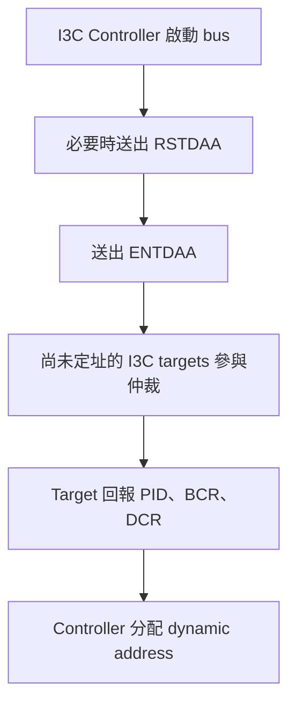
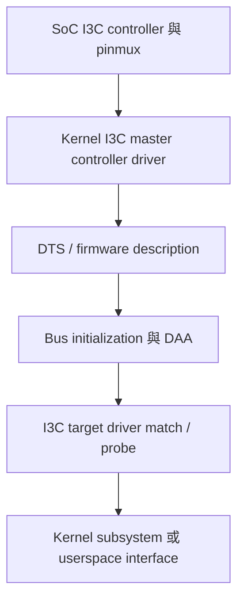

# 22. I3C Framework 與 OpenBMC Porting

I2C、SMBus、PMBus、Linux I2C framework、mux、hwmon 與 OpenBMC sensor data path 已在[第 6 章](../01_part_1_hardware_abstraction_layer/06_i2c_smbus_and_pmbus.md)說明，本章不再重複。第 22 章只處理 I3C 新增的協定能力、Linux framework、平台描述、driver 綁定與 bring-up 方法。

## 適用範圍

本章適用於需要在 BMC 平台導入 I3C controller、I3C target、mixed bus、DAA、CCC、IBI 或 Hot-Join 的工程師。若問題是固定 I2C address、`i2c-tools`、I2C mux、PMBus command、hwmon 或 D-Bus sensor mapping，請直接回到[第 6 章](../01_part_1_hardware_abstraction_layer/06_i2c_smbus_and_pmbus.md)。MCTP over I3C 則參考[第 33 章](../05_part_5_management_interfaces_and_networking/33_mctp_pldm_spdm.md)。

## 適用讀者

- 負責 SoC I3C controller、pinmux、clock、reset、IRQ、DMA 與 Device Tree 的 BSP 工程師。
- 負責 I3C target driver、DAA、CCC、IBI、Hot-Join 或 mixed-bus 驗證的 kernel 工程師。
- 需要判斷問題停在硬體、controller driver、bus enumeration、target probe 或上層服務的人員。

## 快速導覽

- [I3C 核心差異](#221-i3c-核心差異)
- [Linux I3C Framework](#222-linux-i3c-framework)
- [Device Tree 與平台描述](#223-device-tree-與平台描述)
- [DAA、CCC、IBI 與 Hot-Join](#224-daa-ccc-ibi-與-hot-join)
- [Mixed Bus 設計邊界](#225-mixed-bus-設計邊界)
- [Bring-up 與除錯流程](#226-bring-up-與除錯流程)
- [驗收 Checklist](#227-驗收-checklist)

## 22.1 I3C 核心差異

I3C 是 MIPI Alliance 定義的兩線式匯流排。它沿用 `SCL` 與 `SDA` 的基本連線概念，並針對裝置識別、位址管理、傳輸效率與事件通知加入新的協定能力。I3C 不是單純把 I2C clock 調快，也不能只因接腳相同就假設所有 I2C target 都可直接放入任意 I3C bus。

### 22.1.1 快速比較

| 項目 | I2C | I3C |
|---|---|---|
| 主要訊號 | `SCL`、`SDA` | `SCL`、`SDA` |
| 位址 | 常見為固定 7-bit address | 支援 static address 與 dynamic address |
| 位址配置 | Strap、固定值、register 或平台描述 | Controller 可透過 DAA 分配 dynamic address |
| 匯流排管理 | 沒有統一的通用管理命令集 | 使用 CCC 管理 bus 與 targets |
| Target 主動通知 | 通常使用額外 IRQ GPIO 或由 controller polling | 支援 IBI，事件可在 bus 內傳送 |
| 裝置識別 | 主要依賴 address 與平台描述 | 可使用 PID、BCR、DCR 等標準資訊 |
| 電氣驅動 | 主要為 open-drain | 依傳輸階段使用 open-drain 或 push-pull |
| Legacy 相容性 | 原生 I2C | 可在符合條件時與部分 legacy I2C targets 共存 |
| Linux 生態 | framework 與 userspace tools 成熟 | 需確認 controller driver、target driver、Kernel 與 userspace 支援 |

### 22.1.2 Dynamic Address Assignment

I2C target 通常使用固定位址。如果相同位址的裝置位於同一 bus segment，平台常需要 address strap、mux、enable GPIO 或不同 bus 來避開衝突。

I3C target 可具有 static address，也可由 controller 執行 DAA，取得 dynamic address。常見流程如下：



常見 CCC 包括：

- `RSTDAA`：Reset Dynamic Address Assignment，清除或重設既有的 dynamic address assignment。
- `ENTDAA`：Enter Dynamic Address Assignment，開始動態位址分配流程。

`RSTDAA` 的重點是重設 dynamic address，不應簡化成「讓 I3C 裝置切回 I2C mode」。裝置仍是 I3C capable target，只是後續需要重新取得 dynamic address。實際 reset 行為仍要依裝置規格與 bus 狀態確認。

### 22.1.3 CCC

CCC（Common Command Code）是 I3C 的標準管理命令，可分為 broadcast CCC 與 direct CCC：

- Broadcast CCC 對符合條件的多個 targets 生效。
- Direct CCC 對指定 dynamic address 的 target 操作。
- 裝置私有 register protocol 仍可存在，CCC 不等於所有裝置功能都被完全標準化。

使用 CCC 前必須確認 controller driver 與 target driver 是否實作對應命令。只有硬體宣稱支援 I3C，不代表 Linux userspace 已提供直接發送所有 CCC 的穩定介面。

### 22.1.4 IBI

IBI（In-Band Interrupt）讓 I3C target 使用同一條 bus 向 controller 提出事件。相較於每顆 I2C sensor 都配置獨立 IRQ GPIO，IBI 可減少 GPIO 與走線需求，也可降低持續 polling 的負擔。

```text
傳統 I2C：Target -- IRQ GPIO --> Controller
                     + SDA/SCL

I3C：     Target -- IBI over SDA/SCL --> Controller
```

IBI 不是無條件可用。Controller、target、driver、interrupt policy 與 payload handling 都必須支援，系統也要處理 IBI 排程、流量與錯誤情況。

### 22.1.5 PID、BCR、DCR 與 LVR

I3C 裝置識別與能力描述常涉及：

- `PID`（Provisional ID）：48-bit 裝置識別資訊，DAA 時可用來區分 targets。
- `BCR`（Bus Characteristics Register）：描述 target 的 bus 能力與行為特性。
- `DCR`（Device Characteristics Register）：描述 target 的裝置類別。
- `LVR`（Legacy I2C Virtual Register）：由 controller 用來描述 legacy I2C target 的相關 bus 特性，不應解釋成 I2C 裝置內一定存在的實體 register。

若 DTS 或 driver 要描述 I3C target，應以目前 Kernel binding 與裝置規格為準，不應只從 PID 的外觀推導所有欄位。

### 22.1.6 Open-Drain 與 Push-Pull

I2C 主要使用 open-drain，由 pull-up resistor 讓線路回到高電位。I3C 在需要共享、仲裁或相容性的階段仍可使用 open-drain，其他資料傳輸階段則可使用 push-pull，以改善上升時間與傳輸效率。

因此 I3C 的電氣特性不是「整條 bus 永遠 push-pull」。設計時仍需評估：

- Pull-up 與 I3C controller 的電氣要求。
- Legacy I2C target 的電壓與 spike filter 特性。
- Bus capacitance、走線、connector 與 level shifter。
- 混合 bus 可接受的最高速度。
- Hot-plug、power-off leakage 與 unpowered target 行為。

### 22.1.7 Mixed Bus 與 Legacy I2C Targets

I3C 可支援混合式 bus，但必須確認：

1. I3C controller 支援 legacy I2C targets。
2. I2C target 的 address 不與 I3C reserved address rules 衝突。
3. I2C target 的電氣與時序特性符合 mixed-bus 要求。
4. Level shifter、mux 或 buffer 明確支援預定模式。
5. DTS／ACPI 能正確區分 I3C target 與 legacy I2C target。
6. 所有裝置在 bus 初始化、reset、hot-plug 與 power cycle 後都能恢復。

相同的 `SCL`／`SDA` 接腳只代表接線形式相似，不代表協定與電氣行為必然相容。

### 22.1.8 Linux I3C Porting

Linux I3C 整合建議依下列層次檢查：



Bring-up 時至少確認：

- SoC controller、clock、reset、IRQ、DMA 與 pinctrl。
- Kernel config 與 controller driver 是否支援該 SoC revision。
- DAA 的執行時機，以及 target 在 DAA 當下是否已供電並解除 reset。
- Target 的 PID、BCR、DCR、static address 與 dynamic address。
- IBI、CCC、hot-join 與 error recovery 是否被平台使用及支援。
- Legacy I2C targets 是否以正確方式宣告。

## 22.2 Linux I3C Framework

Linux I3C subsystem 與 I2C subsystem 是不同的 framework。不要因為兩者都使用 `SCL`、`SDA`，就假設 I3C target 會以一般 `i2c_client` 建立。排查時先確認物件層級：

```text
SoC I3C controller
  -> I3C master controller driver
    -> I3C bus initialization
      -> DAA / device discovery
        -> struct i3c_device
          -> I3C target driver match / probe
            -> subsystem or userspace interface
```

### 22.2.1 Controller Driver

Controller driver 負責註冊 I3C master controller、執行 bus initialization、傳送 private transfer 與 CCC，並視硬體能力處理 IBI、Hot-Join、error recovery 與 legacy I2C transfer。Bring-up 前需核對：

- Kernel config 已啟用 I3C core 與正確的 SoC controller driver。
- Controller MMIO、clock、reset、IRQ、DMA 與 pinctrl 資源正確。
- Driver 支援目前 SoC revision 與預計使用的功能。
- Bootloader 沒有留下 controller 或 targets 無法接受的狀態。

### 22.2.2 Target Device 與 Driver Match

I3C target 可在 bus enumeration 與 DAA 過程中被識別。Driver match 應以目前 kernel I3C API、target identity 與 driver table 為準，不應把 dynamic address 當成永久身分。Dynamic address 在 reset、power cycle 或重新 DAA 後可能改變，平台軟體不可依賴固定 dynamic address 識別實體裝置。

### 22.2.3 Private Transfer、CCC 與 Subsystem Interface

I3C private transfer 用於 target-specific data；CCC 用於標準化 bus management。Driver probe 成功後，仍需確認它是否向預期 kernel subsystem 註冊介面，例如 hwmon、IIO、MCTP 或其他 class。只有 DAA 成功，不代表上層功能已可用。

## 22.3 Device Tree 與平台描述

Device Tree 至少要正確描述 controller 狀態、pinmux、clock、reset、interrupt 與 bus 下的 targets。實際 property、`reg` 編碼與 target identity 格式必須依目前 kernel binding 與 SoC DTS 範例，不要直接套用 I2C node 寫法。

Bring-up 時需同時核對：

1. Source DTS 是否正確。
2. Build 產出的 DTB 是否包含變更。
3. Bootloader 是否載入該 DTB。
4. Running Device Tree 是否與預期一致。
5. Controller 與 target driver 是否完成 probe。

如果 bus 上包含 legacy I2C targets，必須依 binding 明確描述，並確認 controller driver 支援 mixed bus。不要只靠相同的兩線接法推定相容。

## 22.4 DAA、CCC、IBI 與 Hot-Join

### 22.4.1 DAA 驗證

DAA 排查應保存每次 enumeration 的 PID、BCR、DCR、static address 與分配後的 dynamic address。若 target 未參與 DAA，依序確認供電、reset、bus waveforms、identity、reserved address、controller capability 與 driver log。

### 22.4.2 CCC 使用邊界

使用 CCC 前，先確認命令是 broadcast 或 direct、controller 是否支援、target 是否宣告對應能力，以及命令是否會改變 address 或 bus state。Bring-up script 不應在沒有保存現況時直接送出會改變狀態的 CCC。

### 22.4.3 IBI 驗證

IBI 驗證不只看 interrupt 次數，還要確認 enable flow、payload、acknowledgement、queue overflow、流量限制與 driver callback。若 IBI 不工作，先確認基本 private transfer 與 target probe，再排查 IBI，避免同時追多個變數。

### 22.4.4 Hot-Join

若平台使用 Hot-Join，需驗證 target 在 late power-on、reset release、拔插或重新上電後能被 controller 發現，並確認重新 enumeration 不會破壞既有裝置服務。未使用 Hot-Join 的固定平台應明確記錄為 `N/A`。

## 22.5 Mixed Bus 設計邊界

Mixed bus 驗證至少包含：

- Controller 是否支援 legacy I2C targets。
- Legacy target address 是否碰到 I3C reserved address rules。
- Pull-up、voltage、spike filter、level shifter、mux 與 buffer 是否符合 mixed-bus 要求。
- Legacy target 是否可能長時間 clock stretch 或在未供電時拉住 bus。
- I3C push-pull 階段與 legacy devices 的電氣相容性。
- Reset、power cycle 與 error recovery 後所有 targets 是否恢復。

若平台只是一般 I2C/PMBus bus，不需要為了「較新」而改用 I3C。只有 controller、targets、board topology、kernel driver與 validation plan 都具備時，I3C 的 DAA、IBI 與傳輸效率才有實際價值。

## 22.6 Bring-up 與除錯流程

建議依層級由下往上排查：

1. **硬體層**：量測 power、reset、SCL、SDA、pull-up、voltage 與 bus idle state。
2. **Controller 層**：確認 clock、reset、IRQ、DMA、pinctrl、kernel config 與 controller probe。
3. **Bus 層**：確認 bus initialization、DAA、CCC response 與 error recovery。
4. **Target 層**：確認 PID/BCR/DCR、dynamic address、driver match 與 probe result。
5. **功能層**：確認 private transfer、IBI、Hot-Join 及預期 subsystem interface。
6. **服務層**：若資料需到 OpenBMC userspace，再確認對應 service、D-Bus object 與 API mapping。

### 22.6.1 最小 Log Package

每次 issue 至少保存：

- Board revision、SoC revision、image、kernel、DTB 與 driver commit。
- Controller register dump 與完整 kernel boot log。
- Running Device Tree。
- Logic analyzer waveform，包含 reset release、bus initialization 與失敗交易。
- DAA 前後的 device identity 與 dynamic address。
- CCC、IBI 或 Hot-Join 的測試步驟和結果。
- Power cycle、warm reset 與 BMC reset 是否可重現。

### 22.6.2 常見現象判讀

| 現象 | 優先檢查 |
| --- | --- |
| Controller node 不存在 | DTB、kernel config、controller driver、clock/reset |
| Controller probe 失敗 | MMIO、IRQ、DMA、pinctrl、SoC revision |
| Bus idle 異常 | Pull-up、voltage、unpowered target、level shifter、stuck line |
| Target 未參與 DAA | Power/reset、PID/BCR/DCR、waveform、reserved address |
| DAA 成功但 driver 未 probe | Match table、module、driver registration、identity |
| Private transfer 正常但 IBI 不工作 | IBI enable、capability、queue、callback、traffic policy |
| Reset 後 dynamic address 改變造成服務失效 | 軟體錯誤依賴 dynamic address，應改用穩定 identity |
| Mixed bus 上 legacy target 異常 | Electrical compatibility、clock stretch、address、buffer/mux |

## 22.7 驗收 Checklist

- [ ] Controller 的 power、clock、reset、IRQ、DMA 與 pinmux 已驗證。
- [ ] Kernel config、controller driver 與 target driver 版本已記錄。
- [ ] Running DTB 與 source DTS、build output 一致。
- [ ] DAA 可在 cold boot、warm reset 與 BMC reset 後穩定完成。
- [ ] PID、BCR、DCR 與 dynamic address 可被記錄並正確判讀。
- [ ] 軟體不依賴固定 dynamic address 識別實體 target。
- [ ] 使用到的 CCC 已逐項驗證；未使用項目標為 `N/A`。
- [ ] IBI 與 Hot-Join 若有使用，已完成正常與錯誤路徑驗證。
- [ ] Mixed bus 上所有 legacy I2C targets 均已驗證；若無 mixed bus 則標為 `N/A`。
- [ ] Error recovery 不會造成其他 targets 永久離線。
- [ ] Target driver probe 後可建立預期 subsystem 或 userspace interface。
- [ ] Log package 足以讓另一位工程師重現問題。

## 22.8 本章重點

1. I3C 不是高速版 I2C；核心差異包括 DAA、CCC、IBI、Hot-Join、裝置 identity 與不同電氣階段。
2. Dynamic address 不是永久身分，服務不可用它固定綁定實體裝置。
3. DAA 成功只代表 bus enumeration 前進一步，仍要確認 target driver、subsystem 與 userspace data path。
4. Mixed bus 必須同時驗證協定、位址、電氣與 error recovery。

## 22.9 延伸閱讀

- [第 6 章：I2C、SMBus 與 PMBus](../01_part_1_hardware_abstraction_layer/06_i2c_smbus_and_pmbus.md)
- [第 20 章：Device Tree](../02_part_2_bsp_kernel_and_device_tree/20_device_tree_common_patterns_and_troubleshooting.md)
- [第 21 章：U-Boot、Kernel Driver 與核心服務](../02_part_2_bsp_kernel_and_device_tree/21_u_boot_kernel_drivers_and_core_services.md)
- [第 33 章：MCTP、PLDM 與 SPDM](../05_part_5_management_interfaces_and_networking/33_mctp_pldm_spdm.md)
- MIPI I3C specification overview: https://www.mipi.org/specifications/i3c-sensor-specification
- Linux kernel I3C subsystem documentation: https://docs.kernel.org/driver-api/i3c/
