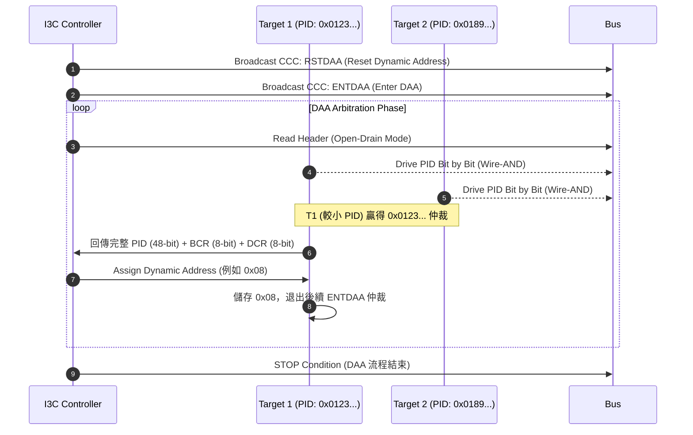
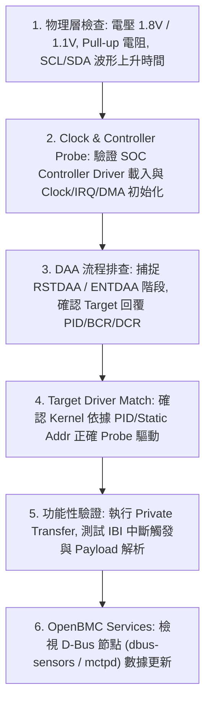

# 22. I3C Framework 與 OpenBMC Porting

I2C、SMBus、PMBus、Linux I2C framework、mux、hwmon 與 OpenBMC sensor data path 已在[第 6 章](../01_part_1_hardware_abstraction_layer/06_i2c_smbus_and_pmbus.md)說明，本章不再重複。第 22 章只處理 I3C 新增的協定能力、Linux framework、平台描述、driver 綁定與 bring-up 方法。

## 適用範圍

本章適用於需要在 BMC 平台導入 I3C controller、I3C target、mixed bus、DAA、CCC、IBI 或 Hot-Join 的工程師。若問題是固定 I2C address、`i2c-tools`、I2C mux、PMBus command、hwmon 或 D-Bus sensor mapping，請直接回到[第 6 章](../01_part_1_hardware_abstraction_layer/06_i2c_smbus_and_pmbus.md)。MCTP over I3C 則參考[第 33 章](../05_part_5_management_interfaces_and_networking/33_mctp_pldm_spdm.md)。

## 適用讀者

* **BSP / Kernel 工程師**：負責 SoC I3C controller (如 DW IP 或 SOC 自研 IP)、pinmux、clock、reset、IRQ、DMA 控制以及 Device Tree 撰寫。
* **System Integration / Firmware 工程師**：負責 I3C target driver 開發、DAA 流程排查、CCC 指令操作、IBI 處理機制以及 OpenBMC 服務對接。
* **Hardware / Validation 工程師**：負責訊號完整性 (SI)、Push-Pull / Open-Drain 準位切換、Mixed Bus 電氣相容性及匯流排波形排查。

## 22.1 I3C 核心協定與物理層機制

MIPI I3C 係為解決傳統 I2C 頻寬不足、腳位過多 (需要額外 IRQ 腳位) 及功耗過高而設計的雙線式 (SCL, SDA) 匯流排標準。它維持了兩線式連線架構，但在電氣驅動、位址分配、傳輸速率與事件通知上帶來了革命性的改進。

```
I2C 傳統拓撲：  Controller <=== SCL / SDA (Open-Drain, 固定 Pull-Up) ===> Targets
                                <--- IRQ GPIO 1..N (獨立實體走線) ----

I3C 現代拓撲：  Controller <=== SCL / SDA (Open-Drain + Push-Pull 動態切換) ===> Targets
                                (透過 IBI 在 SDA/SCL 上發送中斷訊號，無需額外 GPIO)

```

### 22.1.1 傳統 I2C vs I3C 比較

| 比較項目 | Traditional I2C | MIPI I3C v1.0 / v1.1.1 |
| --- | --- | --- |
| **實體線路** | SCL, SDA, 額外中斷腳位 | SCL, SDA (無須額外中斷線) |
| **匯流排驅動** | 全程 Open-Drain | **Open-Drain** (仲裁/標頭) + **Push-Pull** (高傳輸階段) |
| **最高傳輸速率** | Standard (100 kbps), Fast (400 kbps), Fast+ (1 Mbps) | **SDR (12.5 Mbps)**, **HDR-DDR (25 Mbps)**, HDR-TSP/TSL |
| **位址分配** | 硬體 Pin-strap、固定 7-bit 位址 | **Dynamic Address Assignment (DAA)** 或 Static Address |
| **裝置識別與描述** | 無標準 (依據 Datasheet 與平台描述) | 標準化 **PID** (48-bit), **BCR** (8-bit), **DCR** (8-bit) |
| **中斷機制 (IRQ)** | 邊帶 (Sideband) 專用 GPIO 腳位 | **In-Band Interrupt (IBI)** 帶有可選 Payload (MDB) |
| **匯流排控制** | 無統一管理協定 | **Common Command Code (CCC)** (廣播與單播) |
| **Hot-Plug 支援** | 不支援動態發現與定址 | 支援 **Hot-Join** 流程 |
| **功耗效率** | 較高 (Open-Drain 上升沿耗能於 Pull-up 電阻) | 較低 (Push-Pull 驅動主導，傳輸時間極短) |

### 22.1.2 物理層 signaling (Open-Drain vs. Push-Pull)

I3C 的核心電氣創新在於**混合驅動模式**：

1. **Open-Drain 模式**：
* 用於 START、STOP、Header 傳輸、Address 仲裁、DAA 過程、IBI 請求以及 Legacy I2C 相容階段。
* 速度限制在 1.5 MHz ~ 4 MHz 之間，確保線路上的多個裝置可以在不發生電氣短路的情況下進行 Wire-AND 仲裁。


2. **Push-Pull 模式**：
* 當 Controller 取得 Bus 控制權並進入 Data Transfer 階段（SDR 或 HDR）時，SCL 與 SDA 切換為 Push-Pull 主動驅動。
* 擺脫 Pull-up 電阻充放電 RC 時間常數的限制，達到 12.5 MHz 甚至更高的 Clock 速率，大幅降低訊號上升時間與動態功耗。


$$R_{pullup, min} = \frac{V_{DD} - V_{OL}}{I_{OL}}, \quad R_{pullup, max} = \frac{t_r}{0.8473 \times C_{bus}}$$

> **注意事項**：在 Mixed Bus 拓撲中，I3C Controller 會發送特定的 High-Kapp / SCL 脈衝，使 Legacy I2C 裝置的 Spike Filter 濾除高頻訊號，避免 Legacy 裝置將 I3C 高速資料誤判為 START/STOP 條件。

### 22.1.3 傳輸模式 (SDR & HDR)

* **SDR (Standard Data Rate)**：預設高傳輸模式，Clock 頻率最高達 12.5 MHz，資料在 SCL 下降沿 (或上升沿) 觸發，位元速率為 12.5 Mbps。
* **HDR-DDR (Double Data Rate)**：在 SCL 的上升沿與下降沿均進行資料移位，資料傳輸率翻倍至 25 Mbps。
* **HDR-TSP (Ternary Symbol Pure) / HDR-TSL (Ternary Symbol Legacy)**：利用 SCL 與 SDA 的三進位符號編碼，專為無拉高電阻的高密拓撲設計。

### 22.1.4 裝置識別與能力暫存器 (PID, BCR, DCR, LVR)

每顆相容 I3C 的 Target 裝置均包含以下內建暫存器資訊：

1. **PID (Provisional ID, 48-bit)**：
* **Bits** (15 bits)：MIPI Vendor ID (例如 ASPEED, Nuvoton, Intel 等 MIPI 會員代碼)。
* **Bit [32]** (1 bit)：Provisioned ID Type (0 = Vendor Assigned, 1 = Random System Assigned)。
* **Bits** (20 bits)：Part ID (廠商自訂產品型號)。
* **Bits [11:0]** (12 bits)：Instance ID / Serial Number (晶片實例或序號)。


2. **BCR (Bus Characteristics Register, 8-bit)**：描述 Target 的匯流排傳輸能力：
* `Bit [7:6]`：I3C Core 核心版本與能力。
* `Bit [2]`：IBI Requests Allowed (是否支援 IBI)。
* `Bit [1]`：IBI Payload Present (IBI 是否包含 Mandatory Data Byte)。
* `Bit [0]`：Max Data Speed Limitation (是否有頻寬限制)。


3. **DCR (Device Characteristics Register, 8-bit)**：描述 Target 的功能類別 (例如：`0x63` 代表 Sensor, `0xCC` 代表 DDR5 SPD/Hub, `0x0C` 代表 Management Controller)。
4. **LVR (Legacy I2C Virtual Register, 8-bit)**：非實體暫存器，由 Controller 在 DTS 中針對 Legacy I2C 裝置定義，用於描述其 I2C 速率等級 (Standard/Fast/Fast+) 與 Spike Filter 特性。

## 22.2 動態位址分配 (DAA) 與命令碼 (CCC) 運作機制

### 22.2.1 DAA 完整 Arbitration 時序與流程

在 Bus 啟動時，Controller 會對 Bus 上的所有 I3C Target 執行 DAA 流程，透過 48-bit PID 進行逐位元仲裁，自動分配不重複的 7-bit Dynamic Address。



### 22.2.2 常用 Common Command Code (CCC) 彙整表

CCC 可分為 **Broadcast CCC** (所有裝置同時接收，Cmd Code `0x00`~`0x7F`) 與 **Direct CCC** (針對指定 Dynamic Address 裝置，Cmd Code `0x80`~`0xFF`)：

| CCC 名稱 | Cmd Code | 類型 | 功能說明 |
| --- | --- | --- | --- |
| **ENEC / DISEC** | `0x00` / `0x01` (B)<br>

<br>`0x80` / `0x81` (D) | Both | 啟用 (Enable) 或停用 (Disable) Target 的特定事件 (如 IBI, Hot-Join)。 |
| **RSTDAA** | `0x06` (B)<br>

<br>`0x86` (D) | Both | 清除或重置 Target 已分配的 Dynamic Address。 |
| **ENTDAA** | `0x07` (B) | Broadcast | 命令所有未定址的 Target 參與 Dynamic Address 分配流程。 |
| **SETDEFBYTE** | `0x28` (B) | Broadcast | 設定系統預設通訊位元組。 |
| **SETAASA** | `0x29` (B) | Broadcast | 將 Target 的 Static Address 直接設置為 Dynamic Address (Static to Dynamic)。 |
| **SETDASA** | `0x87` (D) | Direct | 直接指定 Target 的 Dynamic Address (不通過 PID 仲裁)。 |
| **SETNEWDA** | `0x88` (D) | Direct | 變更已定址 Target 的 Dynamic Address。 |
| **GETPID** | `0x8D` (D) | Direct | 讀取指定 Target 的 48-bit Provisional ID。 |
| **GETBCR** | `0x8E` (D) | Direct | 讀取指定 Target 的 Bus Characteristics Register (BCR)。 |
| **GETDCR** | `0x8F` (D) | Direct | 讀取指定 Target 的 Device Characteristics Register (DCR)。 |
| **GETSTATUS** | `0x90` (D) | Direct | 讀取 Target 的內部狀態暫存器 (例如中斷旗標、錯誤碼)。 |
| **SETMWL / GETMWL** | `0x09` / `0x8B` | Both | 設定 / 取得 Max Write Length (最大寫入長度)。 |
| **SETMRL / GETMRL** | `0x0A` / `0x8C` | Both | 設定 / 取得 Max Read Length (最大讀取長度) 及 IBI Payload 長度。 |

### 22.2.3 In-Band Interrupt (IBI) 仲裁機制與 Mandatory Data Byte (MDB)

當 Target 需要向 Controller 提出發報 (如 Sensor Data Ready、Alarm Temp Threshold)：

1. **IBI Request**：Target 在 Bus 空閒時，將 SDA 拉低 (Start Condition)。
2. **Arbitration**：當多個 Target 同時發起 IBI 時，Controller 發送 Clock，各 Target 驅動其 Dynamic Address 進行 Open-Drain 仲裁。**位址數值越小者優先權越高** (例如 `0x08` 優先於 `0x0A`)。
3. **MDB & Payload**：Controller 透過 ACK 允許 IBI 後，若 Target 的 BCR 標示支援 Payload，Target 會立即在 Bus 上傳送 1 Byte 的 **MDB (Mandatory Data Byte)** 以及後續資料 Byte，Controller 無需發起額外的 Polling 即可讀取事件內容。

```text
IBI Data Frame:
+-------------------+-----------------+-----+------------------+------------------+------+
| Target Dy Address | Direction (R=1) | ACK | MDB (1 Byte)     | Optional Payload | STOP |
| (Arbitration Bit) |                 |     | (e.g. 0xA0 Temp) | (N Bytes)        |      |
+-------------------+-----------------+-----+------------------+------------------+------+

```

### 22.2.4 Hot-Join 流程

新加入匯流排的裝置 (例如熱插拔主板模組、擴充卡) 可以發出 **Hot-Join Request** (`0x02` Reserved Address)， Controller 收到後會發起 `ENTDAA` 或 `SETDASA` 指令為新插入的裝置動態指定位址，實現即插即用。

## 22.3 Linux Kernel I3C Subsystem 架構解析

Linux 在 v4.20 引入了獨立的 I3C Subsystem (`drivers/i3c/`)，與傳統 `drivers/i2c/` 完全解耦。

### 22.3.1 核心資料結構與物件關係

```
                     +-------------------------------+
                     | struct i3c_master_controller  |
                     +-------------------------------+
                                     |
              +----------------------+----------------------+
              |                                             |
              v                                             v
   +--------------------+                        +--------------------+
   | struct i3c_bus     |                        | struct i2c_adapter | (Legacy I2C Fallback)
   +--------------------+                        +--------------------+
              |
              +----------------------+
              |                      |
              v                      v
   +--------------------+   +--------------------+
   | struct i3c_device  |   | struct i3c_device  |
   +--------------------+   +--------------------+
              |                      |
              v                      v
   +--------------------+   +--------------------+
   | struct i3c_driver  |   | struct i3c_driver  |
   +--------------------+   +--------------------+

```

* `struct i3c_master_controller`：抽象化 Controller 硬體驅動 API (`ops->do_priv_xfers`, `ops->send_ccc_cmd`, `ops->enable_ibi`)。
* `struct i3c_bus`：維護 Bus 上所有被發現的 I3C 裝置清單與 Dynamic Address Bitmap。
* `struct i3c_device`：代表實體 I3C Target 裝置，內含 `struct i3c_device_info` (PID, BCR, DCR, Dynamic/Static Address)。
* `struct i3c_driver`：I3C Target 驅動程式框架，透過 `id_table` 匹配 `PID` 或 `DCR`。

### 22.3.2 Controller Driver 註冊與 Bus Enumeration 流程

1. Controller Driver 在 `probe()` 階段呼叫 `i3c_master_register()`。
2. Subsystem 初始化 `i3c_bus`，建立與 Controller 關聯的 `i2c_adapter` (確保支援 Legacy I2C 裝置)。
3. 發動初始化流程：廣播 `RSTDAA` $\rightarrow$ 發送 `ENTDAA` 掃描匯流排。
4. 針對搜尋到的每個 Target，比對 DTS 設定。若 DTS 中已指定 `assigned-address`，則優先分配該 Static/Dynamic 位址。
5. Subsystem 為每個 Target 建立 `struct i3c_device` 並掛載至 `i3c_bus`，觸發 Target Driver 的 `probe()`。

### 22.3.3 Linux I3C Target Driver 開發範例

以下為一個生產級別的 I3C Target Driver C 語言範本，包含 PID 匹配、Private Transfer 及 IBI 中斷處理：

```c
#include <linux/module.h>
#include <linux/kernel.h>
#include <linux/i3c/device.h>
#include <linux/i3c/master.h>
#include <linux/hwmon.h>

/* 定義範例 Target 暫存器與 PID (Vendor: 0x0123, Part: 0x4567) */
#define MY_SENSOR_PID_VENDOR  0x0123
#define MY_SENSOR_PID_PART    0x4567

struct my_i3c_sensor {
	struct i3c_device *i3cdev;
	struct device *hwmon_dev;
	struct i3c_ibi_payload ibi_payload;
	u8 temp_val;
};

/* IBI 中斷處理 Handle Callback */
static void my_sensor_ibi_handler(struct i3c_device *dev,
				  const struct i3c_ibi_slot *slot)
{
	struct my_i3c_sensor *priv = i3c_device_get_drvdata(dev);
	const u8 *data = slot->data;

	if (slot->len >= 1) {
		/* 第一個 Byte 通常為 MDB (Mandatory Data Byte) */
		u8 mdb = data[0];
		dev_dbg(&dev->dev, "IBI received, MDB=0x%02x\n", mdb);

		if (slot->len >= 2) {
			priv->temp_val = data[1]; /* 讀取 Payload 數據 */
		}
	}
}

/* 讀取 Sensor 數據的 Private Transfer */
static int my_sensor_read_reg(struct my_i3c_sensor *priv, u8 reg, u8 *val)
{
	struct i3c_priv_xfer xfers[2];
	u8 reg_addr = reg;

	/* Write Register Address */
	xfers[0].rnw = false;
	xfers[0].len = 1;
	xfers[0].data.out = &reg_addr;

	/* Read Data Byte */
	xfers[1].rnw = true;
	xfers[1].len = 1;
	xfers[1].data.in = val;

	return i3c_device_do_priv_xfers(priv->i3cdev, xfers, 2);
}

static int my_sensor_probe(struct i3c_device *i3cdev)
{
	struct my_i3c_sensor *priv;
	struct i3c_ibi_setup ibi_setup = { 0 };
	int ret;

	priv = devm_kzalloc(&i3cdev->dev, sizeof(*priv), GFP_KERNEL);
	if (!priv)
		return -ENOMEM;

	priv->i3cdev = i3cdev;
	i3c_device_set_drvdata(i3cdev, priv);

	/* 測試 Private Transfer 讀取晶片狀態 */
	ret = my_sensor_read_reg(priv, 0x00, &priv->temp_val);
	if (ret) {
		dev_err(&i3cdev->dev, "Failed to read sensor status: %d\n", ret);
		return ret;
	}

	/* 註冊 IBI (In-Band Interrupt) */
	if (i3cdev->info.bcr & I3C_BCR_IBI_REQ_GEN) {
		ibi_setup.max_payload_len = 4;
		ibi_setup.num_slots = 2;
		ibi_setup.handler = my_sensor_ibi_handler;

		ret = i3c_device_request_ibi(i3cdev, &ibi_setup);
		if (!ret) {
			i3c_device_enable_ibi(i3cdev);
			dev_info(&i3cdev->dev, "IBI enabled successfully\n");
		}
	}

	dev_info(&i3cdev->dev, "My I3C Sensor Driver Probed successfully\n");
	return 0;
}

static void my_sensor_remove(struct i3c_device *i3cdev)
{
	if (i3cdev->ibi) {
		i3c_device_disable_ibi(i3cdev);
		i3c_device_free_ibi(i3cdev);
	}
}

/* 匹配表格：結合 Vendor ID 與 Part ID */
static const struct i3c_device_id my_sensor_ids[] = {
	I3C_DEVICE(I3C_PID(MY_SENSOR_PID_VENDOR, MY_SENSOR_PID_PART, 0), NULL),
	{ },
};
MODULE_DEVICE_TABLE(i3c, my_sensor_ids);

static struct i3c_driver my_sensor_driver = {
	.driver = {
		.name = "my_i3c_sensor",
	},
	.id_table = my_sensor_ids,
	.probe = my_sensor_probe,
	.remove = my_sensor_remove,
};

module_i3c_driver(my_sensor_driver);

MODULE_AUTHOR("OpenBMC Engineer");
MODULE_DESCRIPTION("MIPI I3C Target Driver Example");
MODULE_LICENSE("GPL");

```

## 22.4 Device Tree 平台描述與實用範例

Device Tree 是 Linux 繫結 Controller 與預先定義 Target 屬性的核心依據。

### 22.4.1 Device Tree Property 規格說明

* `assigned-address` (Cell)：指定 DAA 流程中優先配給 Target 的 Dynamic Address。
* `reg` (3-Cells Array)：描述 Target 的身份：
* Cell 1：PID Bits (Vendor ID 與 Provisioned Type)。
* Cell 2：PID Bits [31:0] (Part ID 與 Instance ID)。
* Cell 3：BCR / DCR 與 Static Address 組合欄位。


* `i3c-scl-hz` (Cell)：I3C SDR 傳輸時的 SCL 頻率 (例如 `12500000` = 12.5 MHz)。
* `i2c-scl-hz` (Cell)：當匯流排降速傳輸 Legacy I2C 交易時的 SCL 頻率 (例如 `400000` = 400 kHz)。

### 22.4.2 完整 AST2600 SoC I3C Device Tree 實例

以下展現如何在 AST2600 平台上配置包含 **DDR5 SPD5118 Hub**、**I3C Sensor** 以及 **Legacy I2C 裝置** 的完整 DTS 節點：

```dts
&i3c0 {
    status = "okay";
    pinctrl-names = "default";
    pinctrl-0 = <&pinctrl_i3c0_default>;

    i3c-scl-hz = <12500000>;  /* I3C SDR Mode 12.5 MHz */
    i2c-scl-hz = <400000>;    /* Legacy I2C Mode 400 kHz */

    /* 1. Target 1: DDR5 SPD Hub (JEDEC SPD5118) */
    spd_hub@0,2c00000000 {
        reg = <0x0000 0x0000 0x2c000000>; /* Static Address 0x2C */
        assigned-address = <0x18>;        /* 動態位址設定為 0x18 */
        compatible = "jedec,spd5118";
    };

    /* 2. Target 2: 高階 I3C 溫度 Sensor (完整 PID 匹配) */
    i3c_sensor@123,45670000 {
        /* PID: Vendor=0x0123, Part=0x4567, Instance=0x0000 */
        reg = <0x0123 0x45670000 0x00000000>;
        assigned-address = <0x08>;        /* 動態位址設定為 0x08 (高 IBI 優先權) */
        compatible = "vendor,my-i3c-sensor";
    };

    /* 3. Legacy I2C Device (傳統 PMBus 電源模組共存於相同 Bus) */
    i2c_pmbus@58 {
        reg = <0x58 0x00 0x10000000>;     /* 標註 7-bit I2C 位址 0x58 與 Legacy LVR 屬性 */
        compatible = "ti,tps53679";
    };
};

```

## 22.5 OpenBMC 整合與 Sensor Data Path

在 OpenBMC 架構下，I3C 裝置數據透傳至 D-Bus 的流程與 I2C 相似，但新增了**動態定址適應**與 **MCTP over I3C** 的超高速控制路徑。

```
Physical I3C Devices (Sensors, SPD Hubs, CPLD)
      | (IBI / Private Transfer / MCTP)
      v
Linux Kernel (I3C Subsystem / Hwmon / MCTP Core)
      | (/sys/class/hwmon/ or /dev/mctpi3c0)
      v
OpenBMC Userspace:
  ├── dbus-sensors (i3csensor / spdsensor)
  └── mctpd (MCTP over I3C Binding Engine)
      |
      v
System Management Interface (Redfish / PLDM / IPMI)

```

### 22.5.1 OpenBMC 中的 I3C 裝置管理 (動態 DAA 對應)

由於 DAA 每次上電分配的 Dynamic Address 可能變動，OpenBMC 服務 **不應使用固定的 Dynamic Address** 作為 Key：

* **正確架構**：使用 `/sys/bus/i3c/devices/i3c-X/PID` (48-bit PID) 作為硬體實體的唯一雜湊 ID。
* **Entity-Manager** 透過辨識 PID、DCR 與 DTS `assigned-address` 生成穩定的 D-Bus 物件路徑。

### 22.5.2 Entity-Manager 設定檔與 `dbus-sensors`

在 Entity-Manager 中宣告 I3C Sensor 的 JSON 範例：

```json
{
    "Exposes": [
        {
            "Address": "0x08",
            "Bus": 0,
            "I3CPID": "0x012345670000",
            "Name": "Dimmer_0_Temp",
            "Thresholds": [
                {
                    "Direction": "Greater",
                    "Name": "UpperCritical",
                    "Severity": 1,
                    "Value": 85.0
                }
            ],
            "Type": "I3CSensor"
        }
    ],
    "Name": "Main_Board_I3C_Sensors",
    "Probe": "xyz.openbmc_project.FruDevice"
}

```

### 22.5.3 MCTP over I3C (MIPI MCTP Binding) 在 OpenBMC 的架構

MIPI Alliance 定義了 **MCTP over I3C Binding Specification** (mipi.org)，比傳統 MCTP over SMBus 傳輸速度快 20~100 倍：

1. **Linux Kernel MCTP Driver**：Kernel 包含 `drivers/net/mctp/mctp-i3c.c`。
2. **傳輸機制**：
* MCTP 控制封包封裝於 I3C Private Write / Read Transfers 或由 Target 透過 IBI 主動發送 MCTP 請求。
* 提供高頻寬、低延遲的 SPDM (Security Protocol and Data Model) 韌體驗證與 PLDM 監控。


3. **OpenBMC `mctpd` 整合**：
`mctpd` 藉由 Linux Socket (`AF_MCTP`) 自動繫結 I3C 介面 (如 `mctpi3c0`)，直接與主板上的 CPU、CPLD 或 PCIe 網卡進行 PLDM 數據交換。

## 22.6 Mixed Bus 設計邊界與電氣相容性

在實際主板設計中，經常發生「I3C Controller 需同時掛載 I3C Target 與傳統 I2C Slave」的情況。此時必須嚴格遵守 Mixed Bus 電氣規範。

### 22.6.1 Legacy I2C Coexistence 的硬體限制與 Spike Filter 要求

1. **50ns Spike Filter 必備**：所有連接在 Mixed Bus 上的 Legacy I2C Target **必須內建 50ns 訊號濾波器 (Spike Filter)**。否則 I3C 12.5 MHz 高速 SCL 邊緣會被 Legacy 裝置誤認為 START/STOP 條件，造成 Bus Lockup。
2. **禁止不相容的 I2C 裝置**：不支援 Spike Filter 的古老 I2C 裝置 (如舊型 100 kHz EEPROM) **絕對不能** 直接接到 Mixed Bus 上，必須使用 I3C-to-I2C Bridge 晶片隔離。

### 22.6.2 High-Speed Push-Pull 邊緣斜率與 Pull-Up 電阻計算

* **Open-Drain 階段 Pull-up 電阻**：典型的上拉電阻阻值選用：
* $V_{DD} = 1.8V$ 時，Pull-up 電阻通常選用 **$1.0\ k\Omega \sim 1.5\ k\Omega$**。


* **Bus Capacitance (匯流排負載電容)**：
* I3C 規範要求 Bus 總負載電容 $C_{LOAD}$ 應控制在 **$< 50\ pF$** (SDR 模式下)。
* 若 Trace 過長或裝置過多導致 $C_{LOAD} > 50\ pF$，SCL 頻率必須自動降頻 (如降至 8 MHz 或 6 MHz)。


### 22.6.3 Level Shifter 與 Multiplexer 在 I3C 拓撲下的選型禁忌

> **警告：傳統 I2C 雙向 Level Shifter (如 PCA9306) 或 Mux (如 PCA9548A) 無法直接用於 I3C 高速 Push-Pull 傳輸！**

* **原因**：PCA9306 等傳統 I2C Level Shifter 依賴內部 N-MOSFET 開漏結構與外部 Pull-up 電阻充放電，其頻寬上限通常只有 1 MHz ~ 2 MHz，無法通過 12.5 MHz 的 Push-Pull 高速邊緣。
* **正確選型**：必須選用支援 **MIPI I3C 專用動態開漏/推挽雙向轉接晶片** (例如 NXP LSF010x 系列或具備 Direction Sensing / Auto-direction 的 I3C Level Translator)。

## 22.7 Target Bring-up 與完整除錯流程

### 22.7.1 階層式 Bring-up SOP



### 22.7.2 Sysfs / DebugFS 偵測指令與 Userspace 工具操作

#### 1. 檢視 Linux Kernel 匯流排清單與已識別的 I3C 裝置

```bash
# 列出系統中所有的 I3C Controller 匯流排
$ ls -l /sys/bus/i3c/devices/
# 輸出範例：
# i3c-0 -> ../../../devices/platform/soc/1e7a0000.i3c/i3c-0
# 0-12345670000 -> ../../../devices/platform/soc/1e7a0000.i3c/i3c-0/0-12345670000 (格式: Bus-PID)

# 查看特定 I3C 裝置的詳細 PID、BCR、DCR 與動態位址
$ cat /sys/bus/i3c/devices/i3c-0/0-12345670000/hd_info/pid
$ cat /sys/bus/i3c/devices/i3c-0/0-12345670000/hd_info/bcr
$ cat /sys/bus/i3c/devices/i3c-0/0-12345670000/hd_info/dcr
$ cat /sys/bus/i3c/devices/i3c-0/0-12345670000/dynamic_address

```

#### 2. 檢視 dmesg 初始化 Log

```bash
$ dmesg | grep -i i3c
# 正常觀察重點：
# i3c-master 1e7a0000.i3c: I3C bus master successfully registered
# i3c-master 1e7a0000.i3c: DAA process started
# i3c-master 1e7a0000.i3c: Found dev PID: 0x012345670000, assigned dynamic addr: 0x08

```

#### 3. 使用 `i3c-tools` (若系統有編譯 `i3cget` / `i3cset`)

```bash
# 針對位址 0x08 發送 Private Read 2 Bytes
$ i3cget -y 0 0x08 0x00 2

# 針對位址 0x08 寫入 Command 0x01, Data 0xFF
$ i3cset -y 0 0x08 0x01 0xFF

```
| 常見故障現象 | 可能原因 | 診斷與建議排查步驟 |
| --- | --- | --- |
| **DAA 時 Target 無回應 (ENTDAA NACK)** | 1. Target 處於 Reset 狀態或未供電<br>2. 訊號線 Pull-up 電阻過小/過大<br>3. Target 僅支援 Static Address | 1. 示波器確認 Target VDD 電壓與 Reset 腳位電位。<br>2. 檢查 DTS 中是否漏寫 `reg` 屬性。<br>3. 嘗試發送 `SETDASA` 直接設定 Static Address。 |
| **DAA 仲裁過程中途崩潰 (Arbitration Fault)** | 1. 兩顆 Target 具有完全相同的 PID<br>2. SCL/SDA 波形畸變，上升沿過緩 | 1. 檢查 Target 是否來自同一批號且未設定 Instance ID。<br>2. 量測 1.5 MHz Open-Drain 階段的 $t_r$ (上升時間)，調整 Pull-up 電阻。 |
| **High-Speed Push-Pull 傳輸時產生 Bus Lockup** | 1. Mixed Bus 上掛有不支援 Spike Filter 的 Legacy I2C 裝置<br>2. 使用了不相容的 Level Shifter | 1. 將 Legacy I2C 裝置隔離或更換。<br>2. 邏輯分析儀抓取 SCL 上升沿是否在 Push-Pull 時出現階梯波或過衝 (Overshoot)。 |
| **IBI 無法觸發或 Controller 無回應** | 1. Target BCR 標示不支援 IBI<br>2. Controller Driver 未呼叫 `enable_ibi()`<br>3. IBI 權限被 `DISEC` 停用 | 1. 查看 `/sys/bus/i3c/.../bcr` 確認 Bit[2] 是否為 1。<br>2. 確認 Target Driver 是否調用 `i3c_device_request_ibi()`。<br>3. 發送 `ENEC` (CCC `0x01`) 指令重啟 IBI 中斷。 |
| **D-Bus 上 Sensor 數值久未更新** | 1. IBI Callback 丟失未處理<br>2. Dynamic Address 改變導致 `dbus-sensors` 抓錯路徑 | 1. 檢視 `/proc/interrupts` 確認 I3C Controller 中斷數有無增加。<br>2. 檢查 Entity-Manager 係以 PID 而非動態位址進行匹配。 |

## 22.8 驗收 Checklist

完成 I3C Porting 與驗收時，必須逐項確認以下項目：

* [ ] **物理層與電氣規範**：SCL/SDA 波形在 Open-Drain (1.5MHz) 與 Push-Pull (12.5MHz) 模式下的上升/下降時間符合 MIPI I3C 規範；Bus 總負載電容 $< 50\ pF$。
* [ ] **Level Shifter / Mux 選型**：板上所有 Level Shifter 均已確認支援 MIPI I3C 高速雙向 Push-Pull 傳輸。
* [ ] **Controller 驅動與 DTS 描述**：SoC Controller 在 Kernel 中無 Error Log 載入；DTS 屬性 (`i3c-scl-hz`, `i2c-scl-hz`, `reg`, `assigned-address`) 設定正確。
* [ ] **DAA 自動定址驗證**：冷開機 (Cold Boot)、暖重啟 (Warm Reset) 及 BMC Reboot 後，系統皆能 100% 穩定完成 DAA 並正確識別所有 Target 的 PID/BCR/DCR。
* [ ] **Target Driver 繫結與 IBI 機能**：Target 驅動正確對應；IBI 中斷能在 Target 發生事件時 100% 觸發，且 Controller 能無誤讀取 MDB 與 Payload。
* [ ] **Mixed Bus 相容性測試**：若有 Legacy I2C 裝置，確認其具備 50ns Spike Filter，且在高頻 I3C 傳輸時不會干擾 Bus。
* [ ] **OpenBMC Service 整合**：`dbus-sensors` 與 `mctpd` 均能無縫從 Kernel 讀取數據並呈現於 D-Bus 介面，且軟體架構不依賴固定 Dynamic Address。

## 22.9 本章重點與延伸閱讀

### 本章核心摘要

1. **電氣切換**：I3C 在 Header/仲裁階段採用 **Open-Drain**，在資料高速傳輸階段切換為 **Push-Pull**，實現 12.5 Mbps 以上的高頻寬與超低功耗。
2. **動態管理 (DAA & CCC)**：透過 48-bit PID 自動進行 DAA 位址分配，並利用 CCC (Common Command Code) 標準化匯流排管理，擺脫傳統 I2C 硬體 Pin-strap 限制。
3. **帶內中斷 (IBI)**：取消邊帶 IRQ GPIO 走線，直接在 SCL/SDA 上發起中斷，並可隨帶 1-Byte MDB 與 Payload。
4. **Linux & OpenBMC 設計原則**：Kernel 使用專屬 `drivers/i3c/` 框架；OpenBMC Userspace 必須以 **PID/Identity** 綁定裝置，絕不可依賴變動的 Dynamic Address。

### 延伸閱讀與參考規格

* [第 6 章：I2C、SMBus 與 PMBus](https://www.google.com/search?q=../01_part_1_hardware_abstraction_layer/06_i2c_smbus_and_pmbus.md)
* [第 20 章：Device Tree 常見 Pattern 與 Debug 手冊](https://www.google.com/search?q=../02_part_2_bsp_kernel_and_device_tree/20_device_tree_common_patterns_and_troubleshooting.md)
* [第 33 章：MCTP、PLDM 與 SPDM 協定與架構](https://www.google.com/search?q=../05_part_5_management_interfaces_and_networking/33_mctp_pldm_spdm.md)
* MIPI Alliance Official Specification: [MIPI I3C v1.1.1 Specification](https://www.mipi.org/specifications/i3c-sensor-specification)
* Linux Kernel Subsystem Documentation: [I3C Subsystem Documentation](https://docs.kernel.org/driver-api/i3c/)
* Distributed Management Task Force (DMTF): [DSP0233 MCTP I3C Transport Binding Specification](https://www.google.com/search?q=https://www.dmtf.org/)