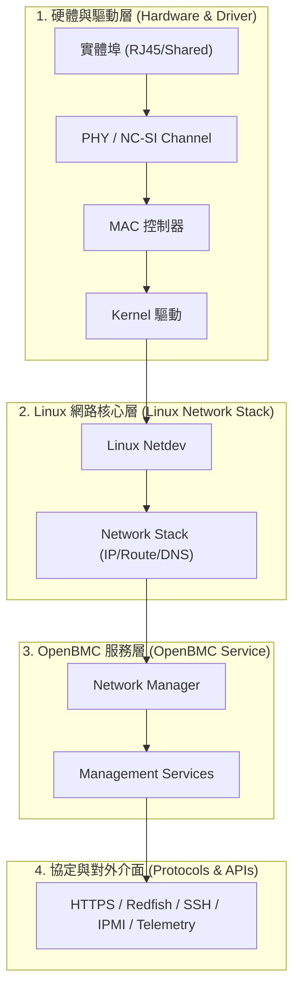

# 23. Network Services


BMC 網路是遠端伺服器硬體管理的主要入口。網路可用性不只取決於是否成功取得 IP address，還需依序完成 [MAC 位址](../01_part_1_hardware_abstraction_layer/13_ethernet_mac_phy_and_mdio.md)初始化、[PHY](../01_part_1_hardware_abstraction_layer/13_ethernet_mac_phy_and_mdio.md) / [NC-SI](../01_part_1_hardware_abstraction_layer/14_nc_si.md) link 建立、VLAN 標籤處理、路由表（Route）配置、DNS 解析、時間同步（NTP / PTP）、[TLS 憑證驗證](../06_part_6_security_and_firmware_maintenance/37_security_baseline.md)與上層 [OpenBMC 管理服務](../03_part_3_platform_monitoring_and_control/23_openbmc_common_projects_and_services_reference.md)啟動。

本章從底層實體網路介面出發，系統化說明 DHCP、Static IP、IPv6 策略、VLAN、Bonding、NIC failover、Hostname、DNS、NTP / PTP、nftables 防火牆、[Redfish](35_redfish_fundamentals.md) 與 [IPMI](34_ipmi_fundamentals.md) network service 的軟硬體整合架構，並建立可重複量測的「開機至 API 可用」時間線與完整驗收流程。

## 23.1 BMC 網路資料路徑


BMC 網路堆疊橫跨實體層（PHY/NC-SI）、Kernel 驅動層、Linux Socket 與 Netdev 層、OpenBMC D-Bus 服務層以及上層 REST/Redfish/IPMI API 介面。封包在 BMC 內部的傳遞路徑如下所示：



當發生網路障礙時，應依據資料路徑層級進行系統化排查：

| 層級 (Layer) | 排查重點 | 關鍵指標 / 檢查指令 |
| :--- | :--- | :--- |
| **1. 實體 Link** | Cable、Switch Port、PHY 狀態與燈號 | `ethtool eth0`、Link LED |
| **2. Driver / Netdev** | 驅動載入、Ring Buffer、介面 UP 狀態 | `dmesg \| grep eth`、`ip link` |
| **3. IP Address** | IPv4/IPv6 位址配置、DHCP 租約、Subnet Mask | `ip addr`、`journalctl -u systemd-networkd` |
| **4. Route / Gateway** | 預設閘道 (Default GW)、Routing Table | `ip route show`、`ip route get <IP>` |
| **5. DNS** | 域名解析、Stub Resolver 狀態 | `resolvectl status`、`getent hosts` |
| **6. Time Sync** | NTP/PTP 同步（避免系統時間超越 TLS 憑證期限） | `timedatectl status` |
| **7. Service Listening** | Socket 綁定狀態與 Port 開放情況 | `ss -lntup` (確認 443, 623, 22) |
| **8. TLS / Auth** | SSL Handshake、Cipher Suite、Session 認證 | `curl -vk https://<BMC_IP>` |
| **9. Application** | D-Bus 內部服務回應、Redfish / IPMI 邏輯 | `journalctl -u bmcweb` |

> `ping` 成功僅代表 ICMP (Layer 3) 點對點路徑可用，無法證明 Redfish (HTTPS)、IPMI over LAN (UDP 623)、DNS 解析、NTP 時間同步或 Event Sender 能正常運作。

## 23.2 Dedicated NIC 與 Shared NIC

在 OpenBMC 架構中，實體管理網路通常分為兩種：

1. **Dedicated Management NIC**：BMC 使用獨立 PHY 與實體管理埠。
2. **Shared NIC / NC-SI**：BMC 與 Host 共用 LOM 或 OCP NIC 的實體網路埠。

平台設計需同時考量：

- 板端網路拓撲
- PHY 與 Sideband 介面
- 電源域與 Reset 行為
- Kernel Netdev 命名
- systemd/udev 規則
- OpenBMC D-Bus 物件對映

最終目標是確保：

> **物理連接埠、Kernel 網路介面與 OpenBMC 管理服務之間，具有固定且可追蹤的對應關係。**

### 23.2.1 Dedicated Management NIC

Dedicated NIC 是 BMC 專屬的實體管理介面。

BMC 內建的 MAC Controller 透過 RGMII、RMII 等 MAC-to-PHY 介面，連接板載 Ethernet PHY，最後導出至獨立的 RJ45 管理埠。

```text
+--------------------------------------------------------------------+
|                            BMC SoC                                 |
|                                                                    |
|  +--------------------+   RGMII/RMII   +------------------------+  |
|  |    Ethernet MAC    | <============> | Dedicated Ethernet PHY |  |
|  |  e.g., FTGMAC100   |  MDIO Control  |      e.g., RTL8211     |  |
|  +--------------------+ <------------> +------------------------+  |
+----------------------------------------------------|---------------+
                                             Dedicated RJ45 Port
```

#### 硬體與驅動檢查項目

##### 1. MAC Controller 與驅動綁定

確認 [Devicetree](../02_part_2_bsp_kernel_and_device_tree/20_device_tree_common_patterns_and_troubleshooting.md) 中的 MAC 節點已啟用：

```dts
&mac0 {
    status = "okay";
};
```

檢查項目：

- MAC 節點是否為 `status = "okay"`
- Kernel Driver 是否成功 Probe
- Netdev 是否已建立
- Driver 是否出現 timeout 或 DMA 錯誤

常見驅動包括：

- `ftgmac100`
- `macb`
- SoC 廠商提供的 Ethernet MAC Driver

##### 2. PHY 與 MDIO Bus

確認 MAC Driver 能透過 MDIO Bus 讀取 PHY。

檢查項目：

- PHY Address 是否正確
- PHY OUI 與 Device ID 是否可讀
- Devicetree 的 `reg` 是否符合硬體 Strapping
- Kernel 是否成功綁定對應 PHY Driver

MDIO Address 錯誤時，常見現象包括：

- 找不到 PHY
- Netdev 存在但無法建立 Link
- PHY 初始化失敗
- Link 狀態長期維持 Down

##### 3. PHY Reset、Clock 與 Strapping

確認 PHY 具備正確的啟動條件。

檢查項目：

- Reset GPIO 極性
- Reset assert 與 deassert 時序
- 25 MHz 或其他參考時脈
- PHY Address Strapping
- RGMII、RMII 或其他介面模式 Strapping

若 PHY Reset 時序或 Clock 不正確，MDIO 可能完全無法存取。

##### 4. `phy-mode` 與 RGMII Delay

Devicetree 的 `phy-mode` 必須符合實際 PCB 與 PHY 設計。

常見設定：

```dts
/* Mode 1: No Internal Delay */
phy-mode = "rgmii";

/* Mode 2: RX Internal Delay Only */
phy-mode = "rgmii-rxid";

/* Mode 3: TX Internal Delay Only */
phy-mode = "rgmii-txid";

/* Mode 4: Both TX and RX Internal Delay (Most Common) */
phy-mode = "rgmii-id";
```

選擇原則：

- `rgmii`：不加入內部 RX/TX Delay
- `rgmii-rxid`：加入 RX Delay
- `rgmii-txid`：加入 TX Delay
- `rgmii-id`：同時加入 RX 與 TX Delay

設定錯誤時可能出現：

- CRC Error
- 高封包遺失率
- 低速正常，但 1 Gbps 不穩定
- Link Up，但實際流量異常

> RGMII Delay 應依據 MAC、PHY 與 PCB 時序設計決定，不應僅以嘗試方式選擇。

##### 5. MAC Address 載入

確認 Netdev 使用正確且唯一的永久 MAC Address。

可能來源：

- SoC OTP
- SPI EEPROM
- Board EEPROM
- U-Boot Environment
- Mainboard FRU
- 平台初始化服務

檢查重點：

- MAC Address 是否為合法 Unicast Address
- 每台系統是否唯一
- 重開機後是否保持一致
- Bootloader 與 Kernel 所讀取的來源是否相同
- 是否因讀取失敗而使用隨機 MAC Address

##### 6. Link Speed 與 Duplex

確認 Auto-negotiation 結果符合預期。

檢查項目：

- 10、100 或 1000 Mbps
- Full Duplex 或 Half Duplex
- Auto-negotiation 是否完成
- Link Partner Advertisement 是否正確
- 是否存在 Duplex Mismatch

Duplex Mismatch 常造成：

- Throughput 降低
- Retransmission 增加
- Late Collision
- 表面 Link Up，但管理操作延遲或逾時

##### 7. 實體線路與上游 Switch

最後確認外部網路環境。

檢查項目：

- 網路線材與接頭品質
- RJ45 Magnetics 與腳位
- Switch Port 速度設定
- Auto-negotiation Policy
- Access VLAN 或 Trunk VLAN
- Untagged 與 Tagged Traffic 規則

### 23.2.2 Shared NIC / NC-SI

Shared NIC 允許 BMC 與 Host 共用同一個實體網路埠。

BMC 透過 NC-SI Sideband 介面連接 Host LOM 或 OCP NIC。BMC 作為 NC-SI Controller，對 NIC 的 Package 與 Channel 發送控制命令。

```text
+-------------------+       NC-SI Sideband       +---------------------+
| BMC OpenBMC       | <========================> | Host NIC            |
| Linux Network     |                            | Package 0           |
| NC-SI Subsystem   |                            |  +-- Channel 0 P0   |
+-------------------+                            |  +-- Channel 1 P1   |
                                                 +---------|-----------+
                                                           |
                                                   Shared RJ45/SFP Port
```

#### 關鍵檢查項目

##### 1. Standby Power

Host 關機時，NIC 與 NC-SI Sideband 仍需保持供電。

檢查項目：

- NIC 是否由 `3.3VSB` 或指定 Standby Rail 供電
- Host S5/G2 時 NC-SI 是否仍可通訊
- NIC Clock 與必要邏輯是否持續運作
- PCIe Power State 是否影響 OOB 管理功能

若 Standby Power 不完整，Host 關機後可能無法透過共享網口管理 BMC。

##### 2. Package 與 Channel Mapping

BMC 開機時應掃描可用的 NC-SI Package 與 Channel。

常見流程包括：

- Select Package
- Clear Initial State
- Get Version ID
- Get Capabilities
- Enable Channel
- Enable Channel Network TX
- Enable AEN

平台文件應記錄：

- Package ID
- Channel ID
- 對應的實體 Port
- 預設使用通道
- 備援通道

##### 3. Host Power Transition

驗證 Host 電源狀態切換時，NC-SI 是否保持穩定。

必要測試：

- G2 到 S5
- S5 到 S0
- S0 到 S5
- Host Warm Reset
- Host Cold Reset
- PCIe Reset
- NIC Function Level Reset
- AC Power Cycle

觀察項目：

- Shared Link 是否瞬斷
- NC-SI Channel 是否重新初始化
- BMC IP 是否仍可存取
- Netdev Carrier 狀態是否正確更新

##### 4. AEN 處理

NIC 可透過 Asynchronous Event Notification 主動通知 BMC。

常見事件：

- Link Status Change
- Configuration Required
- Host Driver Status Change
- NIC Reset 或韌體狀態改變

BMC 收到事件後應：

1. 更新 NC-SI Channel 狀態。
2. 同步 Kernel Netdev Carrier。
3. 必要時重新選擇可用 Channel。
4. 將異常寫入系統日誌。

##### 5. Hardware Filtering Policy

NC-SI Sideband 頻寬有限，因此 NIC 必須正確過濾送往 BMC 的流量。

主要過濾項目：

- BMC MAC Address
- VLAN ID
- Broadcast
- Multicast
- Unicast
- ARP
- IPv6 Neighbor Discovery

設定目標：

- 僅將管理流量送往 BMC
- 避免 Host Data Plane 流量進入 Sideband
- 避免廣播風暴占滿 NC-SI 頻寬
- 確保必要的 ARP、DHCP 與 IPv6 流量可通過

##### 6. Channel Failover

多埠 NIC 可提供 NC-SI Channel 備援。

範例策略：

```text
Primary Channel  : Package 0 / Channel 0
Standby Channel  : Package 0 / Channel 1
```

主通道 Link Down 時，系統應：

1. 確認 Link Down 事件。
2. 掃描其他可用 Channel。
3. 啟用備援 Channel。
4. 恢復 TX 與必要的 Filter。
5. 驗證管理 IP 連線。

需特別確認 Failover 後：

- MAC Address 是否保持一致
- VLAN 設定是否重新套用
- ARP 或 Neighbor Entry 是否更新
- D-Bus 介面狀態是否正確

##### 7. NIC Reset Recovery

NIC 韌體重置後，原有 NC-SI 設定可能消失。

常見觸發條件：

- Host Reboot
- NIC Firmware Crash
- NIC Firmware Update
- PCIe Reset
- NIC Power Cycle

Recovery 流程應包含：

1. 偵測 Channel 失效。
2. 清除舊 Channel 狀態。
3. 重新執行 NC-SI 初始化。
4. 重新啟用 Channel 與 TX。
5. 重新設定 MAC、VLAN 與封包過濾器。
6. 驗證 Link 與網路可達性。

### 23.2.3 Interface Identity 與命名固定化

#### 1. 介面列舉競態

Linux 網路介面可能依照 Driver Probe 完成順序取得 `eth0`、`eth1` 等名稱。

當 Dedicated MAC 與 NC-SI MAC 同時初始化時，Probe 時間可能不同：

```text
Dedicated MAC0 Probe ----+
                         +--> 先完成者可能先取得 eth0
Shared NC-SI MAC1 Probe -+
```

造成 Probe 時間差異的因素包括：

- PHY Reset 時序
- MDIO 掃描時間
- NC-SI Package 探測
- Driver Deferred Probe
- Clock、GPIO 或 Regulator 尚未就緒

因此，不應只依賴 Driver Probe 順序判斷實體介面身份。

可能發生的結果：

```text
Boot A:
eth0 = Dedicated NIC
eth1 = Shared NC-SI NIC

Boot B:
eth0 = Shared NC-SI NIC
eth1 = Dedicated NIC
```

介面對調後，可能引發：

- Static IP 套用至錯誤介面
- VLAN 設定套用至錯誤實體埠
- Redfish 顯示與實體埠不一致
- WebUI 修改錯誤介面
- 遠端管理連線中斷

#### 2. 分層固定介面身份

建議從四個層級建立固定對映：

```text
Physical Port
    |
SoC MAC Instance
    |
Devicetree Identity
    |
systemd/udev Netdev Name
    |
OpenBMC D-Bus Object
```

##### 第一層：固定硬體身份

每個管理介面應先對應至唯一的 SoC MAC Instance。

```text
Dedicated NIC  -> MAC0 -> 0x1e660000
Shared NC-SI   -> MAC1 -> 0x1e680000
```

此對映應記錄於：

- Schematic
- Board Design Specification
- Devicetree
- Platform Network Design Document

##### 第二層：設定 Devicetree Alias

在 Devicetree 中為 MAC Controller 指定固定索引：

```dts
aliases {
    /* Bind the hardware node &mac0 / &mac1 to the system's 
       primary network interface (eth0 / eth1) */
    ethernet0 = &mac0;
    ethernet1 = &mac1;
};
```

對映關係：

```text
ethernet0 -> mac0 -> Dedicated NIC
ethernet1 -> mac1 -> Shared NC-SI
```

Devicetree Alias 可提供穩定的裝置索引，但是否直接決定 `eth0` 與 `eth1`，仍取決於 SoC Driver 與 Kernel 的實作。

因此，平台不應只依賴 Alias，仍需搭配 User Space 命名規則。

##### 第三層：使用 systemd/udev `.link` 規則

使用固定 Bus Path 或 Permanent MAC Address 匹配介面。

Dedicated NIC：

```ini
## /etc/systemd/network/10-dedicated.link

[Match]
Path=platform-1e660000.ethernet

[Link]
Name=mgmt0
```

Shared NC-SI NIC：

```ini
# /etc/systemd/network/20-shared.link

[Match]
Path=platform-1e680000.ethernet

[Link]
Name=ncsi0
```

建議使用：

- `mgmt0`：Dedicated Management NIC
- `ncsi0`：Shared NC-SI NIC

相較於強制命名為 `eth0` 與 `eth1`，語意化名稱具有下列優點：

- 不需進行 `eth0` 與 `eth1` 名稱互換
- 降低重新命名時的名稱衝突
- 日誌可直接辨識介面用途
- 測試腳本與服務綁定更清楚
- 未來增加介面時較容易擴充

如果平台相容性要求必須使用 `eth0` 與 `eth1`，則需額外驗證 systemd-udev 的 rename 順序與名稱衝突處理。

> 永久 MAC Address 適合用於硬體身份固定的平台。若 MAC 可能因更換主板、FRU 或 NIC 而改變，優先使用穩定的 Bus Path。

##### 第四層：固定 OpenBMC D-Bus 對映

完成 Netdev 命名後，`phosphor-networkd` 依照介面名稱建立 D-Bus 物件。

使用語意化名稱時：

```text
/xyz/openbmc_project/network/mgmt0
/xyz/openbmc_project/network/ncsi0
```

若平台要求維持傳統名稱：

```text
/xyz/openbmc_project/network/eth0
/xyz/openbmc_project/network/eth1
```

需確認下列元件使用相同命名：

- `phosphor-networkd`
- systemd-networkd
- Redfish EthernetInterface
- WebUI
- Network Service Binding
- Firewall Rules
- VLAN Configuration
- Factory Default Configuration

#### 3. 平台介面身份對照表

| 識別維度 | Dedicated Management NIC | Shared NC-SI NIC |
|---|---|---|
| 物理連接埠 | 板載獨立 RJ45 管理埠 | Host OCP 3.0 或 LOM 共用埠 |
| SoC MAC Instance | MAC0 | MAC1 |
| AHB Address | `0x1e660000` | `0x1e680000` |
| Devicetree Alias | `ethernet0 = &mac0;` | `ethernet1 = &mac1;` |
| MAC Address 來源 | SPI EEPROM、OTP 或 Board EEPROM | Mainboard FRU、平台 EEPROM 或指定管理 MAC |
| Kernel Device Path | `/sys/devices/platform/ahb/1e660000.ethernet` | `/sys/devices/platform/ahb/1e680000.ethernet` |
| `.link` Match | `Path=platform-1e660000.ethernet` | `Path=platform-1e680000.ethernet` |
| 建議 Netdev 名稱 | `mgmt0` | `ncsi0` |
| 傳統 Netdev 名稱 | `eth0` | `eth1` |
| D-Bus 物件 | `/xyz/openbmc_project/network/mgmt0` | `/xyz/openbmc_project/network/ncsi0` |

> 表中的位址、Path 與介面名稱屬於平台範例，需依實際 SoC、Devicetree 與 sysfs 結果調整。

### 23.2.4 建議驗證流程

#### Dedicated NIC

```text
確認 MAC Driver
    -> 確認 MDIO 與 PHY ID
    -> 確認 Reset、Clock、Strapping
    -> 確認 phy-mode 與 RGMII Delay
    -> 確認 MAC Address
    -> 確認 Link Speed 與 Duplex
    -> 執行封包與壓力測試
```

#### Shared NC-SI NIC

```text
確認 Standby Power
    -> 掃描 Package 與 Channel
    -> 初始化並啟用 Channel
    -> 設定 MAC、VLAN 與 Filter
    -> 驗證 Host S0/S5 Transition
    -> 驗證 AEN 與 Failover
    -> 驗證 NIC Reset Recovery
```

#### Interface Identity

```text
確認 Physical Port 與 MAC Instance
    -> 確認 Devicetree Alias
    -> 確認 sysfs Device Path
    -> 確認 .link 規則
    -> 確認 Netdev 名稱
    -> 確認 D-Bus 物件
    -> 連續重開機驗證
```

建議至少執行：

- 20 次 BMC Reboot
- 10 次 AC Power Cycle
- 10 次 Host S0/S5 Transition
- Dedicated Port 與 Shared Port 交叉拔線
- Shared NIC Channel Failover
- NIC Firmware Reset 或等效 Recovery 測試

每次測試均應確認：

- Netdev 名稱沒有對調
- MAC Address 沒有改變
- Static IP 套用至正確介面
- D-Bus Object Path 保持一致
- Redfish 與 WebUI 顯示正確
- 管理服務仍綁定預期介面


## 23.3 Linux Network Stack

Linux Netdev 提供 Layer 2 網路介面，所有的 IP Address、Subnet Mask、Default Route 與 Firewall 規則皆建立於 Netdev 之上。

系統基礎檢測指令：

```bash
ip -details link show
ip address show
ip route show table all
ip -6 route show table all
ss -lntup
```

### 23.3.1 Link State

Linux Netdev 包含四個關鍵狀態維度：
1. **Administrative State**：管理者是否發送 `ip link set <iface> up`。
2. **Carrier State**：實體層（PHY/NC-SI）是否偵測到電氣 Link（`1` 表示有 Link，`0` 表示 Link Down）。
3. **Operational State**：Netdev 整體狀態（如 `UP`, `DOWN`, `LOWER_UP`, `DORMANT`）。
4. **Speed / Duplex**：PHY 自動協商或 NC-SI 取得之雙工與速率資訊。

底層狀態查詢指令：
```bash
cat /sys/class/net/eth0/operstate
cat /sys/class/net/eth0/carrier
ethtool eth0
ethtool -S eth0
```

若介面為 `UP` 但 `carrier=0`，代表實體線路未連通，此時 DHCP Client 無法發送封包，應優先排查 PHY 暫存器、NC-SI 信號、網線與 Switch 埠狀態。

### 23.3.2 Network Namespace

預設情況下，OpenBMC 管理服務運行於 Default Network Namespace (`init_net`)。若系統設計使用 Container（如 Docker/LXC）或隔離的 Namespace，需精確記錄虛擬網卡（veth）、Bridge 與服務所在 Namespace。

```bash
# 查看所有 network namespaces
ip netns list

# 進入特定 namespace 執行檢測
ip netns exec <ns-name> ip address show
ip netns exec <ns-name> ss -lntup
```

## 23.4 OpenBMC Network Management

OpenBMC 透過 `phosphor-networkd` Daemon 在 D-Bus 上提供標準化的網路配置介面，底層則調用 `systemd-networkd` 或 Netlink API 來套用 Linux 網路設定。

```text
Redfish / IPMI / WebUI / D-Bus Client
        ↓ (D-Bus Calls)
xyz.openbmc_project.Network (phosphor-networkd)
        ↓ (Generates .network files)
/etc/systemd/network/00-bmc-eth0.network
        ↓ (Systemd reload / Netlink)
systemd-networkd / Linux Kernel Netdev
        ↓
Linux System Routing & Network Stack
```

### 23.4.1 D-Bus Objects

`phosphor-networkd` 將實體與虛擬介面拆解為物件樹：

```text
/xyz/openbmc_project/network/eth0
├── /xyz/openbmc_project/network/eth0/ipv4/<id>
├── /xyz/openbmc_project/network/eth0/ipv6/<id>
├── /xyz/openbmc_project/network/eth0/vlan/<vlan_id>
└── /xyz/openbmc_project/network/config
```

常用 D-Bus Interface 包含：
* `xyz.openbmc_project.Network.EthernetInterface`
* `xyz.openbmc_project.Network.IP`
* `xyz.openbmc_project.Network.MACAddress`
* `xyz.openbmc_project.Network.VLAN`

### 23.4.2 Target 檢查

透過以下指令檢查 OpenBMC 網路服務與 `systemd-networkd` 的運作狀態：

```bash
systemctl status xyz.openbmc_project.Network.service --no-pager
systemctl status systemd-networkd.service --no-pager
journalctl -u xyz.openbmc_project.Network.service -b --no-pager
journalctl -u systemd-networkd.service -b --no-pager

busctl tree xyz.openbmc_project.Network
networkctl status
```

### 23.4.3 Persistent 與 Runtime State

* **Runtime State**：直接使用 `ip addr add` 或 `ip route add` 設定，重啟或 Daemon 重建後即消失。
* **Persistent State**：透過 D-Bus / Redfish / IPMI 設定時，`phosphor-networkd` 會將設定寫入 `/etc/systemd/network/` 目錄下的 `.network` 與 `.netdev` 設定檔，由 `systemd-networkd` 永久保留。

**不一致排查標準流程**：
1. 查詢 D-Bus Property (`busctl get-property ...`)。
2. 檢查持久化設定檔 (`cat /etc/systemd/network/*.network`)。
3. 檢查 `networkctl status` 讀取的 systemd 內部狀態。
4. 檢查 `ip address` 與 `ip route` 核心實際套用狀態。
5. 執行 BMC Soft Reset，驗證開機後設定是否完好。

## 23.5 MAC Address

MAC Address 是 Layer 2 網路通訊的唯一硬體識別碼。BMC 需要擁有穩定且不隨韌體更新丟失的 MAC Address。

可能來源：
1. **SoC OTP / eFuse**：SoC 內部一次性燒錄記憶體。
2. **FRU EEPROM**：主板 FRU EEPROM 中之特定偏移區塊。
3. **Dedicated EEPROM**：網卡或 PHY 專屬之 SPI/I2C EEPROM。
4. **U-Boot Environment**：U-Boot 環境變數（如 `ethaddr`, `eth1addr`）。
5. **Device Tree**：DTS 中的 `local-mac-address` 或 `mac-address` 屬性。
6. **Manufacturing Partition**：專用的工廠保護區塊（如 `/rw/cow/` 或獨立 MTD 分區）。
7. **Dynamic Platform Service**：開機時由平台服務根據 Asset Tag 動態算出。

### 23.5.1 優先順序

平台需明確定義 MAC Address 的讀取 Fallback 邏輯：

```text
Factory-programmed EEPROM / OTP MAC
        ↓ (Unreadable / Corrupt)
Protected Manufacturing Storage (SPI Flash)
        ↓ (Unavailable)
U-Boot Environment Variable (ethaddr)
        ↓ (Invalid)
Locally Administered Fallback MAC (e.g., 02:00:00:00:00:01)
```

> **安全警告**：Fallback MAC 僅可用於受控的內部開發或緊急復原流程。生產環境中若多台設備陷入 Fallback MAC，將導致 Layer 2 ARP 衝突與網路癱瘓。

### 23.5.2 Permanent 與 Current MAC

```bash
# 查看當前套用之 MAC 位址
ip link show eth0

# 查詢硬體原始 Permanent MAC 位址
ethtool -P eth0 2>/dev/null
cat /sys/class/net/eth0/address
```

當使用 Bonding、VLAN 或 NC-SI 偽裝 MAC 時，Current MAC 可能與 Hardware Permanent MAC 不同。工程文件需明確註記對外廣播的 MAC 位址來源與 Failover 時的 MAC 轉移動作。

### 23.5.3 Update 與 [Factory Reset](../08_part_8_manufacturing_and_production/46_calibration_board_data_and_provisioning.md)

MAC Address 屬於關鍵工廠資料（Factory Data），韌體更新（[Firmware Update](../06_part_6_security_and_firmware_maintenance/38_firmware_update.md)）與一般系統恢復原廠設定（Factory Reset）嚴禁覆蓋或清除 MAC 位址。若遭遇 RMA 換板，應提供專用的工廠生產工具進行 MAC 重新燒錄。

## 23.6 IPv4：DHCP 與 Static Address

### 23.6.1 DHCP

DHCP 運作遵循 D.O.R.A. 四段流程：

```text
Carrier Up
    ↓
DHCP DISCOVER (Broadcast)
    ↓
DHCP OFFER (From DHCP Server)
    ↓
DHCP REQUEST (Broadcast)
    ↓
DHCP ACK (Server confirms lease)
    ↓
Apply IP / Prefix / Gateway / DNS / NTP / Lease Time
```

**排查與設計重點**：
* **DHCP Client 啟動時機**：必須等實體 Carrier Up 後才開始發送 Discover。
* **Link-down / Retry 機制**：線路拔除再插回時，需發送 DHCP Request 進行 Renewal 或重啟 Discover。
* **Lease Time & Renewal**：`systemd-networkd` 需在 T1 (50% lease time) 進行 Renewal，T2 (87.5%) 進行 Rebind。
* **Option 解析**：確認解析 Option 3 (Gateway)、Option 6 (DNS)、Option 12 (Hostname)、Option 42 (NTP)。
* **Address Conflict Detection (ACD)**：套用前需透過 ARP Probe 檢測 IP 是否衝突。
* **DHCP Timeout / Fallback**：DHCP 失敗後是否自動切換至 Fallback Static IP 或 Link-Local Address。

### 23.6.2 Static Address

靜態 IP 配置至少包含以下參數：
* **IPv4 Address**（例如：`192.168.1.100`）
* **Prefix Length / Netmask**（例如：`24` 或 `255.255.255.0`）
* **Default Gateway**（例如：`192.168.1.1`）
* **DNS Servers**（例如：`1.1.1.1`, `8.8.8.8`）

> **常見錯誤**：Subnet Mask 設定錯誤（如將 `/24` 設為 `/16`）會導致 ARP 廣播範圍異常，造成同網段通訊正常但跨網段封包無法經由 Gateway 送出。

### 23.6.3 DHCP 與 Static 切換

當網路模式由 Static 切換至 DHCP 或反向切換時，必須明確定義行為：
1. **舊 Address 移除時機**：舊 IP 需立即從 Netdev 移除，避免產生多餘的 IP 綁定。
2. **舊 Routing / DNS 清理**：由舊模式產生的 Default Route 與 `/etc/resolv.conf` 條目需完全清除。
3. **HTTP / SSH Session 中斷**：管理員透過舊 IP 進行設定變更時，變更成功後舊連線必定會中斷。
4. **Recovery 機制**：新 IP 設定失敗（例如靜態 IP 輸入錯誤）時，應建立 Timer 逾時自動 Rollback 機制。
5. **多介面同步**：Redfish (`/redfish/v1/Managers/bmc/EthernetInterfaces/eth0`)、IPMI (LAN Print) 與 D-Bus 呈現的 `DHCPEnabled` 狀態需保持強一致性。

## 23.7 IPv6 Policy

IPv6 具備多位址並存特性，單一 Netdev 介面可能同時擁有以下 IPv6 位址：
* **Link-Local Address** (`fe80::/10`)：僅在 Layer 2 Segment 內有效，由 MAC 位址或 EUI-64 自動生成。
* **SLAAC Address** (Stateless Address Autoconfiguration)：根據 Router Advertisement (RA) 傳送的 Prefix 動態生成。
* **DHCPv6 Address**：經由 DHCPv6 Stateful 伺服器分配的位址。
* **Static IPv6 Address**：人工指定的 Global Unicast Address (GUA)。

**平台策略定義與 sysctl 控制參數**：

```bash
# 全域停用 IPv6
sysctl -w net.ipv6.conf.all.disable_ipv6=1

# 特定介面接受 Router Advertisements (RA)
sysctl -w net.ipv6.conf.eth0.accept_ra=2

# 查詢當前 IPv6 配置與路由
ip -6 address show
ip -6 route show table all
networkctl status eth0
```

> **規範需求**：停用 IPv6 時，不能僅移除 IP 位址，必須透過 `sysctl` 禁用 Kernel IPv6 堆疊，並同步更新 `bmcweb` / `dropbear` 等服務之 Binding 策略與 nftables 規則，防止留下 IPv6 後門。

## 23.8 Link-Local 與 Fallback Address

* **IPv4 Link-Local**：使用 `169.254.0.0/16` 網段 (RFC 3927 / APIPA)。
* **IPv6 Link-Local**：使用 `fe80::/10` 網段。

**系統整合與安全注意事項**：
* **DHCP 失敗後處置**：可配置 `systemd-networkd` 在 DHCP 無回應時自動啟動 IPv4 Link-Local 位址。
* **Zone Index (Scope ID)**：在使用 Link-Local 位址進行連線時，必須指定 Interface Name，例如：`https://[fe80::72e2:84ff:fe12:3456%eth0]`。
* **API 與 WebUI 綁定**：管理服務（如 `bmcweb`）需綁定在 `0.0.0.0` 與 `::`，以確保透過 Link-Local 位址也能存取 REST/Redfish 介面。
* **防火牆風險**：Link-Local Address 常被忽視，防火牆政策需一併納入，防止未授權的區域網路存取。

## 23.9 Default Gateway 與 Routing

路由表決定 BMC 封包 egress（送出）時的方向。

```bash
# 查看完整路由表 (包含指定 table)
ip route show table all
ip -6 route show table all

# 查詢送往特定目標 IP 的路由選擇路徑
ip route get 8.8.8.8
```

### 23.9.1 Default Route

多介面平台（如同時存在 Dedicated `eth0` 與 Shared `eth1`）可能自多個來源取得預設路由。必須定義：
* **Route Metric**：數字越小優先權越高（例如 `eth0` Metric 設為 `100`，`eth1` 設為 `200`）。
* **Primary Interface**：指定主要對外通訊介面。
* **DHCP vs Static Metric**：靜態路由通常設定比 DHCP 路由更高的優先權。

### 23.9.2 Source Address Selection

當發送外網封包（如傳送 Redfish Event Alert、NTP 校時或下載 Firmware）時，Linux Kernel 會依據目標 IP 選取最佳 Source Address。若 Source Address 選錯（例如以 `169.254.x.x` 作為 Source IP 存取外部 syslog 伺服器），將導致連線失敗。

### 23.9.3 Policy Routing

多網卡高階平台可運用 Policy Routing 實現流量隔離：

```bash
# 查看路由規則
ip rule show

# 範例：特定來源 IP 使用特定 Routing Table
ip rule add from 192.168.10.100 table 100
ip route add default via 192.168.10.1 dev eth0 table 100
```

## 23.10 VLAN

VLAN (IEEE 802.1Q) 透過在 Ethernet Frame 中插入 4-byte Tag，在同一實體線路上劃分多個邏輯隔離的 Layer 2 網段。

```text
Physical Interface (eth0)
        │
        ├── Virtual Interface: eth0.100 (VLAN ID: 100)
        └── Virtual Interface: eth0.200 (VLAN ID: 200)
```

### 23.10.1 Systemd Configuration 範例

`/etc/systemd/network/10-eth0.200.netdev`:
```ini
[NetDev]
Name=eth0.200
Kind=vlan

[VLAN]
Id=200
```

`/etc/systemd/network/20-eth0.200.network`:
```ini
[Match]
Name=eth0.200

[Network]
DHCP=ipv4
```

### 23.10.2 Target 檢查

```bash
ip -d link show type vlan
ip address show eth0.200
networkctl status eth0.200
```

### 23.10.3 常見問題

* **Switch Port 標籤不符**：Upstream Switch 埠未設定成 Trunk Mode 或未允許該 VLAN ID。
* **MTU 溢位**：VLAN 標籤佔用 4 bytes，若硬體未自動支援 Mini-Jumbo Frames，可能導致 MTU 超過 1500 bytes 限制而丟包。
* **NC-SI VLAN Filter 未開啟**：Shared NIC 模式下，NC-SI 網卡硬體層未啟用對應 VLAN ID 的 Pass-through 濾鏡。

## 23.11 Bonding

Linux Bonding 驅動可將多個實體網卡組合成單一邏輯介面（如 `bond0`），以提供高可用性（Hot Standby）或頻寬整合（Load Balancing）。

```text
                      ┌──> eth0 (Dedicated NIC)
Logical Bond (bond0) ─┤
                      └──> eth1 (NC-SI Shared NIC)
```

### 23.11.1 Active-Backup (Mode 1)

最常用於 BMC 高可用架構。同一時間僅有一張主網卡（Active）負責傳送與接收流量；當主網卡 Carrier Down 時，系統秒級自動切換至備用網卡（Standby）。Switch 端無須配置 LACP。

### 23.11.2 802.3ad LACP (Mode 4)

動態鏈結聚合模式，要求 upstream switch 埠必須支援並配置 802.3ad LACP Group。若 Switch 端未設定，Link 會無法建立或導致封包環路（Loop）。

### 23.11.3 Bond 核心檢測與狀態

```bash
ip -d link show type bond
cat /proc/net/bonding/bond0
networkctl status bond0
```

## 23.12 NIC Failover

NIC Failover 係指當現行網路鏈結失效時，系統自動將流量切換至備用網路路徑的運作機制。

```text
[Failover Trigger]
Carrier Down / Link Loss / NC-SI Channel Timeout / Health Probe Fail
        ↓
[Decision Engine]
Kernel Bonding (Mode 1) / phosphor-networkd / NC-SI Driver
        ↓
[Network Switch Action]
Update Active Slave / Send Gratuitous ARP (GARP) & Unsolicited NA
        ↓
[Service Recovery]
TCP Sessions Retransmit / Redfish Events Continue / IP Maintained
```

### 23.12.1 Service-Aware Failover

單純的 Carrier Loss 檢測無法辨識 Upstream Router 當機或 DNS 服務停擺的狀況。高級平台可實作 Service-Aware Health Probe（如定期 ICMP Echo 或 TCP SYN 存取 Gateway），搭配 **Hysteresis Timer**（滯後計時器）防止網路於兩網卡間頻繁震盪（Flapping）。

### 23.12.2 Gratuitous ARP (GARP) 與 Unsolicited NA

Failover 完成時，BMC 必須立即向 Layer 2 網路廣播 Gratuitous ARP (IPv4) 與 Unsolicited Neighbor Advertisement (IPv6)，強制 Upstream Switch 刷新 MAC Address Table，否則外部封包仍會持續送往舊的實體 Port。

## 23.13 Hostname

Hostname 是 BMC 在網路上的識別名稱，同步影響 DHCP Option 12、mDNS/LLMNR 服務發布、TLS 憑證 SAN (Subject Alternative Name) 以及 Redfish `Manager` 資源。

```bash
# 查詢與變更系統 Hostname
hostnamectl
cat /etc/hostname
busctl get-property xyz.openbmc_project.Network /xyz/openbmc_project/network/config xyz.openbmc_project.Network.SystemConfiguration HostName
```

**設計規範**：
* **預設格式**：通常為 `bmc-<Serial_Number>` 或 `bmc-<MAC_Address>`。
* **合法字元**：遵循 RFC 1123 規範（僅允許 `a-z`, `0-9` 與連字號 `-`，長度最高 63 字元）。
* ** Factory Reset**：恢復原廠設定後，Hostname 應重置為包含產品序號的出廠預設值。

## 23.14 DNS

OpenBMC 使用 `systemd-resolved` 管理域名解析。

```text
OpenBMC Application (e.g. bmcweb / event sender)
        ↓
getaddrinfo() / libc resolver
        ↓
/etc/resolv.conf (Symlink to /run/systemd/resolve/stub-resolv.conf)
        ↓
systemd-resolved Stub Resolver (127.0.0.53:53)
        ↓
Upstream DNS Servers (Configured via Static / DHCP)
```

### 23.14.1 排查步驟

```bash
# 1. 檢視 systemd-resolved 狀態與當前 DNS 伺服器
resolvectl status

# 2. 測試 Name Resolution
getent hosts redfish.org
nslookup redfish.org

# 3. 檢查 DNS 封包路徑 (Port 53 UDP/TCP)
nc -zvv -u <DNS_Server_IP> 53
```

## 23.15 Time Synchronization

精確的系統時間是 TLS 憑證驗證、Audit Log 稽核、Firmware Attestation 與 Event 時序對齊的命脈。

### 23.15.1 NTP / SNTP

OpenBMC 預設選用 `systemd-timesyncd` 或 `chrony` 進行時間同步。

```bash
timedatectl status
timedatectl timesync-status
systemctl status systemd-timesyncd --no-pager
journalctl -u systemd-timesyncd -b --no-pager
```

**時間跳變策略**：
* **Step**：開機初期差距過大時，直接跳躍修正系統時間。
* **Slew**：系統運行中，以微幅調整 Clock Frequency 的方式漸進校正時間，避免 Log Timestamp 倒退。

### 23.15.2 PTP (IEEE 1588)

對時間精度要求至微秒（$\mu s$）等級的資料中心，BMC 可啟用 PTP 服務。透過 `ptp4l` 與 `phc2sys` 工具將 Hardware Timestamping 與 Physical Hardware Clock (PHC) 同步至 Linux System Clock。

```bash
# 檢查介面是否支援 Hardware Timestamping
ethtool -T eth0
ls -l /dev/ptp*
```

### 23.15.3 Time Owner 仲裁機制

> **重要原則**：系統中嚴禁同時有兩個服務（如 NTP 與 PTP，或 NTP 與 IPMI Set SEL Time）同時寫入 System Clock，否則會造成系統時間無限跳動。平台需明確設計時間主控權（Time Owner）仲裁邏輯。

## 23.16 Network Service Listening

網路介面指派 IP 位址後，管理 Daemon 必須開啟對應 Socket 並進行 Bind。

```bash
# 查看系統所有 Listening Sockets (包含 PID 與服務名稱)
ss -lntup
```

**核心服務與對應 Port 清單**：
* **`bmcweb`**：HTTPS (Port 443) - 提供 WebUI、Redfish、KVM/Virtual Media WebSocket。
* **`dropbear`**：SSH (Port 22) - 提供 Command Line 遠端管理。
* **`phosphor-ipmi-net`**：IPMI over LAN (UDP Port 623)。
* **`systemd-resolved`**：DNS Stub Resolver (127.0.0.53:53)。

服務可設定 Binding 策略：`0.0.0.0` (All IPv4)、`::` (All IPv6) 或限定特定 Netdev 介面。當動態新增 VLAN 或切換 IP 時，必須確保服務 Socket 能自動適應或重置綁定。

## 23.17 Redfish Network Mapping

Redfish 標準模型透過 Manager 資源呈現網路介面：

`GET /redfish/v1/Managers/bmc/EthernetInterfaces/eth0`

```json
{
  "@odata.id": "/redfish/v1/Managers/bmc/EthernetInterfaces/eth0",
  "@odata.type": "#EthernetInterface.v1_9_0.EthernetInterface",
  "Id": "eth0",
  "Name": "BMC Dedicated Network Interface",
  "InterfaceEnabled": true,
  "MACAddress": "70:E2:84:12:34:56",
  "LinkStatus": "LinkUp",
  "SpeedMbps": 1000,
  "HostName": "bmc-70e284123456",
  "IPv4Addresses": [
    {
      "Address": "192.168.1.100",
      "SubnetMask": "255.255.255.0",
      "AddressOrigin": "Static",
      "Gateway": "192.168.1.1"
    }
  ],
  "IPv6Addresses": [],
  "NameServers": ["1.1.1.1"],
  "VLAN": {
    "VLANEnable": false,
    "VLANId": 0
  }
}
```

當發送 `PATCH` 請求修改 Redfish 網路設定時，`bmcweb` 將轉換為 D-Bus 方法調用，修改 `phosphor-networkd`，最後產出 `.network` 檔案並執行 `systemd-networkd` 重載。

## 23.18 IPMI LAN Configuration

IPMI over LAN (Channel 1 或 Channel 2) 的網路設定，在 OpenBMC 中必須映射至與 Redfish/D-Bus 相同的單一 Authority 源頭。

```bash
# 讀取 IPMI LAN 參數
ipmitool lan print 1

# 設定 Static IP
ipmitool lan set 1 ipaddr 192.168.1.150
ipmitool lan set 1 netmask 255.255.255.0
ipmitool lan set 1 defgw ipaddr 192.168.1.1
ipmitool lan set 1 ipsrc static
```

內部介面必須實作 **Set-In-Progress (SIP)** 狀態機，確保在連刷多條 IPMI 指令時，不會因中途部分套用而產生網路斷線。

## 23.19 Firewall 與 Service Exposure

OpenBMC 現代版本預設採用 `nftables` 作為防火牆引擎，實施最小權限（Zero Trust）之對外服務管控。

```bash
# 查看 nftables 規則集
nft list ruleset
```

**標準單機防火牆規則範例 (`nftables.conf`)**：

```nftables
table inet filter {
    chain input {
        type filter hook input priority 0; policy drop;

        # 允許 Loopback 流量
        iif "lo" accept

        # 允許已建立的連線
        ct state established,related accept

        # 允許 ICMP / ICMPv6 (Ping & Neighbor Discovery)
        ip protocol icmp accept
        ip6 nexthdr icmpv6 accept

        # 開放管理服務 Ports
        tcp dport { 22, 443 } accept      # SSH, HTTPS
        udp dport { 123, 623 } accept     # NTP, IPMI over LAN
    }
}
```

## 23.20 TLS / Certificate 與時間相依性

HTTPS / Redfish 連線建立包含以下相依鏈結：

```text
TCP Connection Established
        ↓
TLS Handshake Initiation
        ↓
Check Server/Client Certificate Validity Period (NotBefore <= CurrentTime <= NotAfter)
        ↓
Host Name Verification (Client Access URL == Certificate SAN)
        ↓
Establish Encrypted Session
```

> **陷阱**：若 BMC 剛開機且時間未與 NTP 同步（預設落在 1970 年），TLS Handshake 會因為「憑證尚未生效 (`Certificate Not Yet Valid`)」而被 Client 端的瀏覽器或 API Script 直接拒絕。系統設計必須考量在 RTC 無電池或未同步時間前，如何妥善處理預設自訂憑證與開機流程。

## 23.21 [開機可連線時間](../07_part_7_debugging_performance_and_testing/43_performance_resource_and_boot_time.md)

「BMC 開機完成」不等於「網路與 Redfish API 可用」。完整評估 BMC 開機效能需依據以下「開機至 API 可用」之精細時間線：

```text
T0  BMC Hardware Reset Deassert (Power On)
T1  Kernel Driver Initialized (ftgmac100 probe success)
T2  Netdev Interface Created (eth0 registered)
T3  Physical Carrier Up (PHY / NC-SI Link established)
T4  IP Address Assigned (Static configured or DHCP Lease ACK)
T5  Default Route & Gateway Active
T6  DNS Resolver Ready
T7  Time Synchronized (NTP / PTP synchronized)
T8  Management Service Listening (bmcweb socket listening on port 443)
T9  TLS Handshake Success
T10 Session Authentication Success
T11 First Redfish API Request Success (/redfish/v1/ 200 OK)
```

### 23.21.1 自動化量測 Script (Python/Bash)

外部測試端可執行以下 Probe 腳本，記錄精確的時間點：

```bash
#!/bin/bash
BMC_IP="192.168.1.100"
START_TIME=$(date +%s.%N)

echo "Starting probe for BMC API readiness..."
while true; do
    HTTP_CODE=$(curl --connect-timeout 1 --max-time 2 -k -s -o /dev/null -w "%{http_code}" https://${BMC_IP}/redfish/v1/)
    if [ "$HTTP_CODE" -eq 200 ] || [ "$HTTP_CODE" -eq 401 ]; then
        END_TIME=$(date +%s.%N)
        ELAPSED=$(echo "$END_TIME - $START_TIME" | bc)
        echo "API Accessible! First HTTP Response Code: $HTTP_CODE"
        echo "Total Time to API Ready: ${ELAPSED} seconds"
        break
    fi
    sleep 0.2
done
```

## 23.22 Network Configuration Update

遠端透過 Redfish 或 IPMI 修改 BMC 的 IP 位址極具風險，一旦參數設定錯誤將導致 BMC 永遠失聯。安全的配置更新流程需包含 **Two-Phase Commit** 與 **Rollback Timer**：

```text
User Sends New IP Config (Redfish PATCH)
        ↓
Validate Input (Subnet, Gateway validity)
        ↓
Save Backup Config & Start 60s Rollback Timer
        ↓
Apply New Runtime Configuration
        ↓
User Accesses BMC via New IP & Sends "Confirm / Commit" API Call
        ├──> (Success) Cancel Rollback Timer & Save Permanently
        └──> (Timeout / No Response) Automatic Rollback to Previous IP Config
```

## 23.23 Persistent Data / Update 與 Factory Reset

BMC 網路相關設定在韌體更新（Firmware Update）與恢復原廠設定（Factory Reset）時的保存政策：

| 資料類別 | 儲存位置 | Firmware Update | Factory Reset |
| :--- | :--- | :---: | :---: |
| **Factory Permanent MAC** | EEPROM / OTP / SPI MTD | **保留** | **保留** |
| **Static IP / Subnet / GW** | `/etc/systemd/network/` (RWFS) | **保留** | **清除** (回預設值) |
| **DHCP / Static Mode** | `/etc/systemd/network/` | **保留** | **清除** (回預設值) |
| **VLAN / Bonding Config** | `/etc/systemd/network/` | **保留** | **清除** |
| **Hostname** | `/etc/hostname` | **保留** | **重置** (回出廠預設) |
| **TLS Certificates** | `/etc/ssl/certs/https/` | **保留** | **重新產生自簽憑證** |
| **DHCP Lease Cache** | `/var/lib/systemd/network/` | 可重建 | 清除 |

## 23.24 [Security 與管理平面隔離](../06_part_6_security_and_firmware_maintenance/37_security_baseline.md)

* **Out-of-Band (OOB) 隔離**：專用管理網路 (Dedicated NIC) 應與 Data Center 內部業務數據網路實體隔離。
* **NC-SI Pass-through 側鏈安全**：Shared NIC 模式下，硬體過濾器必須禁止 Host 存取 BMC 內部私有 IP，防止惡意 Host 透過 Sideband 攻擊 BMC。
* **Rate Limiting (抗 DoS 攻擊)**：利用 `nftables` 設定 ICMP 與 SYN 封包速率限制。

## 23.25 常見問題與判讀

| 障礙現象 | 可能原因 | 優先排查指令與工具 |
| :--- | :--- | :--- |
| 找不到 `eth0` 網卡介面 | Device Tree 缺失或 Kernel Driver 載入失敗 | `dmesg \| grep -i eth`, `ls /sys/class/net` |
| 網卡狀態 `UP` 但 `carrier=0` | 實體網線未插、PHY 發送 Reset 或 NC-SI 通道失聯 | `ethtool eth0`, `cat /sys/class/net/eth0/carrier` |
| DHCP 無法取得 IP | Carrier Down、Upstream DHCP Server 故障或 VLAN Tag 錯誤 | `journalctl -u systemd-networkd -b`, `tcpdump -i eth0 port 67` |
| 同網段可 Ping 通，跨網段 Ping 失敗 | Default Gateway 設定錯誤或 Subnet Mask 範圍不一致 | `ip route show`, `ip route get <Remote_IP>` |
| IP 可 Ping 通，但域名無法解析 | DNS Server IP 未配置或 UDP 53 被防火牆阻擋 | `resolvectl status`, `nslookup <domain>` |
| Ping 正常，但 Redfish / HTTPS 連不上 | `bmcweb` 當掉、Socket 綁定錯誤或系統時間異常導致 TLS 失效 | `ss -lntup`, `systemctl status bmcweb`, `timedatectl` |
| Master Switch 切換後，BMC 失聯 | BMC 未發送 Gratuitous ARP，Switch MAC 表未更新 | `ip neighbor show`, 手動執行 `arping -I eth0 -A -c 3 <BMC_IP>` |

## 23.26 [Packet Capture 與診斷](../07_part_7_debugging_performance_and_testing/41_debug_toolkit.md)

當網路疑難雜症無法透過 Log 判定時，使用 `tcpdump` 側錄原始封包為最終權威診斷手法。

```bash
# capture 完整封包並寫入 pcap 檔案
tcpdump -ni eth0 -s 0 -w /tmp/network.pcap

# 側錄 DHCP 申領流程封包 (UDP Port 67/68)
tcpdump -ni eth0 -e -vv 'udp port 67 or udp port 68'

# 側錄 Layer 2 ARP 請求與 IPv6 Neighbor Discovery
tcpdump -ni eth0 -e 'arp or icmp6'

# 側錄 Redfish HTTPS 通訊 (TCP Port 443)
tcpdump -ni eth0 -nn -X 'tcp port 443'
```

## 23.27 [Debug Log 收集](../07_part_7_debugging_performance_and_testing/41_debug_toolkit.md)

工程師可執行此自動化指令指令集，一次收集所有網路排查必備資訊：

```bash
#!/bin/sh
OUT=/tmp/network-debug
mkdir -p "$OUT"

cat /etc/os-release > "$OUT/os-release.txt" 2>&1
uname -a > "$OUT/uname.txt"
dmesg -T > "$OUT/dmesg.txt"
journalctl -b --no-pager > "$OUT/journal.txt" 2>&1

ip -details link show > "$OUT/ip-link.txt" 2>&1
ip address show > "$OUT/ip-address.txt" 2>&1
ip route show table all > "$OUT/ip-route.txt" 2>&1
ip -6 route show table all > "$OUT/ip6-route.txt" 2>&1
ip rule show > "$OUT/ip-rule.txt" 2>&1
ip neigh show > "$OUT/ip-neigh.txt" 2>&1

networkctl status > "$OUT/networkctl.txt" 2>&1
resolvectl status > "$OUT/resolvectl.txt" 2>&1
timedatectl status > "$OUT/timedatectl.txt" 2>&1
ss -lntup > "$OUT/listening-sockets.txt" 2>&1
nft list ruleset > "$OUT/nftables.txt" 2>&1

for p in /sys/class/net/*; do
    iface=$(basename "$p")
    ethtool "$iface" > "$OUT/ethtool-$iface.txt" 2>&1
    ethtool -S "$iface" > "$OUT/ethtool-$iface-stats.txt" 2>&1
done

busctl tree xyz.openbmc_project.Network > "$OUT/network-dbus.txt" 2>&1

tar czf "/tmp/network-debug-$(date +%Y%m%d-%H%M%S).tar.gz" -C /tmp network-debug
echo "Debug package collected at /tmp/network-debug-*.tar.gz"
```

## 23.28 [Bring-up 順序](../07_part_7_debugging_performance_and_testing/40_debug_methodology.md)

新 BMC 平台板卡（Bring-up）網路除錯作業順序：

1. **硬體驗證**：確認 MAC Controller、PHY MDIO 位址、NC-SI 線路與 RJ45 連接器腳位設計。
2. **MAC 讀取**：確認出廠 MAC 是否能從 EEPROM/OTP 正確讀取，未落入 Fallback 狀態。
3. **Driver 與 Carrier**：載入 Kernel Driver，確認 `eth0` 介面生成，插拔網線能正常觸發 Carrier UP/DOWN。
4. **基本 IPv4/IPv6 通訊**：測試 Static IP 與 DHCP 下的點對點 Ping 通訊。
5. **預設路由與 DNS**：確認跨網段存取與域名解析服務 (`resolvectl`) 運作正常。
6. **虛擬介面測試**：驗證 VLAN (802.1Q) Tagging 與 Bonding (Mode 1 Active-Backup) 切換。
7. **時間同步**：確認 NTP / PTP 服務能校正系統時間。
8. **管理服務綁定**：確認 `bmcweb` (HTTPS) 與 `dropbear` (SSH) 正常 Listening。
9. **D-Bus 與 Redfish 一致性**：透過 Redfish API 進行網路變更，驗證 D-Bus 物件與 Linux Runtime 設定是否完全一致。
10. **開機效能指標**：量測 T0 至 T11 各階段時間，進行開機速度最佳化。

## 23.29 平台實測紀錄表

### 介面狀態紀錄表

| 測試項目 | 檢測指令 / 來源 | 預期標準 | 實測值 | 狀態 (Pass/Fail) |
| :--- | :--- | :--- | :--- | :---: |
| Physical Interface | Hardware Schematic | Dedicated / Shared NC-SI | [待填] | [ ] |
| Driver Status | `dmesg \| grep eth` | Driver loaded without error | [待填] | [ ] |
| MAC Authority | `ethtool -P eth0` | Read from EEPROM / OTP | [待填] | [ ] |
| Link Speed/Duplex | `ethtool eth0` | 1000Mbps / Full Duplex | [待填] | [ ] |
| IPv4 Configuration | `ip address show eth0` | Valid IP & Subnet assigned | [待填] | [ ] |
| IPv6 Configuration | `ip -6 address show` | Link-local & GUA present | [待填] | [ ] |
| Redfish API Sync | GET Redfish EthernetInterfaces | Matches Linux runtime `ip addr` | [待填] | [ ] |

### 開機時間線里程碑紀錄表

| 里程碑 (Milestone) | 判定依據 / Log 來源 | 單項耗時 (Delta) | 累計時間 (Monotonic) |
| :--- | :--- | :---: | :---: |
| **T0: Hardware Power On** | BMC Reset Deassert | 0.0s | 0.0s |
| **T1: Driver Ready** | `dmesg` ftgmac100 probe success | [待填] | [待填] |
| **T2: Netdev Created** | Kernel registered `eth0` | [待填] | [待填] |
| **T3: Carrier Up** | `systemd-networkd`: Link UP | [待填] | [待填] |
| **T4: IP Ready** | DHCP Lease acquired or Static set | [待填] | [待填] |
| **T7: Time Synchronized** | `systemd-timesyncd`: Synchronized | [待填] | [待填] |
| **T8: Service Listening** | `bmcweb` port 443 socket listening | [待填] | [待填] |
| **T11: Redfish API Ready** | External Probe HTTP 200/401 OK | [待填] | [待填] |

## 23.30 [驗收 Checklist](../08_part_8_manufacturing_and_production/45_manufacturing_and_factory.md)

### 基礎介面與 IP 位址
- [ ] Dedicated PHY 或 NC-SI Shared NIC 驅動程式無 Error 載入。
- [ ] MAC 位址正確取自專屬權威源頭（EEPROM/OTP），且於 Factory Reset 後保留。
- [ ] IPv4 DHCP 與 Static IP 配置可順暢切換，舊 Address/Route 會自動完全清理。
- [ ] IPv6 Link-Local、SLAAC 與 Static 配置符合產品安全規範。
- [ ] 預設閘道 (Default Gateway) 與 DNS 解析服務運作正常。

### 高級網路與備援
- [ ] VLAN 介面建立正確，IEEE 802.1Q Tag 封包可順暢通過 Upstream Switch。
- [ ] Active-Backup Bonding 於實體線路拔除時，能於 1 秒內完成無縫 Failover 並發送 Gratuitous ARP。
- [ ] NC-SI 於 Host 處於 S0（開機）與 S5（關機/待機）狀態下均能保持 BMC 通訊不中斷。

### 服務與安全性
- [ ] NTP / PTP 時間同步服務運作正常，未與其他時間寫入服務發生競態。
- [ ] `bmcweb` (443)、SSH (22) 與 IPMI (623) 僅於指定之網路介面對外 Listen。
- [ ] `nftables` 防火牆正確啟用，預設 Policy 為 DROP，僅開放必要之服務埠。
- [ ] TLS 憑證驗證於時間同步完成前後均具備良好的防呆與提示機制。
- [ ] Redfish API、IPMI LAN Commands、D-Bus 物件與 Linux 系統 Runtime 狀態維持強一致性。

## 23.31 本章重點

1. **網路完整性**：BMC 網路可用性不只是 IP 能 Ping 通，必須涵蓋自 PHY Link 至上層 Redfish API 與 TLS Handshake 的完整通路。
2. **介面權威**：網卡 MAC 位址與網路設定必須具備單一權威源頭（Authority），防止 IPMI、Redfish 與 D-Bus 各自為政。
3. **時間相依**：HTTPS/Redfish 的安全建立（TLS Handshake）極度依賴正確的系統時間，需確保開機初期的 NTP 同步策略與憑證有效性。
4. **側鏈隔離**：NC-SI Shared NIC 模式省去獨立網線成本，但必須嚴格審查 Standby 供電政策與 Sideband 側鏈安全性。
5. **指標量測**：衡量 BMC 網路效能應以「開機至第一個 REST/Redfish API 可成功回應 (T11)」為權威驗收指標。

## 23.32 本章參考資料

* OpenBMC phosphor-networkd Architecture: [https://github.com/openbmc/phosphor-networkd](https://github.com/openbmc/phosphor-networkd)
* systemd-networkd & systemd.network Manual: [https://www.freedesktop.org/software/systemd/man/latest/systemd-networkd.service.html](https://www.freedesktop.org/software/systemd/man/latest/systemd-networkd.service.html)
* Linux Kernel Ethernet Bonding Driver Documentation: [https://docs.kernel.org/networking/bonding.html](https://docs.kernel.org/networking/bonding.html)
* Linux PTP Project (IEEE 1588): [https://linuxptp.nwtime.org/](https://linuxptp.nwtime.org/)
* DMTF Redfish EthernetInterface Schema Specification: [https://redfish.dmtf.org/schema_index](https://redfish.dmtf.org/schema_index)
* DMTF Network Controller Sideband Interface (NC-SI) Specification: [https://www.dmtf.org/standards/pmci](https://www.dmtf.org/standards/pmci)

